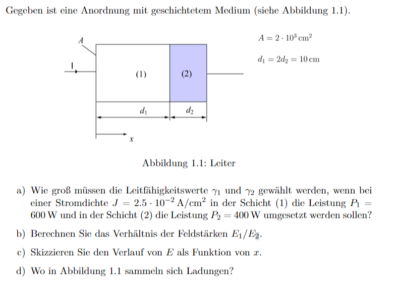
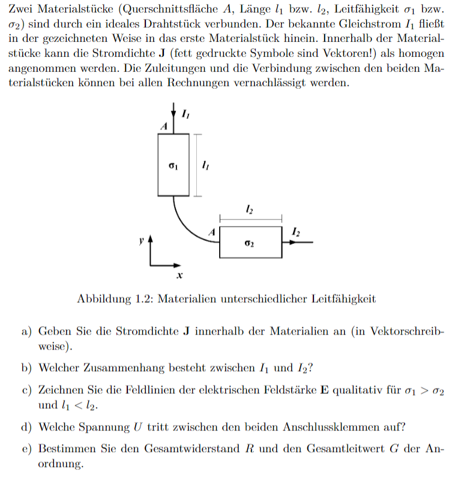

# Elektrisches Feld

> [!question] [Magnetisches Feld](Magnetisches%20Feld.md) :LiRefreshCcw:

---

> [!info] Das elektrische Feld beschreibt Kraftwirkungen auf Objekte, die eine elektrische [Ladung](elektrisches%20Feld.md) tragen. (Intensitätsgröße des E-Feld)
> - Die Ursache elektrischen Felder sind selbst Ladungen.
> - Die Ladungen können ruhen oder in Bewegung sein

> [!hint]- Folgende Behandlung des E-Feld gilt nur in der Elektrostatik und näherungsweise bei langsamen Änderungen.
> Statisch: 
> - es ändert sich nichts mehr (eingeschwungener Zustand)
> - Keine ruckartigen/schnelle Änderungen
> - in der HF Technik sind einige Vereinfachungen der Elektrostatik nicht mehr gültig

> [!info] [Coulomb-Kraft](Coulomb-Kraft.md)
>Ähnlich wie das Schwerefeld einer Masse, kann auch einer einzelnen Ladung ein elektrisches Feld $\mathbf{E}$ zugeordnet werden.  
> Die [Kraft](../Physik/{MOC}%20Kräfte.md) auf eine Ladung 𝑞, die in dieses Feld eingebracht wird ergibt sich dann aus:
> $$\mathbf{F}=q\cdot \mathbf{E}$$
> 
>> [!success] Die [Kraft](../Physik/{MOC}%20Kräfte.md) auf eine Ladung $q$ in einem von $Q$ hervorgerufenen externen Elektrischen Feld ist proportional zu $q$ und $\mathbf{E}$  
>

Das Feld das eine Ladung $Q$ um sich herum erzeugt ist, ähnlich wie beim Schwerefeld mit sternförmig auseinander gehenden Feldlinien verknüpft und mit mit dem Quadrat des Abstandes ab; sein [Betrag](../Mathematik/Algebra/Betrag.md) reduziert sich mit dem Quadrat des Abstands zu dieser Ladung:

$$|\mathbf{E}| = \frac{Q}{4\pi\varepsilon_{0}r^{2}}$$

Die Einheit der elektrischen Feldstärke ist $1 \frac{V}{m}$.

> [!important] Wie im Schwerefeld der Erde gilt auch im [Elektrischen Feld](elektrisches%20Feld.md) der Energie-Erhaltungssatz 
> Die [Arbeit](../Physik/Mechanische%20Arbeit.md) und das Potenzial (von [Potentielle Energie](../Physik/Energieerhaltung.md)) im Statischen [E-Feld](elektrisches%20Feld.md) führt uns zur [elektrischen Spannung](elektrische%20Spannung.md)

## Statisches [E-Feld](elektrisches%20Feld.md) $\iff$ Gravitationsfeld

|                                                     Gravitationskraft                                                     |                                        [Coulomb-Kraft](Coulomb-Kraft.md)                                        |
| :-----------------------------------------------------------------------------------------------------------------------: | :-------------------------------------------------------------------------------------------------------------: |
|                                             $\mathbf{F} = m\cdot \mathbf{g}$                                              |                                        $\mathbf{F} = q \cdot \mathbf{E}$                                        |
|                                  $\mathbf{F} = m\cdot \dfrac{G\cdot M}{\mathbf{r}^{2}}$                                   |                    $\mathbf{F} = q \cdot \dfrac{Q}{4\pi\varepsilon_{0}\cdot \mathbf{r}^{2}}$                    |
|                                                                                 |                                                                          |
|                                                                                                                           |                                                                                                                 |
|                                        Gravitationsfeld der Erde mit der Masse $M$                                        |                                       elektrisches Feld einer Ladung $Q$                                        |
|                      $\mathbf{g} = -\dfrac{G\cdot M}{\lvert  \mathbf{r} \rvert^{3}}\cdot \mathbf{r}$                      |     $\lvert \mathbf{E} \rvert = \dfrac{Q}{4\pi\varepsilon_{0}\lvert \mathbf{r} \rvert^{3}}\cdot \mathbf{r}$     |
|                                                                                  |                                                                                       |
|                                                                                                                           |                                                                                                                 |
|                                                          $F_{G}$                                                          |                                                     $F_{E}$                                                     |
| auf eine Masse $m$ wirkt im Gravitationsfeld $\mathbf{g}$ der Masse $M$ eine [Kraft](../Physik/{MOC}%20Kräfte.md) $F_{G}$ | Auf eine Ladung $q$ wirkt durch das durch $Q$ hervorgerufene E-Feld $\mathbf{E}$ eine [Kraft](Coulomb-Kraft.md) |

> [!warning] Unterschied zum G-Feld
> Ladungen können unterschiedliche Vorzeichen haben, Massen nicht. Elektrische Ladungen können sich daher anziehen und abstoßen, während sich massebehaftete Körper immer anziehen.

## Elektrische Feldstärke in einem Leiter

> [!question] [Materialgesetz](Materialgesetz.md)

Die elektrische Feldstärke im Leiter ist von der Stromdichte $\mathbf{J}$ und vom Materialabhängigen spezifischen Leitwert $\sigma$ bzw spez. Widerstand $\rho=\frac{1}{\sigma}$ Abhängig. Diese Beziehung ist stark mit dem [Ohmschen Gesetz](Ohmsches%20Gesetz.md) verwandt.

$$
\begin{align}
&\mathbf{E} = \frac{\mathbf{J}}{\sigma}=\mathbf{J}\cdot \rho
\end{align}
$$

# Beispiele

- Überlegung zu [Linienladung](Linienladung.md)
- Überlegung zu [Flächenladung](Flächenladung.md)
- Überlegung zu Kugelförmige Flächenladung

> [!EXAMPLE]- Stromfluss in Leitern  
> 
>
> > [!SUCCESS]- Lösung  
> > 

> [!EXAMPLE]- Stromfluss in Leitern 2  
> 
>
> > [!SUCCESS]- Lösung  
> > 

# Tags

- [ESD](../Hardwareentwicklung/ESD.md)
- [Coulomb-Kraft](Coulomb-Kraft.md)
- [Elektrisches Feld – Wikipedia](https://de.wikipedia.org/wiki/Elektrisches_Feld)

# Flashcards

Was beschreibt das elektrische Feld?;;Das elektrische Feld beschreibt Kraftwirkungen auf Objekte, die eine elektrische Ladung tragen.
<!--SR:!2024-03-19,4,190-->
Wie verhält sich ein *Elektron* (kinematisch), welches in ein *in x-Richtung orientiertes* homogenes [elektrisches Feld](elektrisches%20Feld.md) eingebracht wird?;;es beschleunigt in negative x-Richtung.
<!--SR:!2024-04-08,24,270-->
Ein leifähiger elliptischer Zylinder wird in ein homogenes [E-Feld](elektrisches%20Feld.md) eingebracht:  welches sind die Feldlinien und welches die Äquipotentiallinien
?
Normal zur Ellipse: Feldlinien
Tangential zur Ellipse: Äquipotentiallinien
<!--SR:!2024-03-21,13,266-->

