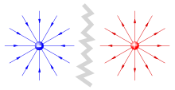

  - statischen E-Feld
  - E-Feld
  - E-Feldstärke
  - Elektrische Feldstärke
  - elektrisches Feld
  - elektrischen Feld

# Statisches [E-Feld](Elektrisches%20Feld.md)

> [!INFO] Statisch:  
> es ändert sich nichts mehr (eingeschwungener Zustand)
> Keine ruckartigen/schnelle Änderungen
> in der HF Technik sind einige Vereinfachungen der Elektrostatik nicht mehr gültig

> [!info] [Coul[elektrisches Feld](elektrisches%20Feld.md) wie das Schwerefeld einer Masse, kann auch einer einzelnen Ladung ein [elektrisches Feld](Elektrisches%20Feld.md) $E$ zugeordnet werden.  
> Die [Kraft](../Physik/Kraft.md) auf eine Ladung 𝑞, die in dieses Feld eingebracht wird ergibt sich dann aus:
> $$\vec{F}=q\cdot \vec{E}$$
> die elektrische Kraft auf eine Ladung $q$ in einem von $Q$ hervorgerufenen externen elektrischen Feld ist proportional zu $q$ und $E$  
>

Das Feld das eine Ladung $Q$ um sich herum erzeugt ist, ähnlich wie beim Schwerefeld mit sternförmig auseinander gehenden Feldlinien verknüpft und mit mit dem Quadrat des Abstandes ab; sein [Betrag](../Mathematik/Betrag.md) reduziert sich mit dem Quadrat des Abstands zu dieser Ladung:

$$|\vec{E}| = \frac{Q}{4\pi\varepsilon_{0}r^{2}}$$

Die einheit des Elektrischen Feldes ist\frac{V}{m}$.

> [!important] Wie im Schwerefeld der Erde gilt auch im [Elektrischen Feld](Elektrisches%20Feld.md) der Energie-Erhaltungssatz 
> Die [Arbeit](../Physik/Me[E-Feld](Statisches%20E-Feld.md)otenzial (von [Potentielle Energie](../Physik/Energieerhaltung.md)) im Statischen[E-Feld](elektrisches%20Feld.md)) führt uns zur [elektrischen Spannung](elektrische%20Spannung.md)

## Statisches [E-Feld](Elektrisches%20Feld.md) $\iff$ Gravitationsfeld

|                Gravitationskraft                 |                  [Elektrische Kraft](Elektrische%20Kraft.md) / [Coulomb-Kraft](Elektrische%20Kraft.md)                  |
|:------------------------------------------------:|:-------------------------------------------------------------------:|
|            $\vec{F} = m\cdot \vec{g}$            |                     $\vec{F} = q \cdot \vec{E}$                     |
| $\vec{F} = m\cdot \dfrac{G\cdot M}{\vec{r}^{2}}$ | $\vec{F} = q \cdot \dfrac{Q}{4\pi\varepsilon_{0}\cdot \vec{r}^{2}}$ |

|                    |                                   [elektrisches Feld](elektrisches%20Feld.md)          Gravitationsfeld der Erde mit der Masse $M$                | [Elektrisches Feld](Elektrisches%20Feld.md) einer Ladung $Q$ |
| :----------------------------------------------------------------------: | :----------------------------------------------------------: |
| $\vec{g} = -G\cdot M\cdot \dfrac{1}{ \mid \vec{r}\mid^{3}}\cdot \vec{r}$ |   $\mid\vec{E}\mid = \dfrac{Q}{4\pi\varepsilon_{0}r^{2}}$    |
|                                             |                                    |

| $F_{G}$                                                                                 | $F_{E}$                                                                                  |
| --------------------------------------------------------------------------------------- | ---------------------------------------------------------------------------------------- |
| auf eine Masse $m$ wirkt im Gravitationsfeld $\vec{g}$ der [E-Feld](elektrisches%20Feld.md)/Kraft.md) $F_{G}$ | Auf eine Ladung $q$ wirkt durch das durch $Q$ hervorgerufene [E-Feld](Elektrisches%20Feld.md) $\vec{E}$ eine [Kraft](../Physik/Kraft.md) |

> [!warning] Unterschied zum G-Feld
> Ladungen können unterschiedliche Vorzeichen haben, Massen nicht. Elektrische Ladungen können sich daher anziehen und abstoßen, während sich massebehaftete Körper immer anziehen.

## Feldstärke in einem Leiter

$$
\begin{align}
&\vec{E} = \frac{\vec{J}}{\sigma}=\vec{J}\cdot \rho
\end{align}
$$

# Beispiele

- Überlegung zu [Linienladung](Linienladung.md)
- Überlegung zu [Flächenladung](Flächenladung.md)
- Überlegung zu [[Kugelförmige Flächenladung]]

> [!EXAMPLE]- Stromfluss in Leitern  
> 
>
> > [!SUCCESS]- Lösung  
> > 

> [!EXAMPLE]- Stromfluss in Leitern 2  
> 
>
> > [!SUCCESS]- Lösung  
> > 

# Tags

[ESD](../Hardwareentwicklung/ESD.md)

## Flashcards

Was beschreibt das elektrische Feld?;;Das elektrische Feld beschreibt Kraftwirkungen auf Objekte, die eine elektrische Ladung tragen.
<!--SR:!2024-03[elektrisches Feld](Statisches%20E-Feld.md)* (kinematisch), welches in ein *in x-Richtung orientiertes* homogenes [elektrisches Feld](Elektrisches%20Feld.md) eingebracht wird?;;es beschleuni[E-Feld](Statisches%20E-Feld.md)R:!2024-03-09,7,250-->
Ein leifähiger elliptischer Zylinder wird in ein homogenes [E-Feld](Elektrisches%20Feld.md) eingebracht:  welches sind die Feldlinien und welches die Äquipotentiallinien
?
Normal zur Ellipse: Feldlinien
Tangential zur Ellipse: Äquipotentiallinien
<!--SR:!2024-03-21,13,266-->

# [Elektrisches Feld](https://de.wikipedia.org/wiki/Elektrisches_Feld)

> [!info] Das elektrische Feld beschreibt Kraftwirkungen auf Objekte, die eine elektrische [Ladung](elektrisches%20Feld.md) tragen.
> - Die Ursache elektrischen Felder sind selbst Ladungen.

# Tags

- [elektrisches Feld](elektrisches%20Feld.md)
- [Elektrische Kraft](Elektrische%20Kraft.md)