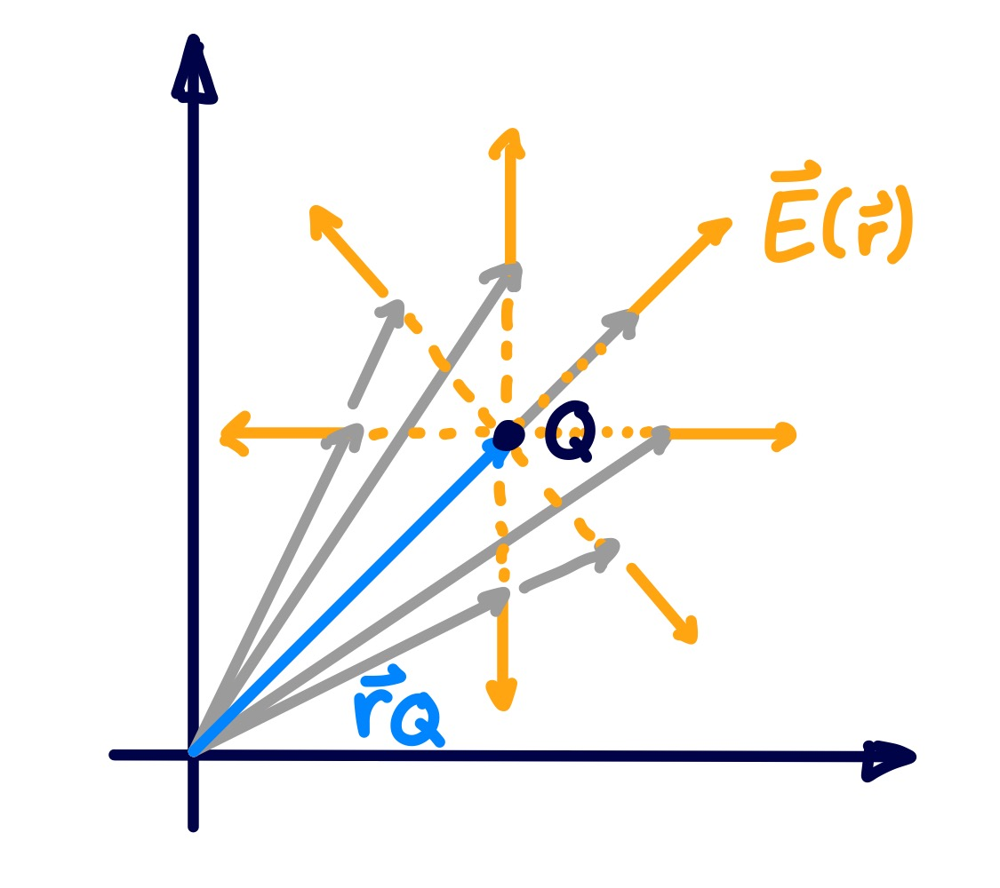
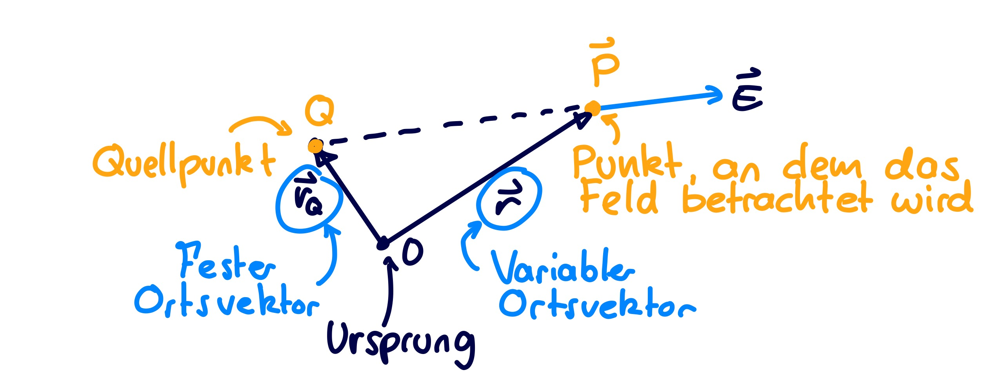
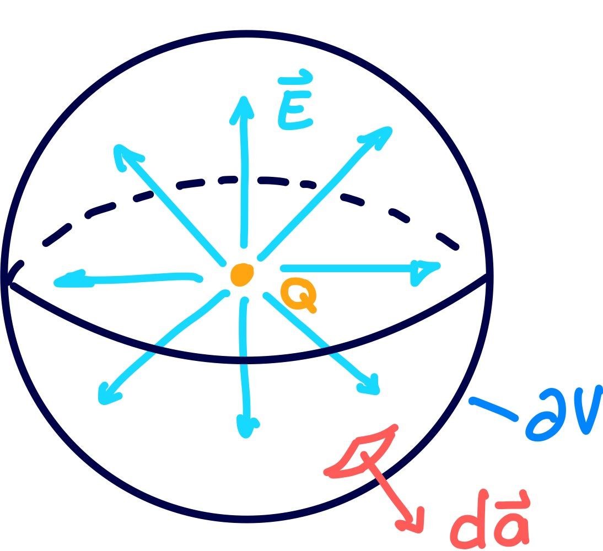

# Punktladung

> [!question] [Elektrostatik](index.md)

---

## Elektrisches Feld

> [!info] Elektrisches Feld einer Punktladung ^E-PUNKT
> 
> $$
> \mathbf{E}(\mathbf{r}) = \underbrace{ \frac{Q}{4\pi \varepsilon \lVert \mathbf{r}-\mathbf{r}_{Q} \rVert_{2}^{2}} }_{ \text{Betrag der Feldstärke} } \cdot \underbrace{ \frac{\mathbf{r}-\mathbf{r}_{Q}}{\lVert \mathbf{r}-\mathbf{r}_{Q} \rVert_{2} } }_{ \text{Richtung } }
> $$

| Feldlinien im Koordinatensystem | Ortsvektoren |
| :-: | :-: |
|  |  |

> [!hint] Man rechnet *Spitze ($\mathbf{r}$) - Fuß ($\mathbf{r}_{Q}$)* 

## Potenzial

> [!info] Potenzial im Abstand $r$ einer Punkladung 
> 
> $$
> \varphi(r) - \underbrace{ \varphi(r_{0} \to \infty) }_{ :=~0 } = 
> \frac{Q}{4\pi \varepsilon r}
> $$

|                            Potenzial Trichter                            |                                Draufsicht                                |
| :----------------------------------------------------------------------: | :----------------------------------------------------------------------: |
|  |  |

---

## Herleitungen

- [Elektrostatisches Feld](index.md#Elektrisches%20Feld)
- [Elektrisches Potenzial](index.md#Elektrisches%20Potenzial)

### 1. Schritt: Ladungsverteilung

Die Ladungsverteilung konzentriert sich auf einen einzigen Punkt mit Ladung $Q$. Die rechte Seite von [MW3](Leitergeometrie.md#^MW3) vereinfacht sich

$$
\int_{V}\rho(\mathbf{r})\mathrm{~d}V(\mathbf{r}) = Q
$$

### 2. Schritt: Volumen

Als Volumen legt man eine Kugel um die Punktladung.

> [!hint] Der [Flächennormalvektor](../../Mathematik/Analysis/Vektoranalysis/Flächenintegral.md) der Kugel zeigt genau wie das Feld der Ladung in radiale Richtung. Das [Skalarprodukt](../../Mathematik/Algebra/Skalarprodukt.md) vereinfacht sich:
> 
> $$
> \mathbf{E} || \mathrm{d}\mathbf{a} \implies \mathbf{E}\cdot\mathrm{d}\mathbf{a} = \left| \mathbf{E} \right| \left| \mathrm{d}\mathbf{a} \right| \cos\alpha = E \cdot\mathrm{d}a
> $$

Die Linke Seite von [MW3](Leitergeometrie.md#^MW3) vereinfacht sich:

$$
\varepsilon E {\color{orange} \oint_{\partial V} \mathrm{d}a } =\varepsilon E ~{\color{orange}4\pi r^{2}}
$$

### Ergebnis: Feldstärke

Beide Seiten zusammen ergeben

$$
\varepsilon E 4\pi r^{2} = Q \implies \mathbf{E}(\mathbf{r}) = \frac{Q}{4\pi \varepsilon \lVert \mathbf{r} \rVert_{2}^{2}} \hat{\mathbf{e}}_{\mathbf{r}}
$$

Mit dem Einheitsrichtungsvektor $\hat{\mathbf{e}}_{\mathbf{r}} = \frac{\mathbf{r}}{\lVert \mathbf{r} \rVert_{2} }$.

Dieses Ergebnis für das Elektrische Feld ist gültig, sofern sich die Punktladung im Ursprung des Koordinatensystems befindet. Spätestens bei der Betrachtung mehrerer Ladungen im Raum, muss das Feld auch von einem *beliebigen* Punkt im Koordinatensystem beschrieben werden.

- Punkt, an dem sich die Ladung befindet, wird zum *festen* [Ortsvektor](../../Physik/Koordinatensysteme.md) $\mathbf{r}_{Q}$ (Quellpunkt, Laufpunkt)
- Punkt, an dem das elektrische Feld $\mathbf{E}(\mathbf{r})$ betrachtet wird, wird der *variable* Ortsvektor $\mathbf{r}$ (Aufpunkt)

$$
\mathbf{r} \mapsto \mathbf{r} - \mathbf{r}_{Q}
$$

Man erhält dann das Feld [wie oben](#^E-PUNKT).

### Ergebnis: Potenzial

Zwecks übersichtlichkeit wird die Punktladung in den Ursprung $\mathbf{r}_{Q}=\mathbf{0}$ gelegt.

Man integriert einen beliebigen Weg von $r$ nach $r_{0}$.

$$
\varphi(r)- \varphi(r_{0}) = \int_{r}^{r_{0}} \mathbf{E}\cdot\mathrm{d}\mathbf{s} = 
\int_{r}^{r_{0}} \frac{Q}{4\pi \varepsilon \lVert \mathbf{r} \rVert_{2}^{2}} \hat{\mathbf{e}}_{\mathbf{r}} \cdot \mathrm{d}\mathbf{s}
$$

Bei der wahl, dass der Weg $S$ entlang der Radialen Richtung integriert wird, gilt $\hat{\mathbf{e}}_{\mathbf{r}}| |\mathrm{d}\mathbf{s}$ und der Ausdruck vereinfacht sich zu

$$
\varphi(r) - \varphi(r_{0}) = \int_{r}^{r_{0}} \frac{Q}{4\pi \varepsilon r'^{2}} \cdot \mathrm{d}r' = \frac{Q}{4\pi\varepsilon}\left( -\frac{1}{r'} \right) \Bigg|_{r}^{r_{0}}
$$

Man lässt nun $r_{0} \to \infty$ gehen und definiert das Potenzial im unendlichen auf einen beliebigen Wert, hier $\varphi(r_{0} \to \infty) :=0$

$$
\varphi(r) = \frac{Q}{4\pi\varepsilon r}
$$

## Referenzen

- $\lVert \cdot \rVert_{2}$ [Euklidsche Norm](../../Mathematik/Algebra/Euklidsche%20Norm.md)