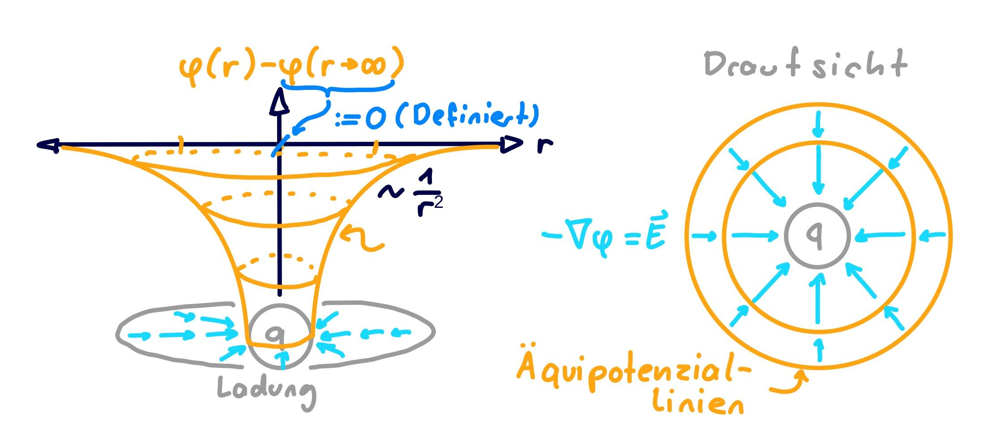

---
tags:
aliases:
  - Elektrostatik
keywords:
subject:
  - Elektrotechnik
  - VL
semester: SS24
created: 3. Juni 2024
professor:
title: Elektrostatik
---
 

# Elektrostatik

> [!info] In der Elektrostatik betrachten wir nur das zeitlich konstante elektrische Feld
> Daher reduzieren sich die [MWG](Maxwell.md) zu:
>
> $$
> \begin{gathered}
> \nabla \times \mathbf{E}=0 \\
> \nabla \cdot \mathbf{D}=\rho
> \end{gathered}
> $$
> 
> bzw.
> 
> $$
> \begin{gathered}
> \oint_{\partial A} \mathbf{E} \cdot \mathrm{d} \mathbf{s}=0 \\
> \oint_{\partial V} \mathbf{D} \cdot \mathrm{d} \mathbf{A}=\int_V \rho \mathrm{d} V
> \end{gathered}
> $$

Der Ausdruck $\oint \mathbf{E}\cdot\mathrm{d}\mathbf{s} = 0$ impliziert, dass das $\mathbf{E}$ Feld [Wegunabhängig](../../Mathematik/Analysis/Vektoranalysis/Wegunabhängig.md) ist.

Das bedeutet, dass das Elektrische Feld als [Gradient](../../Mathematik/Analysis/Vektoranalysis/Gradient.md) eines Skalarfelds dargestellt werden kann.

> [!satz] **S)** Das Elektrische Feld ist der negative Gradient des Potenzials.
> 
> $$
> \mathbf{E} = -\nabla\varphi
> $$

- Minus per definition

Woraus Folgt, dass das statische Elektrische Feld ein konservatives Kraftfeld ist. Die *Arbeit* in diesem Kraftfeld ist die Potenzialdifferenz oder [elektrische Spannung](elektrische%20Spannung.md):

$$
\implies - \int_{\mathbf{r}_{a}}^{\mathbf{r}_{b}} \mathbf{E}(\mathbf{r})\cdot\mathrm{d}\mathbf{s} =
\int_{\mathbf{r}_{a}}^{\mathbf{r}_{b}} \nabla\varphi(\mathbf{r}) \cdot \mathrm{d}\mathbf{s} =
\varphi(\mathbf{r}_{b})-\varphi(\mathbf{r}_{a})
$$

Das bedeutet, dass das eletrostatische Feld **keine geschlossenen Feldlinien aufweist**.

Das Potenzial ergibt per obiger definition nur als Differenz einen Sinn. Gibt man das Potenzial als alleinstehenden Wert an, muss man einenen Referenzpunkt Wählen.

