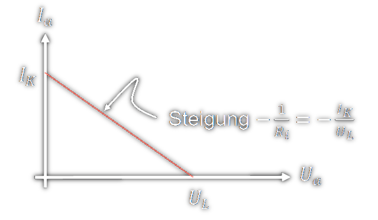

 

# Ersatzschaltbilder

> [!info] 
> Eine beliebige lineare Quelle (Spannungsund Stromquellen in einem Netzwerk aus Widerständen) kann zwischen zwei Klemmen als Theveninoder Norton-Ersatzbild dargestellt werden.

Das Netzwerk kann dabei durch zwei Parameter (oder Messungen) vollständig identifiziert werden:
- Die *Leerlaufspannung* $U_{L}$: Jene [elektrische Spannung](elektrische%20Spannung.md) die im Leerlauf an den Klemmen anliegt
- Den *Kurzschlussstrom* $I_{K}$: Der [Strom](elektrischer%20Strom.md) der bei Kurzschluss zwischen den Klemmen fließt

$$
\begin{aligned}
R_i & =\frac{U_L}{I_K} \\
U_a & =U_L \frac{R_a}{R_a+R_i}=I_K \frac{R_i R_a}{R_i+R_a}
\end{aligned}
$$

## Norton ESB: Stromquelle

> [!important] Bei $R_{a}\to\infty$ ist $U_{a} = U_{L} = I_{K}\cdot R_{i}$ die Quellspannung des Thevenin ESB 

## Thevenin ESB: Spannungsquelle

> [!important] Bei $R_{a} = 0$ ist der der Strom $I_{K} = \frac{U_{L}}{R_{i}}$ der Quellstrom des Norton ESB

## Beispiel

$$
\begin{gathered}
U_L=U_0 \frac{R_2}{R_1+R_2}+I_0 \frac{R_1 R_2}{R_1+R_2} \\
I_K=\frac{U_0}{R_1}+I_0 \\
R_i=\frac{U_L}{I_K}=\frac{R_1 R_2}{R_1+R_2}
\end{gathered}
$$

> [!success] Alternative Methode zur Bestimmung für $R_i$ :
> Wenn Sie als Last eine *Quelle* (egal ob Spannungsoder Stromquelle) anschließen, so könnten Sie sowohl im Ersatzbild als auch in der echten Schaltung den Beitrag dieser Quelle durch das [[Superpositionsprinzip]] bestimmen.
> Für die Berechnung des Beitrags dieser Quelle müssen alle anderen Quellen 0 gesetzt werden (Spannungsund Stromquellen durch Kurzschlüsse bzw. Leerläufe ersetzen).
> Im ESB wird das Netzwerk dann durch $R_i$ repräsentiert; demnach können Sie Im Originalnetzwerk einfach durch Zusammenfassung der sich so ergebenden Widerstände $R_i$ bestimmen - in unserem Fall einfach eine Parallelschaltung von $R_1$ und $R_2$.