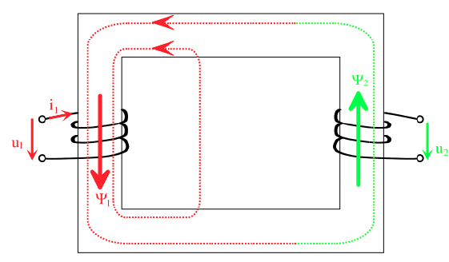
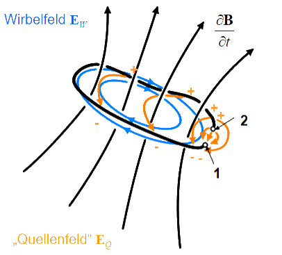
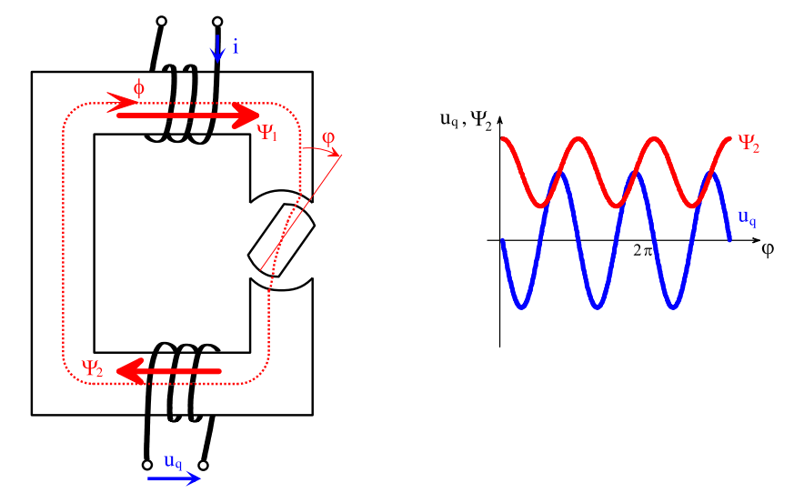

---
tags:
  - Baugruppe/Komponente
aliases:
  - Spule
  - Spulen
  - Induktivitäten
  - Henry
keywords:
subject:
  - VL
  - Elektrotechnik
  - Elektrische Maschinen und Antriebselektronik
semester: WS23
created: 8th April 2022
professor:
  - Bernhard Jakoby
  - Wolfgang Gruber
---
 

# Induktivitäten

## Schaltsymbol

| Symbol                           | reales ESB                           |
| -------------------------------- | ------------------------------------ |
|  |  |

## Kenngrößen der Induktivität

Bei Stromänderungen in einer Spule wird in der Spule selbst und in den magnetisch angekoppelten Spulen eine [induzierte Spannung](#Spannungsinduktion).

Der Grad der Stromänderung und und die Indultivität $L$ beeinflussen hierbei die höhe der induzierten Spannung.

> [!def] **Induktivität** ^INDU
> 
> $$ [L] = \mathrm{\frac{Vs}{A}} = \Omega \mathrm{s} = \mathrm{H} \dots \text{Henry}$$
> Strom Spannungsbeziehung
> $$
> u_{L}(t) = L\frac{\mathrm{d}i_{L}}{\mathrm{d}t}(t)\qquad i_{L}(t) = \frac{1}{L} \int_{t_{0}}^{t} u_{L}(\tau)\mathrm{~d}\tau 
> $$
> 

### Magnetischer Zusammenhang

Allgemein gilt der Zusammenhang mit dem [magnetischen Fluss](Magnetischer%20Fluss.md) zwischen den beiden Strängen $\mu$ und $\nu$

> [!def] Magnetischer Zusammenhang
$$ L_{\mu\nu} = \frac{\mathrm{d}\Psi_{\mu}}{\mathrm{d}i_{\nu}} $$

|  |                    |
| ------------------------------------- | ------------------------------------------------------ |
| Selbstinduktivität                    | Gegeninduktivität (hier zweisträngig $\mu = 1, \nu=2$) |

Unter Berücksichtigung der nichtlinearen Eisencharakteristikverändert die [Permeablität](../Physik/Konstanten/Permeablität.md) in Abhängigkeit von der Erregung ihren Wert.

Typischer Kennlinienverlauf

### Energie in der Spule

Die Induktivität ist ebenso ein Maß für die Fähigkeit der Spule elektromagentische Energie zu speichern.

Die **Energie** die in einer **Induktivität** gespeichert werden kann ergibt sich aus:

$$ E = \frac{L\cdot I^{2}}{2}  $$

## Spannungsinduktion

> [!question] [Magnetfeld](Magnetisches%20Feld.md)

Induktionsphänomene treten nur in *Wechselfeldern* auf.

### Ruheinduktion

Ein magnetisches Wechselfeld erzeugt elektrische Wirbelfelder - dies bedeutet, dass geschlossene elektrische Feldlinien auftauchen!

> [!info] Ein sich zeitliches wechselndes Magnetfeld wird von einem elektrischen Feld *linkswendig* umwirbelt.
> Es wird also nicht durch Ladungen erzeugt, sondern durch die Änderung des magnetischen Feldes. Die naheliegendsten Begründung dafür ist die [Lenzsche Regel](../Physik/Lenzsche%20Regel.md)

Wenn man einen Leiter entlang des Wirbelfeldes $\vec{E}_{W}$ legt, verschieben sich die Ladungen entlang des Leiters und an den Klemmen entsteht eine [Potenzialdifferenz](elektrische%20Spannung.md) - die *induzierte* Spannung.

> [!hint] Induzierte Spannung
> Diese Wirbelfelder werden durch das [Induktionsgesetz](Maxwell.md#2.%20MWG%20-%20Induktionsgesetz) beschrieben:
> $$
> -u_{\mathrm{q}} = \oint_{\partial A} \vec{E} ~\mathrm{d} \vec{s}=-\int_{A} \frac{\partial \vec{B}}{\partial t} \mathrm{d} \vec{a} = -\frac{\mathrm{d}\Psi}{\mathrm{d}t}
> $$
> Dabei wird die Beziehung zum [magnetischen Fluss](Magnetischer%20Fluss.md) auf die infinitesimalen Größen angewendet. Die Fläche $A$ ist die **Spiralfläche** über der gesamten Wicklung, nicht der Spulenquerschnitt, deshalb der **verkettete** Fluss $\Psi$. $\partial A$ ist der Leiter selbst. In dem minus steckt die *linkswendigkeit* des umwirbelnden E-Felds.

Im statischen Fall entspricht das der bereits bekannten Beziehung $\oint_{\partial A} \vec{E}\cdot d\vec{s} = 0$. Also dass die Spannung an den Klemmen $0$ ist. Das ist hier nicht mehr der Fall.

Für die Spulenspannung einer Realen Spule mit Äquvalenten Serienwiderstand $R$ gilt dann

> [!def] **D - UIND)** Induzierte Spannung ^UIND
> $$
> u_{L} = Ri + \frac{\mathrm{d}\Psi}{\mathrm{d}t} \quad\overset{ L = \tfrac{\mathrm{d}\Psi}{\mathrm{d}i}}{ \iff } \quad Ri + L \frac{\mathrm{d}i}{\mathrm{d}t} = u_{\mathrm{L}}
> $$

### Bewegungsinduktion

**Generatoren mit Rotationsbewegung**

|                       |                                                |
| -------------------------------------------------------- | -------------------------------------------------------------------------------- |
| Prinzip des Sysnchrongenerators                          | Prinzip des Reluktanzgenerators                                                  |
| Fluss ändert sich nicht (Luftspule rotiert im Luftspalt) | Magnetkreis selbst ändert sich. Breite des Luftspalts ist anhängig von der phase |

Die Quellspannung $u_{\mathrm{q}} = \dfrac{\mathrm{d}\Psi}{\mathrm{d}t}(t,\varphi)$ kann in eine *induktive* und eine *rotatorische* Komponente aufgespalten werden. 

$$
u_{\mathrm{q}} = \frac{\partial \Psi}{\partial i} \frac{\mathrm{d}i}{\mathrm{d}t}+ \frac{\partial \Psi}{\partial \vec{\varphi}}\vec{\omega} \qquad \text{mit } \vec{\omega} = \frac{\mathrm{d}\vec{\varphi}}{\mathrm{d}t} 
$$

$\vec{\omega}$ ist ein Vektor mit der Richtung seiner Rotationsachse

**Generatoren mit translatorischer Bewegung**

Analog zur rotatorischen Bewegung gilt die Aufspaltung der Quellspannung $u_{\mathrm{q}} = \frac{\mathrm{d}\Psi}{\mathrm{d}t}(t,\vec{s})$ in eine *induktive* und eine *translatorische* Bewegung:

$$
u_{\mathrm{q}} = \frac{\partial \Psi}{\partial i} \frac{\mathrm{d}i}{\mathrm{d}t}+ \frac{\partial \Psi}{\partial \vec{s}}\vec{v} \qquad \text{mit } \vec{v} = \frac{\mathrm{d}\vec{s}}{\mathrm{d}t} 
$$

## Schaltvorgänge

Grundsätzlich kann man sagen, dass die Induktivität Änderungen des **Stromes entgegenwirkt** ([Lenzsche Regel](../Physik/Lenzsche%20Regel.md)).

nach 1-mal $\tau$ sind $63\%$ des Stromes erreicht.

|              Einschaltvorgang einer Induktivität              |              Abschaltvorgang einer Induktivität               |
| :-----------------------------------------------------------: | :-----------------------------------------------------------: |
|  |  |
|                             #todo                             |                             #todo                             |

---

# Tags

## Wikipedia

[Induktivitäten](<https://de.wikipedia.org/wiki/Induktivit%C3%A4t_(Bauelement)>)

[Spulen](<https://de.wikipedia.org/wiki/Spule_(Elektrotechnik)>)