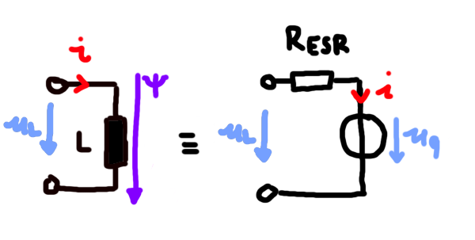
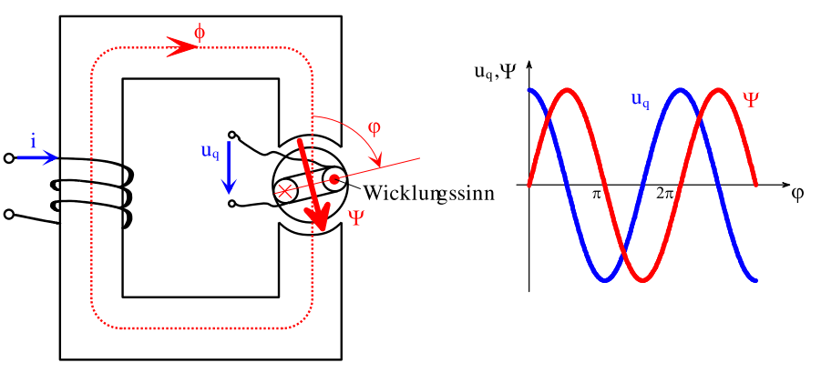
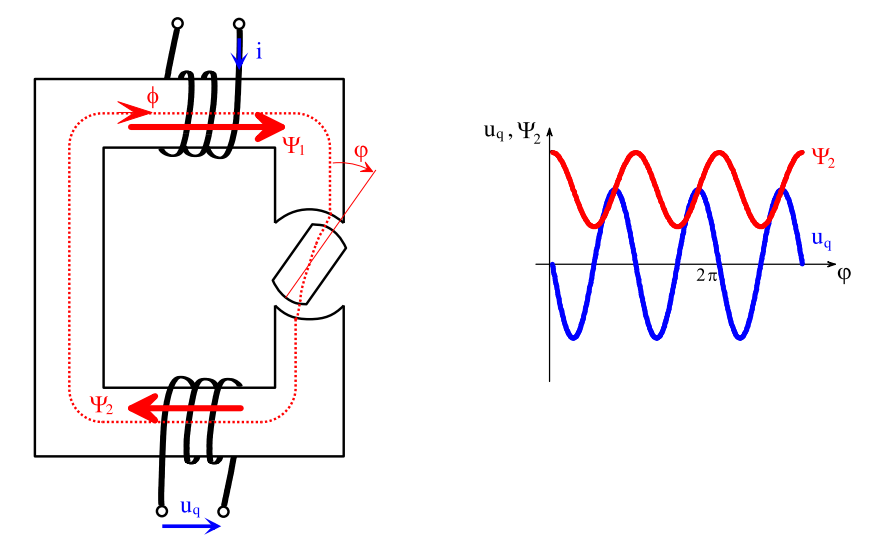
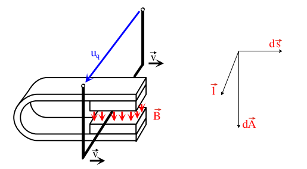

---
tags:
  - Baugruppe/Komponente
aliases:
  - Spule
  - Spulen
  - Induktivitäten
  - Henry
keywords: 
subject:
  - VL
  - Elektrotechnik
semester: WS23
created: 8th April 2022
professor:
  - Bernhard Jakoby
cited:
---
 

# Induktivitäten

## Schaltsymbol

| Symbol                                       | reales ESB                       |
| -------------------------------------------- | -------------------------------- |
|  |  |

## Kenngrößen der Induktivität

> [!def] **Induktivität**
> $$ [L] = \frac{Vs}{A} = \Omega s = H \dots \text{Henry}$$

### Strom-Spannungsbeziehung

### Energie in der Spule

Die **Energie** die in einer **Induktivität** gespeichert werden kann ergibt sich aus:

$$ E = \frac{L\cdot I^{2}}{2}  $$

Grundsätzlich kann man sagen, dass die Induktivität Änderungen des **Stromes entgegenwirkt** ([Lenzsche Regel](../Physik/Lenzsche%20Regel.md)).

nach 1-mal $\tau$ sind $63\%$ des Stromes erreicht.

| Einschaltvorgang einer Induktivität    | Abschaltvorgang einer Induktivität     |
| :--------------------------------------: | :--------------------------------------: |
|  |  |
| #todo                                  | #todo                                  |

## Induktionsgesetz

> [!question] [Magnetfeld](Magnetisches%20Feld.md)

Induktionsphänomene treten nur in *Wechselfeldern* auf.

### Ruheinduktion

Ein magnetisches Wechselfeld erzeugt elektrische Wirbelfelder - dies bedeutet, dass geschlossene elektrische Feldlinien auftauchen!

> [!info] Ein sich zeitliches wechselndes Magnetfeld wird von einem elektrischen Feld *linkswendig* umwirbelt.
> Es wird also nicht durch Ladungen erzeugt, sondern durch die Änderung des magnetischen Feldes. Die naheliegendsten Begründung dafür ist die [Lenzsche Regel](../Physik/Lenzsche%20Regel.md)

Wenn man einen Leiter entlang des Wirbelfeldes $\vec{E}_{W}$ legt, verschieben sich die Ladungen entlang des Leiters und an den Klemmen entsteht eine [Potenzialdifferenz](elektrische%20Spannung.md) - die *induzierte* Spannung.

> [!hint] Induzierte Spannung
> Diese Wirbelfelder werden durch das [Induktionsgesetz](Maxwell.md#2.%20MWG%20-%20Induktionsgesetz) beschrieben:
> $$
> -u_{\mathrm{q}} = \oint_{\partial A} \vec{E} ~\mathrm{d} \vec{s}=-\int_{A} \frac{\partial \vec{B}}{\partial t} \mathrm{d} \vec{a} = -\frac{\mathrm{d}\Psi}{\mathrm{d}t}
> $$
> Dabei wird die Beziehung zum [magnetischen Fluss](Magnetischer%20Fluss.md) auf die infinitesimalen Größen angewendet. Die Fläche $A$ ist die **Spiralfläche** über der gesamten Wicklung, nicht der Spulenquerschnitt, deshalb der **verkettete** Fluss $\Psi$. $\partial A$ ist der Leiter selbst. In dem minus steckt die *linkswendigkeit* des umwirbelnden E-Felds.

Im statischen Fall entspricht das der bereits bekannten Beziehung $\oint_{\partial A} \vec{E}\cdot d\vec{s} = 0$. Also dass die Spannung an den Klemmen $0$ ist. Das ist hier nicht mehr der Fall.

### Bewegungsinduktion

**Generatoren mit Rotationsbewegung**

|  |  |
| ----------------------------------- | ---------------------------------- |
| Prinzip des Sysnchrongenerators     | Prinzip des Reluktanzgenerators    |

Die Quellspannung $u_{\mathrm{q}} = \dfrac{\mathrm{d}\Psi}{\mathrm{d}t}(t,\varphi)$ kann in eine *induktive* und eine *rotatorische* Komponente aufgespalten werden. 

$$
u_{\mathrm{q}} = \frac{\partial \Psi}{\partial i} \frac{\mathrm{d}i}{\mathrm{d}t}+ \frac{\partial \Psi}{\partial \vec{\varphi}}\vec{\omega} \qquad \text{mit } \vec{\omega} = \frac{\mathrm{d}\vec{\varphi}}{\mathrm{d}t} 
$$

$\vec{\omega}$ ist ein Vektor mit der Richtung seiner Rotationsachse

**Generatoren mit translatorischer Bewegung**

Analog zur rotatorischen Bewegung gilt die Aufspaltung der Quellspannung in eine *induktive* und eine *translatorische* Bewegung:

$$
u_{\mathrm{q}} = \frac{\partial \Psi}{\partial i} \frac{\mathrm{d}i}{\mathrm{d}t}+ \frac{\partial \Psi}{\partial \vec{s}}\vec{v} \qquad \text{mit } \vec{v} = \frac{\mathrm{d}\vec{s}}{\mathrm{d}t} 
$$

---

### Induzierte Spannung

quellstrom $i$ ist konstant

Quellspannung

$$ u_{q}=\frac{\mathrm{d}\Psi}{\mathrm{d}t}(t,\varphi) $$
Verketteter Fluss: $\Psi = N \cdot\Phi$

Bisher:

$$
u = Ri + L\frac{\mathrm{d}i}{\mathrm{d}t} \overset{ \Psi = Li }{ \to } Ri + \frac{\mathrm{d}\Psi}{\mathrm{d}t} 
$$

Aufgespalten in eine induktive und rotatorische komponente

$$
u_{q} = \underbrace{ \frac{\partial \Psi}{\partial i}\cdot \frac{\mathrm{d}i}{\mathrm{d}t} }_{\text{Ruhe ind.}} +\underbrace{ \frac{\partial \Psi}{\partial \vec{\varphi}}\vec{\omega} }_{ \text{Bewegt ind.} }
$$

$\vec{\varphi}$ und $\vec{\omega}$ sind vektoren wegen der Rotationsachse. $\vec{\omega} = \dfrac{\mathrm{d}\vec{\varphi}}{\mathrm{d}t}$

Synchrongenerator: Fluss ändert sich nicht (Luftspule rotiert im Luftspalt)

Reluktanzgenerator: Magnetkreis selbst ändert sich. Breite des Luftspalts ist anhängig von der phase

#### Induktionsgesetz

Beim Integral: $\mathrm{d}\mathbf{s}\times \mathbf{l} = \mathrm{d}\mathbf{a}$

$\mu,\nu$ sind indizes

---

# Tags

## Wikipedia

[Induktivitäten](<https://de.wikipedia.org/wiki/Induktivit%C3%A4t_(Bauelement)>)

[Spulen](<https://de.wikipedia.org/wiki/Spule_(Elektrotechnik)>)