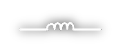
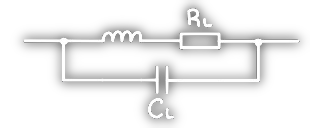

# Induktivitäten

## Schaltzeichen

| Symbol        | ESB |
| ------------- | --- |
|  |     |

## Induktivitäten Als Bauelemente Leistungselektronischen Schaltungen

Unter **Vernachlässigung** von **$R_{L}$** und der **parasitären Parallelkapazität $C_{L}$**, gilt für lineare Materialien der folgende Zusammenhang der die Spannung an der Induktivität beschreibt:

$$
\begin{align*}
	u_{L} = L\cdot \frac{di}{dt}
\end{align*}
$$

Die **Energie** die in einer **Induktivität** gespeichert werden kann ergibt sich aus:

$$
\begin{align*}
E &= \frac{L\cdot I^{2}}{2} 
\end{align*}
$$

Grundsätzlich kann man sagen, dass die Induktivität Änderungen des **Stromes entgegenwirkt** ([Lenzsche Regel](../Physik/Lenzsche%20Regel.md)).

Durch das Anlegen einer Puls-förmigen Spannung an eine Induktivität folgt, dass sich **$i_{L}$ nicht linear verhält**.

Der in der Leistungselektronik relevante Fall ist jener einer Zeitkonstante, die viel größer ist als die Pulsfrequenz, sowie eines vernachlässigbaren [Ohm](Ohmsches%20Gesetz.md)'schen Widerstands.  
Daher gilt die folgende Näherung:

$$
\begin{align*}
i \approx \frac{1}{L}\cdot u_{L}\cdot t
\end{align*}
$$

Der nicht lineare reale Wert ergibt sich durch das Lösen der [homogenen linearen DGL 1. Ordnung](../Mathematik/mathe%20(4)/lineare%20DGL%201.%20Ordnung.md)

$$
\begin{align*}
	u_{L} &= L\cdot \frac{di}{dt}\\
	i_{L} &= \frac{u_{L}}{R}\cdot\left(1-e^{\frac{-t}{\tau}}\right)\rightarrow \tau=\frac{L}{R}
\end{align*}
$$

nach 1-mal $\tau$ sind $63\%$ des Stromes erreicht.

### Einschaltvorgang einer Induktivität

### Abschaltvorgang einer Induktivität

---

# Tags

## Wikipedia

[Induktivitäten](<https://de.wikipedia.org/wiki/Induktivit%C3%A4t_(Bauelement)>)

[Spulen](<https://de.wikipedia.org/wiki/Spule_(Elektrotechnik)>)