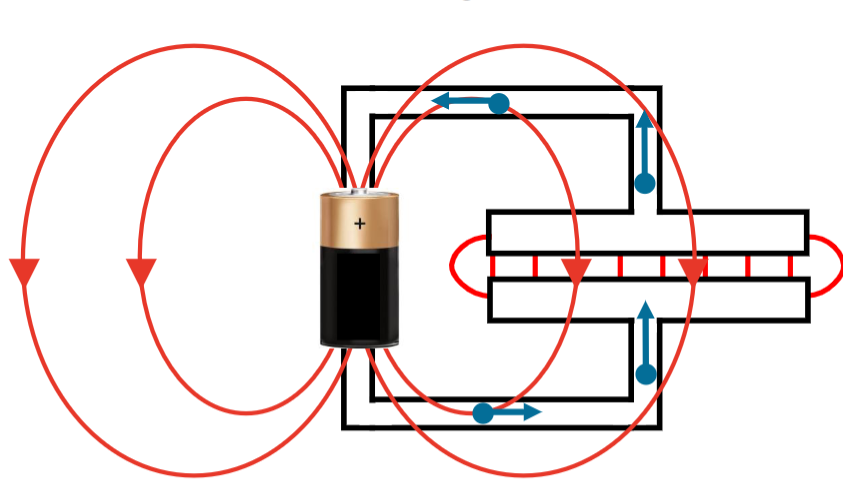
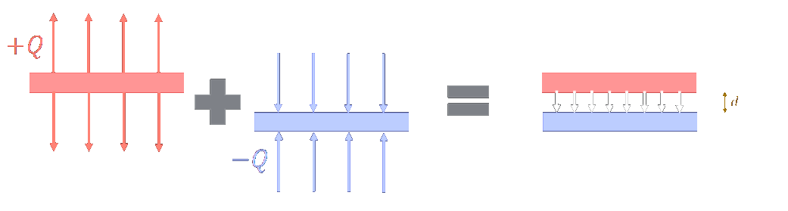

---
tags:
  - Baugruppen/Komponente
aliases:
  - Kondensator
  - Kapazitäten
keywords:
subject:
  - VL
  - Einführung Elektrotechnik
semester: WS23
created: 11th April 2023
professor:
  - Michael Offenhuber
  - Siegbert Schrempf
  - Bernhard Jakoby
cited: 
---

# Der Kondensator - ein Ladungsspeicher

> [!INFO] Der Kondensator – ein Ladungsspeicher  
>  Ein Kondensator ist eine Anordnung zweier Elektroden mit unterschiedlichem [Potenzial](elektrische%20Spannung.md), bei der durch räumliche Nähe ein elektrostatisches Feld entsteht.  
>  Die entsprechende Kenngröße heißt *Kapazität*.

> [!warning] parasitäre Kapazität  
>  Da die im folgenden beschriebenen Effekte im Prinzip zwischen allen Leitern auftreten (also auch welchen die räumlich weiter entfernt sind), tritt die Kapazität im Prinzip zwischen allen Leitern auf – oft auch unerwünschter Weise, man spricht von parasitären Kapazitäten.

> [!TIP] [Ladungen](elektrisches%20Feld.md) verschieben sich solange, bis das [E-Feld](elektrisches%20Feld.md) in den Leitern verschwindet und im Kondensator verteilt ist:
> 
> 1. Feld wirkt auf bewegliche Elektronen im eingebrachten Kondensator und Anschlussdrähten
> 2. Die [Ladungen](elektrisches%20Feld.md) verschieben sich solange, bis das Feld in allen Leitern verschwindet (Platten und Drähte), d.h. dort dann konstantes Potenzial. Das Feld wird dadurch verzerrt.
> 3. Im Zuge dieser Verschiebungen wurden die Platten [geladen](elektrisches%20Feld.md). Das Feld zwischen den Platten ist mit der [Potenzialdifferenz](elektrische%20Spannung.md) (durch [Spannungsquelle](elektrische%20Spannung.md) vorgegeben) verknüpft, erzeugt wird es vornehmlich durch die [Ladungen](elektrisches%20Feld.md) auf dem Platten.

## Schaltsymbol

| Symbol | ESB                               |
| ------ | --------------------------------- |
|        |  |

## Kenngrößen im Kondensator

### Die Kapazität

Aus der Überlegung zur [Flächenladung](Flächenladung.md) kennen wir, dass für die beiden Platten gilt:

$$\lvert \vec{E} \rvert= \frac{Q}{2A\cdot \varepsilon}  $$

> [!hint] Das Feld der jeweiligen Seite der Platte das zur anderen zeigt, verläuft in die selbe Richtung, wird also [überlagert](Superpositionsprinzip.md). (wobei sich die äußeren Felder aufheben).
> für das Feld im Kondensator ergibt sich: $\lvert \vec{E} \rvert = \frac{Q}{2A\cdot \varepsilon} + \frac{Q}{2A\cdot \varepsilon} = \frac{Q}{A\cdot \varepsilon}$
> 
> Mit der [elektrischen Spannung](elektrische%20Spannung.md) im [E-Feld](elektrisches%20Feld.md): $U = \lvert \vec{E} \rvert \cdot d$
> 
> $$\boxed{ \frac{U}{d} = \frac{Q}{A\cdot \varepsilon}\implies Q = \varepsilon_{0} \cdot \frac{A}{d} \cdot U = C\cdot U\implies C = \varepsilon \cdot \frac{A}{d} }$$
>
> $\varepsilon = \varepsilon_{0}\cdot\varepsilon_{r}$
> $\varepsilon_{0}$ … [Dielektrizitätskonstante](../Physik/Konstanten/Dielektrizitätskonstante%20des%20Vakuum.md)
> $\varepsilon_{r}$ … Relative [Permittivität](Dielektrikum.md) des [Dielektrikums](Dielektrikum.md)
>   

### [Ladung](elektrisches%20Feld.md) Und Kapazität im Kondensator

Die Kapazität ist der Proportionalitätsfaktor zwischen [Ladung](elektrische%20Ladung.md) und Spannung im Kondensator:

$$
Q=C\cdot U
$$
> [!important]- Begründung der proportionalität
> $$
> \left.\begin{align}
> U = \int \vec{E}\cdot d\vec{s} \implies U \propto E \\
> E = Q \cdot \frac{1}{4\pi\varepsilon_{0}r^{2} }\implies E \propto Q
> \end{align}\right\} \implies U \propto Q
> $$

### [Strom](elektrischer%20Strom.md) Und Spannung im Kondensator

$$
\begin{gather}
dQ = i\cdot dt \\
Q = C\cdot U \implies dq = C\cdot du \\
i\cdot dt = C\cdot du \\
i = C\cdot \frac{du}{dt}
\end{gather}
$$

Integrieren beider seiten liefert die Kondensator-Spannung:

$$ u(t)=u\left(t_0\right)+\frac{1}{C} \int_{t_0}^t i(\tau) \mathrm{d} \tau $$

### Energie im Kondensator

Die Energie im Kondensator lässt sich durch die eingespeiste [Leistung](elektrische%20Leistung.md) berechnen:  
Die Integrationsvariable $\uptau$ dient zur Unterscheidung zur Laufzeit variable $t$: 

$$
W_m(t)-W_{m(0)}=\int_{0}^{t} p(\uptau) \, d \uptau =\int_{0}^{t} i(\uptau) \cdot u(\uptau) \,d \uptau \\
$$

Der [Strom](elektrischer%20Strom.md) im Kondensator ist Abhängig von der Änderungsrate der angelegten [Spannung](elektrische%20Spannung.md) und der Kapazität, also folglich: $i(t) = C\cdot \frac{du}{dt}$  

$$=\int_{0}^{t} C \frac{d u}{d \uptau}\cdot u(\uptau) \,d \uptau$$

Das beliebig kleine Zeit Intervall $d\uptau$ kürzt sich aus der Gleichung (Achtung Integrationsgrenzen ändern sich)

$$
=\int_{0}^{t} C \frac{d u}{\cancel{ d \uptau }}\cdot u \,\cancel{ d \uptau }
=\int_{0}^{u(t)} C\cdot u\cdot \, d u
=\frac{C u(t)^2}{2}
$$

> [!info]- Aus diesem Ausdruck für die Energie kann eine Sprungbedingung abgeleitet werden:
> Die Spannung an einer Kapazität kann sich nicht sprunghaft ändern, da eine solche Änderung auch einen Sprung in der gespeicherten Energie $W$ bedeuten würde.
> Um einen solchen zu realisieren, müsste zum Zeitpunkt des Sprungs vom angeschlossenen Netzwerk unendliche Leistung $p(t)=d W / d t$ geliefert oder aufgenommen werden.

### [Geometrie](Geometrie.md)

- Plattenkondensator
- Zylinderkondensator
- Drehkondensator
- Vielschichtkondensator

### [Dielektrikum](Dielektrikum.md)

Verschiedene Bauformen von Kondensatoren haben unterschiedliche Dielektrika:
- MLCC - Multilayer Ceramic Capacitor
- ELKO - Elektrolytkondensator
- TALKO - Tantal Elektrolytkondensator

# Kondensator in der [Wechselstromtechnik](Wechselstromtechnik.md) und [Impedanz](Impedanz.md)

> [!summary] Video 6. 30 min

## Idealer Kondensator

$$
jX_{C}=\frac{1}{j\omega C}
$$

## Realer Kondensator

> [!summary] ESB  
> 
> 
> - $R_{ESR}$: dielektrische und elektrische Verluste
> - $ESR$: equivalent series resistance
> - $L$: intrinsische parasitäre [Induktivität](Induktivitäten.md) durch Anschlusskontakte

$$
\begin{align*}
\underline{Z} &= R_{ESR}+j\omega L+ \frac{1}{j\omega C}\\
X&=0\quad\text{bei } f_{r}\\
f_{0} &= \frac{1}{2\pi}\cdot \frac{1}{\sqrt{LC}}
\end{align*}
$$

> [!INFO] Wertebereich von der Bauform abhängig  
> $C\approx1nF$  
> $L\approx1\mu H$  
> $R_{ESR}\approx0.1\Omega$

# Tags

[Abblockkondensator](Abblockkondensator.md)

# Übung & Flashcards

Warum ist im Kondensator $Q$ proportional zu $U$?
?
$$
\left.\begin{align}
U = \int \vec{E}\cdot d\vec{s} \implies U \propto E \\
E = Q \cdot \frac{1}{4\pi\varepsilon_{0}r^{2} }\implies E \propto Q
\end{align}\right\} \implies U \propto Q
$$
Außerdem gilt:
$i = \frac{dq}{dt} = C\cdot \frac{du}{dt}$
$dq = C\cdot du\implies Q=C\cdot U$