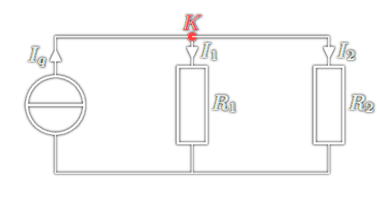

# Kirchhoff'sche Regeln

> [!QUESTION] Die Kirchhoff'schen Regeln stellen fast immer die Ausgangssituation bei der Analyse eines elektrischen Netzwerks dar

## Maschenregel

> [!SUMMARY] Spannungen, deren Zählrichtung mit der Umlaufrichtung der Masche übereinstimmt, haben ein positives Vorzeichen.  
> 
> $$M: -U_{q}+U_{1}+U_{2} = 0$$
>
> $$\Rightarrow U_{1}+U_{2} = U_{q}$$

Allgemein: $\sum_{\text{Masche}}U=0$

## Knotenregel

> [!SUMMARY] Die Summe der in einen Knoten fließenden Ströme muss gleich der Summe der aus dem Knoten herausfließenden Ströme sein. 
> 
> $$K: I_{q}=I_{1}+I_{2}$$

Allgemein: $\sum_{\text{Knoten}}I=0$

# Tags

 Warum funkionieren die Kirchhoffschenreglen? -> Beschreibeung mittels [MWG](Maxwell.md)