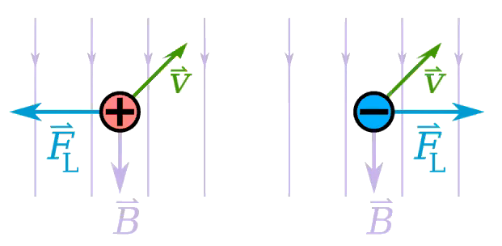
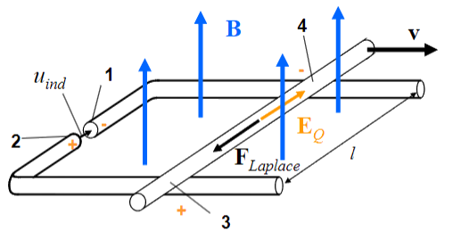

 

# Magnetische Kraft (Laplace Kraft)

> [!info] Laplace-Kraft: Magentische Kraft
> Die Kraft $\vec{F}$ auf eine mit der Geschwindigkeit $\vec{v}$ bewegte [Ladung](elektrische%20Ladung.md) $Q$ in einem Magnetfeld, welches durch die sogenannte Induktion $\vec{B}$ (auch: "magnetische Flussdichte") beschrieben wird, ist gegeben durch:
> $$ \vec{F} = Q\cdot \vec{v}\times \vec{B}$$
>
> und ist teil der [Lorentz-Kraft](Lorentz-Kraft.md).

