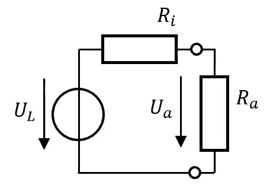

 

# Leistungsanpassung

Bei der Leistungsanpassung eines [elektrischen Netzwerks](Schaltungsanalyse.md), werden die Bauteile so gewählt, dass die [Leistung](elektrische%20Leistung.md) an der Last maximal ist.

## Beim Zweipol

$$
\begin{gathered}
U_a=U_L \frac{R_a}{R_a+R_i} \\
P_a=\frac{U_a^2}{R_a}=U_L^2 \frac{R_a}{\left(R_a+R_i\right)^2}
\end{gathered}
$$

Extremszenarien:
$R_{a} = 0$: Kurzschluss $\to$ es fällt keine Spannung ab, $P=U_{a}\cdot I$: $U_{a} = 0\implies P=0$
$R_{a} = \infty$: Leerlauf $\to$ es fließt kein [Strom](elektrischer%20Strom.md), $P = U_{a}\cdot I$: $I = 0 \implies P=0$

> [!question] Ermittlung des Maximums zwischen dieser beiden Extremfällen
> Der Abschlusswiderstand $R_{a}$ an dem die maximale [Leistung](elektrische%20Leistung.md) umgesetzt wird, lässt sich mit einem Satz aus der [Kurvendiskussion](../Mathematik/{MOC}%20Kurvendiskussion.md) ermitteln. Dieser besagt, dass wenn die erste [Ableitung](../Mathematik/mathe%20(3)/Differenzialrechnung.md) an einem Wert der Funktion 0 ergibt, dieser Punkt ein lokales [Maximum](../Mathematik/mathe%20(3)/Extremwert.md) oder [Minimum](../Mathematik/mathe%20(3)/Extremwert.md) ist.

$$
\begin{aligned}
& P\left(R_L\right)=\frac{U_{L}^2}{R_L}=\left(U \cdot \frac{R_L}{R_i+R_L}\right)^{2} \cdot \frac{1}{R_{L}}=U^{2} \cdot \frac{R_L}{\left(R_i+R_L\right)^{2}}
\end{aligned}
$$
 

$$
\begin{gathered}
\frac{d P\left(R_L\right)}{d R_L}=U^2 \cdot \frac{d}{d R_L}\left(\frac{R_L}{\left(R_i+R_L\right)^2}\right)=0 \\
\left(R_L+R_i\right)^{-2}-\frac{2 R_L}{\left(R_L+R_i\right)^3}=0 \\
\frac{1}{\left(R_L+R_i\right)^2}=\frac{2 R_L}{\left(R_i+R_L\right)^3} \\
R_i+R_L=2 R_L \\
R_i=R_L
\end{gathered}
$$