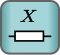
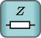
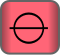
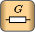
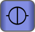
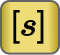
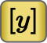

---
tags:
  - "#Schaltungsanalyse"
aliases:
  - "#Schaltungsanalyse"
  - Netzwerkanalyse
  - Duale Netzwerke
  - Schaltungsanalyse
  - elektrische Netzwerke
  - elektrisches Netzwerk
keywords: 
subject:
  - VL
  - Elektrotechnik
semester: SS24
created: 4. März 2024
professor:
  - Andreas Springer
---
 

# Lineare Netzwerke

[Duale Netzwerke – Wikipedia](https://de.wikipedia.org/wiki/Duale_Netzwerke)

> [!info] Lineare Elektrische Netzwerke erfüllen die Vorraussetzungen eines [LTI-Systems](../Systemtheorie/LTI-Systeme.md)

> [!summary] [**Duale Zweipole)**](Zweipol.md) Ideale Elementare Komponenten in Netzwerken

|  |  |  |  |  |
| :---------------: | :---------------: | :---------------: | :---------------: | :---------------: |
|  |  |  |  |  |

> [!summary] [**Vierpol-Parameter)**](../Hardwareentwicklung/Vierpol.md) Ein und Ausgangsbeziehungen von Netzwerken

|    Impedanzmatrix    |     Hybridmatrix     |     [Kettenmatrix](../Hardwareentwicklung/Kettenmatrix.md)     |    [Streuparameter](../HF-Technik/Streuparameter.md)    |
| :------------------: | :------------------: | :------------------: | :------------------: |
|  |  |  |  |
|  |  |  |                      |

## Aufbau eines Netzwerks

> [!info] Ein Netzwerk besteht im allgemeinen aus $n$-Polen ($n\geq 2$)
> Da sich $n$-Pole durch [Zweipole](Zweipol.md) modellieren lassen, betrachten wir **Nur aus Zweipolen bestehende Netzwerke**.
> - z.B lassen sich für [Transistoren](../Hardwareentwicklung/Halbleiter/{MOC}%20Transistor.md), die in der Regel drei Anschlüsse haben, Ersatzschaltbilder angeben, die Ausschließlich aus Zweipolen bestehen (siehe [Kleinsignal Ersatzschaltbild](../Hardwareentwicklung/Halbleiter/BJT%20Kleinsignalverhalten.md))
> 

Wir nehmen an, dass alle Zweipole ($R$, $L$, $C$, Quellen) bekannt sind und dass das Netzwerk aus $k$ Knoten und $z$ Zweigen.

## Systematische Analyse linearer Netzwerke

> [!info] Eine systematisches Verfahren ([Algorithmus](../Softwareentwicklung/DS-Algo/{MOC}%20Algorithmus.md)) für die Analyse ist notwendig für:
> - Analyse komplexerer Netzwerke
> - Computer gestützte Verfahren

### Verfahren Für die Analyse

- [Knotenpotentialverfahren](../Hardwareentwicklung/Knotenpotentialverfahren.md)
- [Maschenstromverfahren](Maschenstromverfahren.md)

### Grafische Netzwerkanalyse

Grafisch Hilfsmittel wie [Zeigerdiagramme](Wechselstromtechnik.md) und [Ortskurven](../Systemtheorie/Übertragungsfunktion.md) erlauben ein rasches Verständnis des Verhaltens eines Wechselstrom netzwerks

Im Zusammenhang mit den Zeigerdiagrammen werden wir uns noch mit der [Inversion von Zeigern](Wechselstromtechnik.md#Inversion%20von%20Zeigern) beschäftigen
  - um z.B. Z- oder Y-Zeigerdiagramme von Schaltungen zeichnen zu können, die eine Mischung aus Bauelementen in Serien- und Parallelschaltung enthalten

# Tags

[^1]: Für den Fall der [Wechselstromtechnik](Wechselstromtechnik.md)