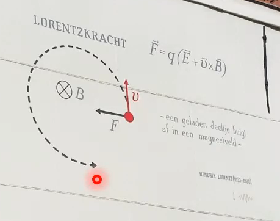

 

# Lorentz-Kraft

Ruhende [Ladungen](elektrische%20Ladung.md):
- erzeugen $\vec{E}$
- erfahren eine [elektrische Kraft](Coulomb-Kraft.md) in Anwesenheit von $\vec{E}$

Bewegte [Ladungen](elektrische%20Ladung.md):
- erzeugen $\vec{B}$
- erfahren eine [magnetische Kraft](Laplace-Kraft.md) in Anwesenheit von $\vec{B}$

Die Allgemeine Kraft auf [Ladungen](elektrische%20Ladung.md) (bei Anwesenheit beider Felder) ist die ***Lorentz-Kraft***

$$
\vec{F} = \underbrace{ Q\cdot \vec{E} }_{ \text{Coulomb Kraft} }+\underbrace{ Q\cdot \vec{v}\times \vec{B} }_{ \text{Laplace Kraft} } = Q\cdot(\vec{E}+\vec{v}\times \vec{B})
$$