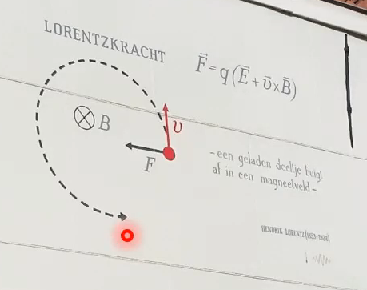

 

# Lorentz-Kraft

Ruhende [Ladungen](elektrische%20Ladung.md):
- erzeugen $\vec{E}$
- erfahren eine [elektrische Kraft](Coulomb-Kraft.md) in Anwesenheit von $\vec{E}$

Bewegte [Ladungen](elektrische%20Ladung.md):
- erzeugen $\vec{B}$
- erfahren eine [magnetische Kraft](Laplace-Kraft.md) in Anwesenheit von $\vec{B}$

> [!important] Die Allgemeine Kraft auf [Ladungen](elektrische%20Ladung.md) (bei Anwesenheit beider Felder) ist die ***Lorentz-Kraft***
> $$
> \vec{F} = \underbrace{ Q\cdot \vec{E} }_{ \text{Coulomb Kraft} }+\underbrace{ Q\cdot \vec{v}\times \vec{B} }_{ \text{Laplace Kraft} } = Q\cdot(\vec{E}+\vec{v}\times \vec{B})
> $$

> [!info] Lorentz-Kraft
> Die [Laplace Kraft](Laplace-Kraft.md) ist nur die Kraft welche aus der Bewegung der [Ladungen](elektrische%20Ladung.md) folgt.
> Wie wir wissen erzeugen Ladungsträger unabhängig von ihrem kinematischen Zustand ein [elektrisches Feld](elektrisches%20Feld.md) welches eine Kraft auf andere Ladungsträger Verursacht.
> Diese Kraft [überlagert](../Index/Superpositionsprinzip.md) sich mit der [Laplace Kraft](Laplace-Kraft.md) und wird als Lorentz Kraft bezeichnet.