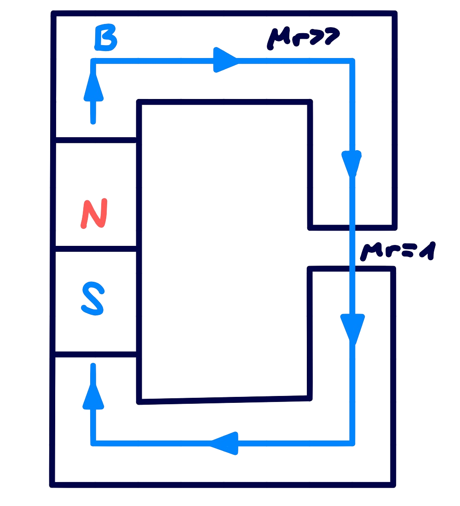
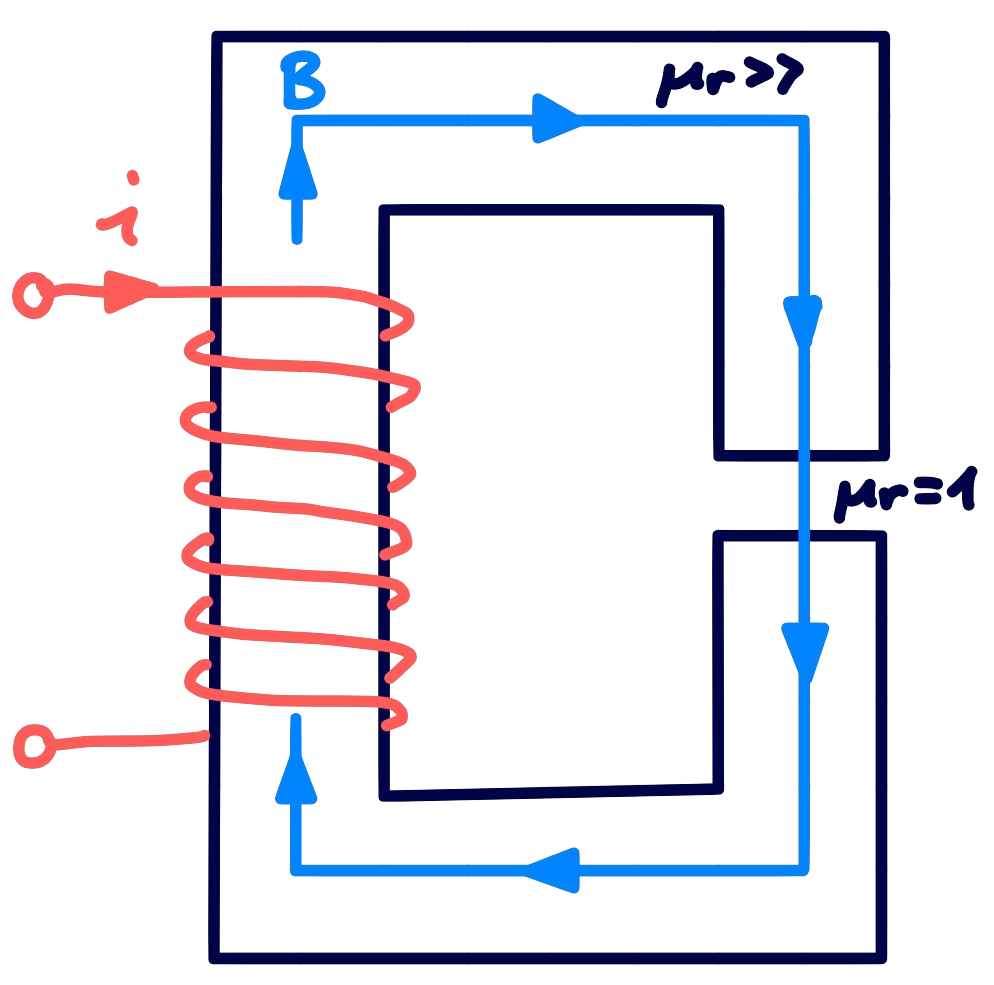

## Magnetische Quellen

> [!hint] Es gibt keine Magnetischen Monopole $\iff$ [4. Maxwell Gleichung](Maxwell.md#^MW4)

| [Permanentmagnet](../Physik/Permanentmagnet.md) | [Elektromagnet](../Physik/Elektromagnet.md) |
| :---------------------------------------------: | :-----------------------------------------: |
|         |    |

Der Permanentmagnet selbst hat einen hohen magnetischen widerstand für Fremdfelder ($\mu \approx 1.1$). Äquivalent zum Innwiderstand einer Spannungsquelle.