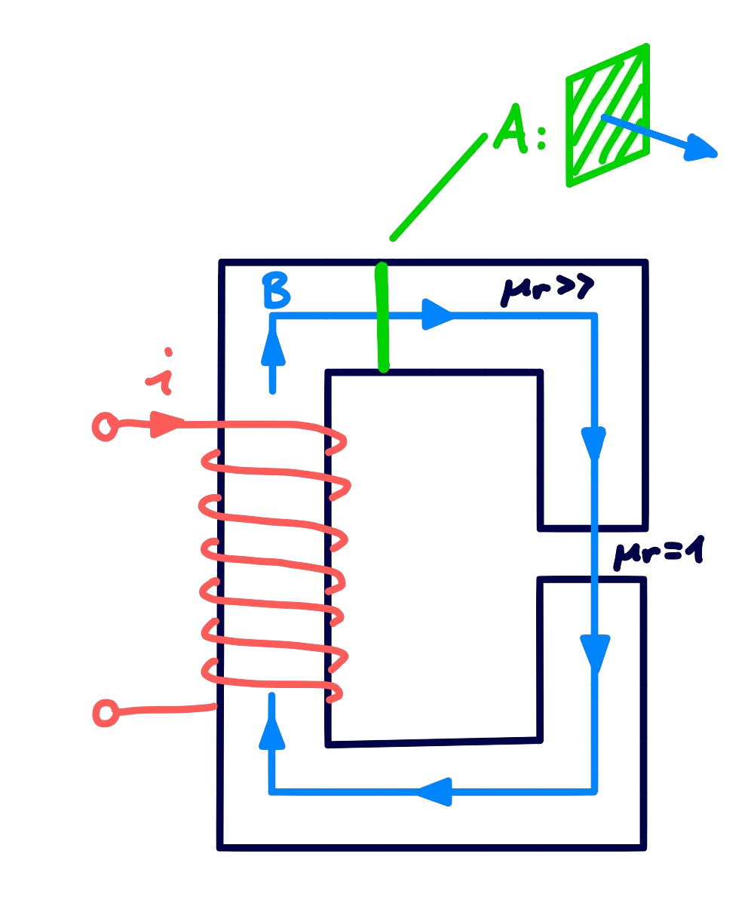
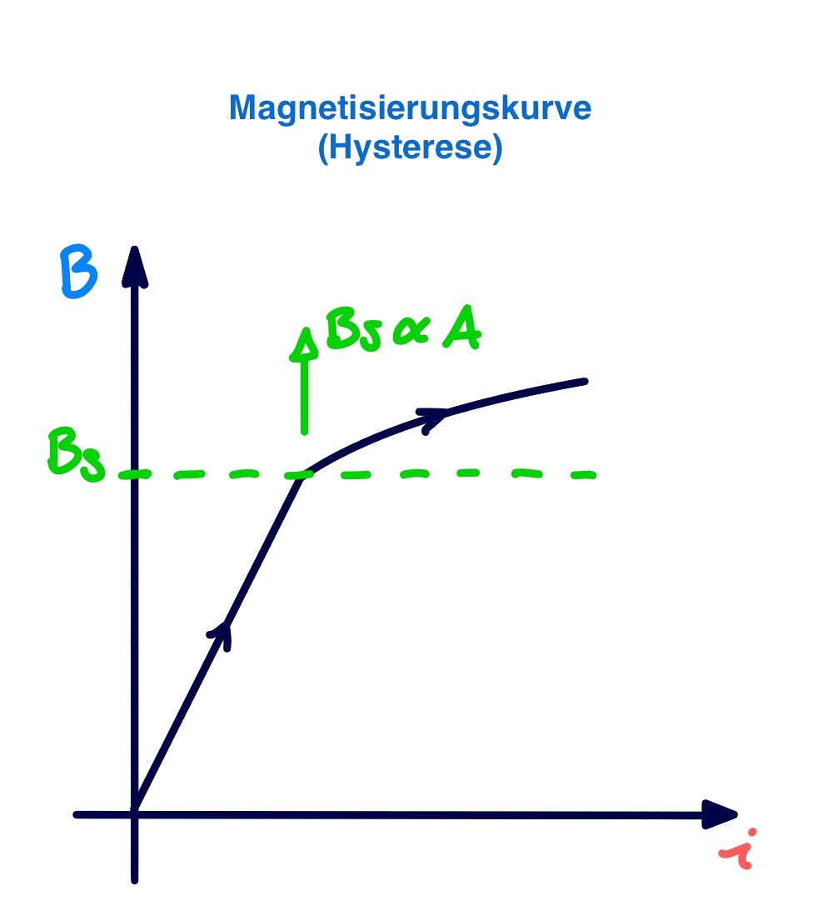
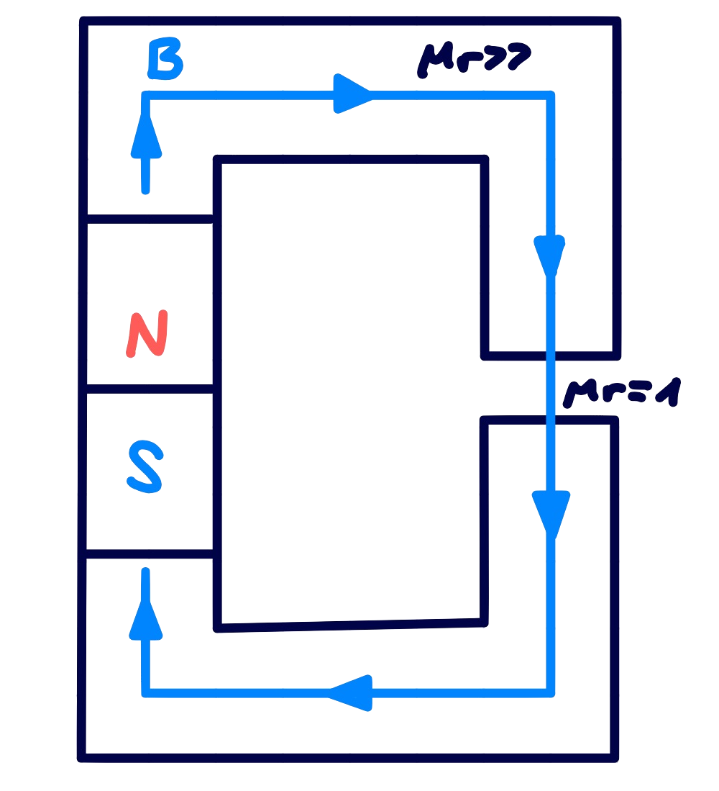
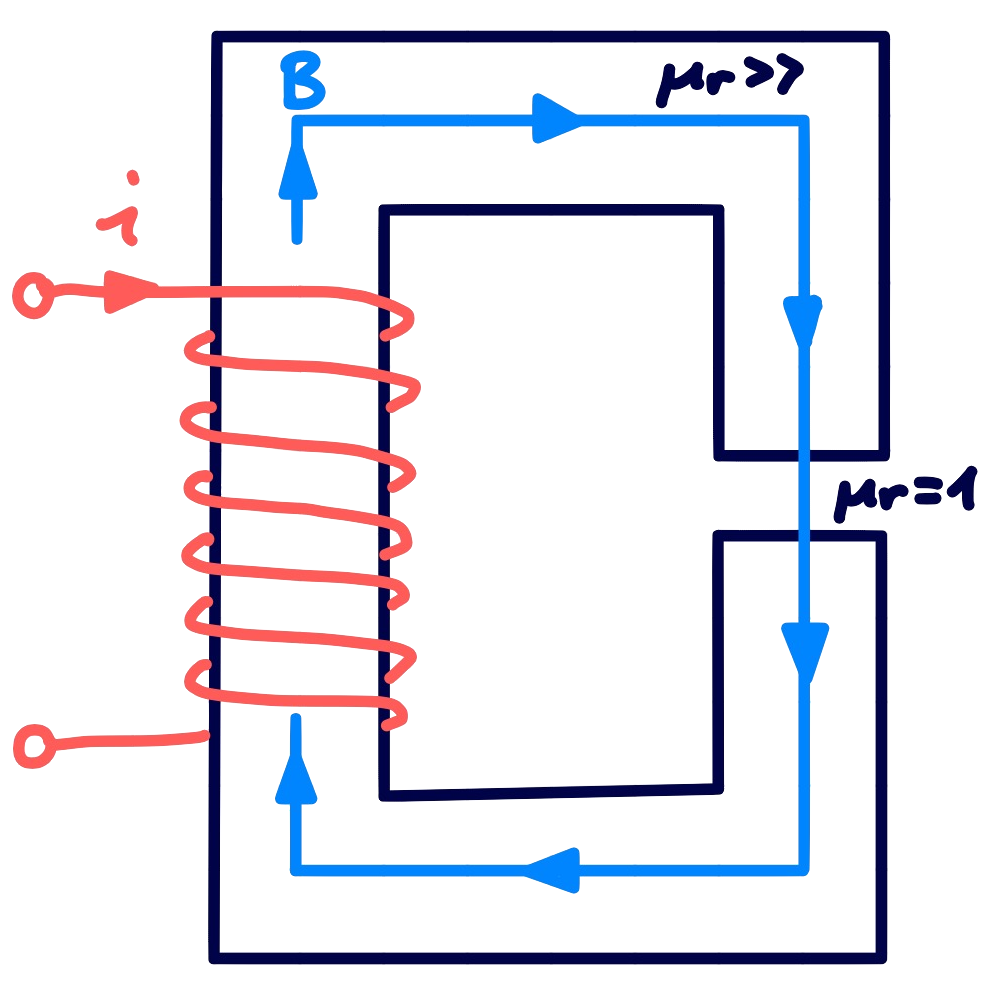
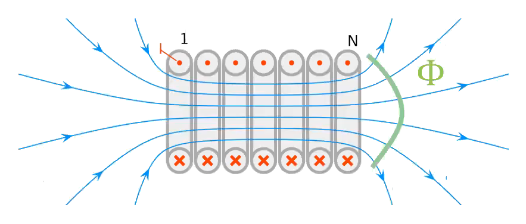
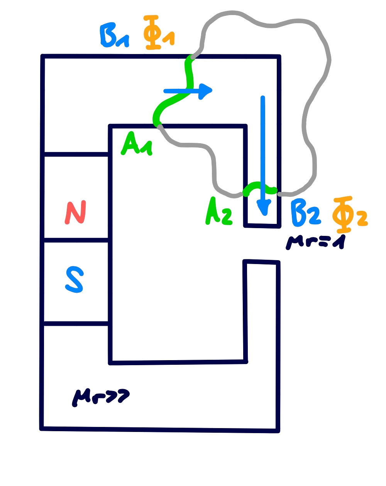
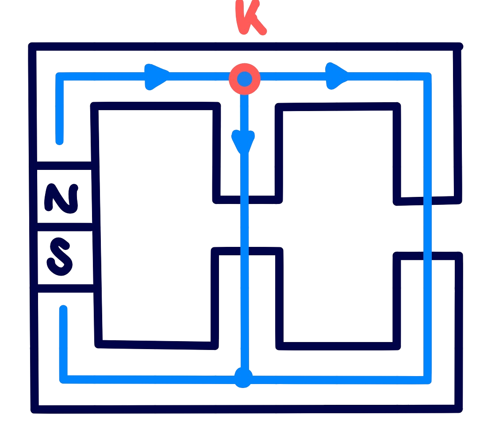

 

# Magnetisches Feld

> siehe: [elektrisches Feld](elektrisches%20Feld.md) 

> [!hint] Auf bewegte Ladungsträger innerhalb eines Magnetfelds wirkt die [magnetische Kraft](Laplace-Kraft.md):
> Die Ursache für ein magnetisches Feld sind selbst *bewegte* Ladungsträger

## Magnetfeld im Leiter

> [!info] Rechte Hand Regel
> Die Feldlinien sind konzentrische Kreise, die den stromführenden Leiter rechtswendig (s. Rechte-Hand-Regel) „umwirbeln“. 
> Feld um einen (*unendlich ausgedehnten*) langen Draht der den [Strom](elektrischer%20Strom.md) 𝐼 führt:
>
> 

Der Betrag des magnetischen Flusses $\vec{B}$ im Abstand 𝑟 der Leiterachse ist gegeben durch.

$$
B(r) = \frac{\mu_{0}\cdot I}{2\pi r} \qquad[B] = \frac{Vs}{m^{2}} = T \dots \text{Tesla}
$$

$\mu_{0} \approx 4 \pi 10^{-7} \frac{\mathrm{Vs}}{\mathrm{Am}} \ldots$ [Permeabilität](../Physik/Konstanten/Permeablität%20des%20Vakuums.md) des freien Raumes, Naturkonstante

## Materialgesetz - Permeabilität

> [!question] [Materialgesetze nach Maxwell](Maxwell.md#^MATG) für das Magnetfeld
> $$\mathbf{B}= \mu \mathbf{H}$$

Magnetische Leitfähigkeit - **Permeabilität** $\mu = \mu_{0}\cdot\mu_{r}$:
- Ein gut magnetisch leitfähiges Material möchte in einem Magnetfeld den Luftspalt minimieren.
- z.B: Aluminium ist zwar gut elektrisch Leitfähig aber nicht magnetisch

ferromagnetisch: $\mu_{r} \gg$ 
diamagnetisch: $\mu_{r}<$  (material stoßt sich vom Magnetfeld leicht ab)

### Magnetisierung und Sättigung

> [!question]  **Manetische Sättigung:** Ab einem Gewissen Strom wird der Kern des Magnetkreises nicht weiter Magnetisiert
> - Querschnitt des Magnetkreises größer machen um Sättigungsinduktion zu minimieren

|                                                                  |                                                                     |
| ------------------------------------------------------------------------------------------------------ | --------------------------------------------------------------------------------------------------------- |
| Durch das Einbringen eines Magnetfeldes durch eine Spule in den Eisenkreis, wird der kern Magnetisiert | Damit ergibt sich für die Magnetische Flussdichte über dem Strom die Hysterese- oder Magnetisierungskurve |

### Magnetische Quellen

> [!hint] Es gibt keine Magnetischen Monopole $\iff$ [4. Maxwell Gleichung](Maxwell.md#^MW4)

|          **Permanentmagneten**           |            **Elektromagneten**            |
| :--------------------------------------: | :---------------------------------------: |
|  |  |

## Magnetischer Fluss

Anstelle der lokalen Feldstärke $B$ beschreibt man das Feld auch gerne durch einen so genannten magnetischen Fluss $\Phi$, der eine bestimmte Fläche (z.B. die Querschnittsfläche eines Stabmagneten) durchsetzt.

> [!question]- Vergleich zur Stromstärke und Stromdichte: **Magnetische Flüsse** $\iff$ **Elektrische Ströme**
>  Die Beziehung zwischen diesem Fluss $\Phi$ und dem Feld B entspricht genau jener zwischen elektrischem Strom $I$ und elektrischer Stromdichte $J$
>  (obwohl im Magnetfeld nichts fließt)

$$\Phi = \int_{A}\vec{B} \cdot d\vec{A} \qquad [\Phi] = Vs = Wb\dots \text{Weber}$$

Durch die Geometrie der Wicklung der Spule wird ein Magnetfeld erzeugt, das äquivalent wäre zu $N$ Mal der Drahtfläche mit $N$ mal dem Stromfluss. Daher kann der Fluss vervielfacht werden. Es ergibt sich der Verkettete Fluss $\Psi$:

$$\Psi = N\cdot\Phi$$

### Knotenregel

Durch die Analogie mit dem Elektrischen Strom gilt hier auch die Knotenregel. Gefolgt aus der 4. Maxwellgleichung.

| Jeder Durch eine Fläche zufließender magnetische Fluss muss auch wieder abfließen  $$\Phi_{1}=\Phi_{2} \iff \int_{A_{1}}\mathbf{B}_{1}\cdot\mathrm{d}\mathbf{a}=\int_{A_{2}}\mathbf{B}_{2}\cdot\mathrm{d}\mathbf{a} $$ |  |
| ---------------------------------------------------------------------------------------------------------------------------------------------------------------------------------------------------------------------------- | ---------------------------------------- |
| Daraus ergibt sich die Knotenregel $$\sum_{K} \Phi=0 \iff \oint_{A} \mathbf{B}\cdot\mathrm{d}\mathbf{a} = 0$$                                                                                                             |  |

## Durchflutung $\Theta$

> [!question] [1. Maxwellgleichung](Maxwell.md#^MW1)

Zusammenhang mit der Windungszahl einer Induktivität: Die Durchflutung $\Theta$ ist:

$$
\oint_{ \delta A}\mathbf{H}\cdot \mathrm{d}\mathbf{s} = \int_{A}\mathbf{J}\cdot\mathrm{d}\mathbf{A} = \Theta = \sum_{v=1}^{N}i_{v}
$$

Bei einer einfachen Spule: $\Theta = N\cdot i$

# Flashcards

Was beschreibt der magnetische Fluss
?
Genau wie beim elektrischen Strom kann der Strom nur durch eine Fläche definiert werden.
Um die Größe des Magnetfelds darzustellen kann der Fluss durch eine Fläche bestimmt werden (z.B. Der Querschnitt einer [Spule](Induktivitäten.md))
$I = \int  \vec{J}\cdot d\vec{A} \iff \Phi = \int \vec{B}\cdot d\vec{A}$
<!--SR:!2024-03-16,1,230-->
