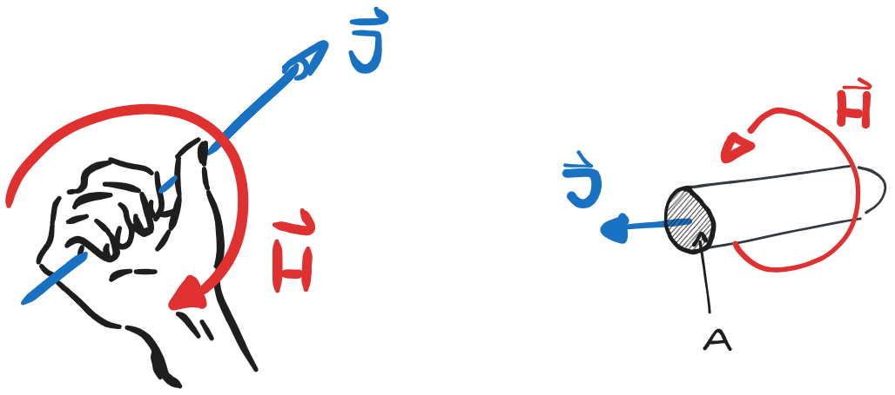

 

# Magnetisches Feld

> [!question] [elektrisches Feld](elektrisches%20Feld.md) :LiRefreshCcw:

---

> [!hint] Auf bewegte Ladungsträger innerhalb eines Magnetfelds wirkt die [magnetische Kraft](Laplace-Kraft.md):
> Die Ursache für ein magnetisches Feld sind selbst *bewegte* Ladungsträger

## 🗺️ Map of Content

- [Materialgesetz - Permeabilität](../Physik/Konstanten/Permeablität.md)
- [Magnetische Quellen](Magnetische%20Quellen.md) - Magnete
- [Magnetischer Fluss](Magnetischer%20Fluss.md) - $\Phi$
- [Durchflutung](Durchflutung.md) - $\Theta$
- [Reluktanz](Maschinen/Reluktanz.md) - $\mathfrak{R}$
- [Magnetkreis](Maschinen/Magnetkreis.md) - Schematischer Aufbau von Anwendungen

## Magnetfeld im Leiter

Der Betrag des magnetischen Flusses $\mathbf{B}$ im Abstand $r$ der Leiterachse ist gegeben durch. 

$$
B(r) = \mu_{0}H(r) = \mu_{0}\frac{I}{2\pi r} \qquad[B] = \frac{Vs}{m^{2}} = T \dots \text{Tesla}
$$

> [!info] Rechte Hand Regel
> Die Feldlinien sind konzentrische Kreise, die den stromführenden Leiter rechtswendig (s. Rechte-Hand-Regel) „umwirbeln“. Feld um einen (*unendlich ausgedehnten*) langen Draht der den [Strom](elektrischer%20Strom.md) 𝐼 führt:
>
> 

## Elektromechanische Energieumwandlung

Für die Umwandlung der Energie im elektromechanischen Wandler gilt der [Energieerhaltungssatz](Energieerhaltung.md)

$$
\mathrm{d}W_{\text{el}} = \mathrm{d}W_{\text{mech}} + \mathrm{d}W_{\text{mag}} + \mathrm{d}W_{\text{V}}
$$
mit

- $\mathrm{d}W_{\text{el}}$ ... Aufgenommene elektrische Energie
- $\mathrm{d}W_{\text{mech}}$ ... mechanische Arbeit
- $\mathrm{d}W_{\text{mag}}$ ... magnetisch gespeicherte Energie 
- $\mathrm{d}W_{\text{V}}$ ... Verluste

Eine Änderung der Arbeit leifert analog die Leistung

$$
P_{\text{el}} = P_{\text{mech}} + \frac{\mathrm{d}W_{\text{mag}}}{\mathrm{d}t} + P_{\text{v}}
$$

---

# Flashcards

> [!question] Was beschreibt der magnetische Fluss
> 
?
> > [!success] Genau wie beim elektrischen Strom kann der Strom nur durch eine Fläche definiert werden.
> > Um die Größe des Magnetfelds darzustellen kann der Fluss durch eine Fläche bestimmt werden (z.B. Der Querschnitt einer [Spule](Induktivität.md))
> > $I = \int  \vec{J}\cdot d\vec{A} \iff \Phi = \int \vec{B}\cdot d\vec{A}$
<!--SR:!2024-03-16,1,230-->
