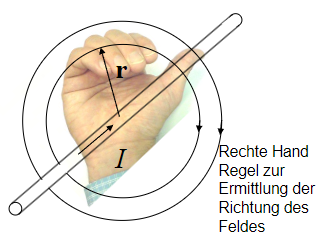
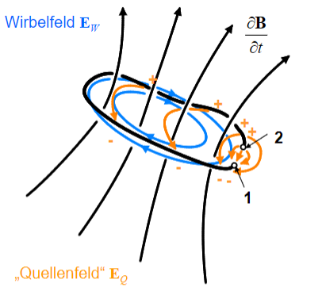
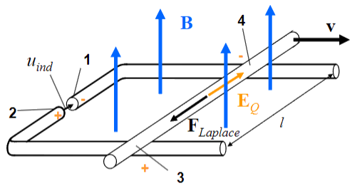

 

# Magnetisches Feld

> siehe: [elektrisches Feld](elektrisches%20Feld.md) 

> [!info] Auf bewegte Ladungsträger innerhalb eines Magnetfelds wirkt die [magnetische Kraft](Laplace-Kraft.md):
> - Die Ursache für ein magnetisches Feld sind selbst *bewegte* Ladungsträger
>   - z.B elektrische Ströme

> [!info] [Laplace-Kraft](Laplace-Kraft.md): Magentische Kraft
> Die Kraft $\vec{F}$ auf eine mit der Geschwindigkeit $\vec{v}$ bewegte [Ladung](elektrische%20Ladung.md) $Q$ in einem Magnetfeld, welches durch die sogenannte Induktion $\vec{B}$ (auch: "magnetische Flussdichte") beschrieben wird, ist gegeben durch:
> $$ \vec{F} = Q\cdot \vec{v}\times \vec{B}$$
>
> und ist teil der [Lorentz-Kraft](Lorentz-Kraft.md).

## Magnetfeld im Leiter

> [!info] Rechte Hand Regel
> Feld um einen (*unendlich ausgedehnten*) langen Draht der den [Strom](elektrischer%20Strom.md) 𝐼 führt:
>  Die Feldlinien sind konzentrische Kreise, die den stromführenden Leiter rechtswendig (s. Rechte-Hand-Regel) „umwirbeln“. 

Der Betrag des magnetischen Flusses $\vec{B}$ im Abstand 𝑟 der Leiterachse ist gegeben durch.

$$
B(r) = \frac{\mu_{0}\cdot I}{2\pi r} \qquad[B] = \frac{Vs}{m^{2}} = T \dots \text{Tesla}
$$

$\mu_{0} \approx 4 \pi 10^{-7} \frac{\mathrm{Vs}}{\mathrm{Am}} \ldots$ [Permeabilität](../Physik/Konstanten/Permeablitätskonstante%20des%20Vakuum.md) des freien Raumes, Naturkonstante

## Der magnetische Fluss

Anstelle der lokalen Feldstärke B beschreibt man das Feld auch gerne durch einen so genannten magnetischen Fluss $\Phi$, der eine bestimmte Fläche (z.B. die Querschnittsfläche eines Stabmagneten) durchsetzt.

> [!question]- Vergleich zur Stromstärke und Stromdichte:
>  Die Beziehung zwischen diesem Fluss $\Phi$ und dem Feld B entspricht genau jener zwischen elektrischem Strom $I$ und elektrischer Stromdichte $J$
>  (obwohl im Magnetfeld nichts fließt)

$$\Phi = \int_{A}\vec{B} \cdot d\vec{A} \qquad [\Phi] = Vs = Wb\dots \text{Weber}$$

Durch die Geometrie der Wicklung der Spule wird ein Magnetfeld erzeugt, das äquivalent wäre zu $N$ Mal der Drahtfläche mit $N$ mal dem Stromfluss. Daher kann der Fluss vervielfacht werden. Es ergibt sich der Verkettete Fluss $\Psi$:

$$\Psi = N\cdot\Phi$$

## Induktionsphänomene

Induktionsphänomene kamen bisher nicht vor, weil wir und nicht um Zeit Abhängigkeiten des Feldes gekümmert haben. Diese Phänomene treten nämlich nur in *Wechselfeldern* auf.

### Ruheinduktion

Ein magnetisches Wechselfeld erzeugt elektrische Wirbelfelder - dies bedeutet, dass geschlossene elektrische Feldlinien auftauchen!

> [!info] Ein sich zeitliches wechselndes Magnetfeld wird von einem elektrischen Feld *linkswendig* umwirbelt 
> Es wird also nicht durch Ladungen erzeugt, sondern durch die Änderung des magnetischen Feldes. (Warum wissen wir nicht -> Naturgesetz)

Wenn man einen Leiter entlang des Wirbelfeldes $\vec{E}_{W}$ legt, verschieben sich die Ladungen entlang des Leiters und an den Klemmen entsteht ein [Potenzialdifferenz](elektrische%20Spannung.md).

es ergibt sich die *induzierte* Spannung:

$$u_{ind}=\frac{d\Phi}{dt}$$

> [!hint]- zweite Maxwell-Gleichung 
> Diese Wirbelfelder werden durch das Faraday'sche Gesetz (2. MWG) beschrieben:
> $$\oint \vec{E} \cdot d \vec{s}=-\int \frac{\partial \vec{B}}{\partial t} \cdot d \vec{A}$$
> In dem minus steckt die *linkswendigkeit* des umwirbelnden E-Felds.
> Die Fläche ist jene die der Leiter Aufspannt.
> Im statischen Fall entspricht das der bereits bekannten Beziehung $\oint \vec{E}\cdot d\vec{s} = 0$

### Bewegungsinduktion

![[../assets/Excalidraw/Drawing 2024-03-13 10.24.40.excalidraw]]

