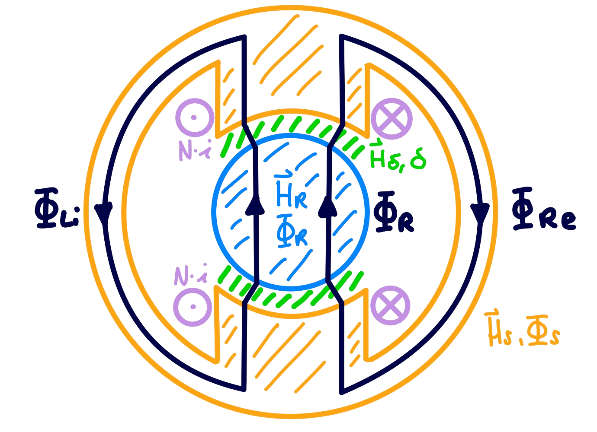

 
# Magnetkreis

Ein Magnetkreis ist die schematische Darstellung einer Zusammenschaltung aus magnetischen Elementen. Durch ihn wird veranschaulicht in welcher Quantität diese Elemente mit dem magnetischen Fluss durchströmt sind.   

**Elemente im Magnetkreis**

- [Magnetische Quellen](Magnetische%20Quellen.md) - Magnete
- Magnetisch Leitfähige Verbindungen - Eisenkreis
- Speicherung der Magnetischen Energie - Luftspalt

**Prinzipien**

- [Reluktanz Prinzip](Reluktanz.md#^RelPrinz)

## Wichtige Kenngrößen und Zusammenhänge

|                   |                im magnetischen Kreis                 |             im elektrischen Kreis             |                     |
| ----------------: | :--------------------------------------------------: | :-------------------------------------------: | :------------------ |
|       magn. Fluss |                        $\Phi$                        |                      $I$                      | Strom               |
| magn. Flussdichte |             $\mathbf{B}=\mu \mathbf{H}$              |        $\mathbf{J}=\sigma \mathbf{E}$         | Stromdichte         |
|     Permeabilität |                        $\mu$                         |                   $\sigma$                    | Leitwert            |
|         Reluktanz |           $\mathfrak{R}=\dfrac{l}{\mu A}$            |            $R=\dfrac{l}{\sigma A}$            | Impedanz            |
|    magn. Spannung |              $V = \mathfrak{R} \cdot I$              |                 $U=R\cdot I$                  | Spannung            |
|      Durchflutung | $\Theta = \oint \mathbf{H}\cdot\mathrm{d}\mathbf{s}$ | $u=\oint \mathbf{E}\cdot\mathrm{d}\mathbf{s}$ | induzierte Spannung |

## Entwurf

Entwurfsrichtlinien:

- Ausreichender Eisenquerschnitt
    - Kleinere Fläche -> höhere Flussdichte daher frühere Sättigung -> Nicht linearer bereich
- große Luftspaltfläche, kleine Luftspaltlänge
- Symmetrischer Aufbau

---

## Beispiel eines Magnetkreises

Modellbild einer Zweipoligen Maschine mit zwei Statorspulen:

$$\underset{ \longleftarrow }{ \Phi_{Li} } = \underset{ \longrightarrow }{ \Phi_{Re} } = \frac{1}{2} \Phi_{S}$$

|                                 | Feldstärke            | Fluss                            | Abstand / Länge |
| ------------------------------- | --------------------- | -------------------------------- | --------------- |
| $\color{orange}\text{Stator}$   | $\mathbf{H}_{S}$      | $\Phi_{S}=\Phi_{Re} + \Phi_{Li}$ | $l_{S}$         |
| $\color{lightblue}\text{Rotor}$ | $\mathbf{H}_{R}$      | $\Phi_{R}$                       | $l_{R}$         |
| $\color{green}\text{Luftspalt}$ | $\mathbf{H}_{\delta}$ | $\Phi_{R}$                       | $\delta$        |

|                                       | Windungszahl | elektrischer Strom |
| ------------------------------------- | ------------ | ------------------ |
| $\color{magenta}\text{Erregerspulen}$ | $N$          | $i$                |

Durchflutung:

$$
\Theta = \oint_{L} \mathbf{H}\cdot\mathrm{d}\mathbf{s} = \sum_{v=1}^{N}i_{v}
$$

Das Ringintegral wird zur Maschengleichung:

