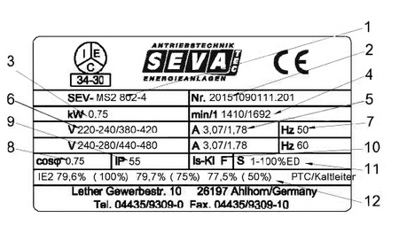

---
tags:
aliases:
keywords:
subject:
  - VL
  - Elektrische Maschinen und Antriebselektronik
semester: SS25
created: 1st May 2025
professor:
release: false
title: GSM-Typenschild
---

# GSM - Typenschild

Nenndaten zum [dynamischen Betriebsverhalten](Gleichstrommaschine.md#Dynamisches%20Betriebsverhalten) einer Gleichstrommaschine

1) Type (letzte Stelle = Anzahl Pole)  
2) Seriennummer  (1. vier Stellen = Herstellungsjahr)  
3) Nennleistung  
4) Nenndrehzahl  
5) Nennstrom  
6) Nennspannung  
7) Nennfrequenz  
8) Leistungsfaktor  
9) Schutzart  
10) Isolationsklasse  
11) Betriebsart  
12) Wirkungsgrad