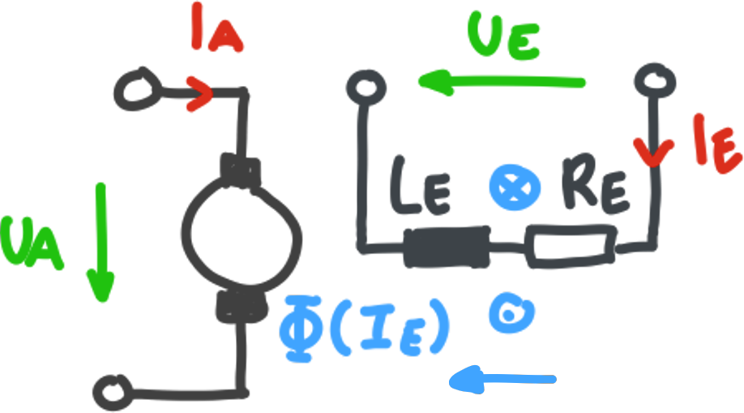
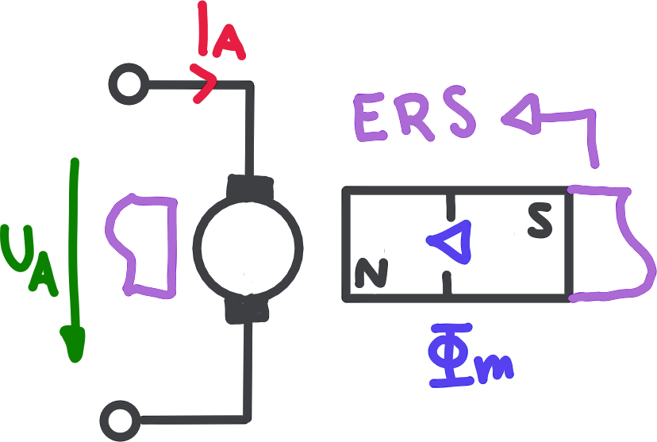

# Gleichstrommaschine

> [!info] **Merkmale:**
> - Spulenwicklung im Rotor
> - Bürste

Auf dem **Typenschild** sind die normierter **Nenngrößen** zu finden.

- [GSM-Typenschild](GSM-Typenschild.md) 

## Aufbau

### Stator / Erreger

Der **Stator / Erreger** wird mit einem Konstanten *Erregerfluss* durchströmt, welcher durch EM bzw PM erzeugt wird.

Arten der Erregung:
- [[#Fremderregung]]
- [Nebenschlusserregung](#Nebenschlusserregung)
- [Reihenschlusserregung](#Reihenschlusserregung)

### Rotor / Anker

Im **Rotor / Anker** befinden sich beliebg Viele wicklungen die im Kreis Angeordnet sind. Die **Kontakte** der wicklungen sind am Schaft der Maschine freigestellt und kontaktieren die Bürsten.

### Kommutator

Durch den **Kommutator / Stromwender** wird die Stromrichtung immer so *umgekehrt*, dass sich die momentan bestromten Rotorwicklungen geschickt zum Nächstgelegenen Pol *anzieht* bzw *abstößt*. Dies wird allein durch geschickte verdrahtung der Rotorwicklungskontakte erzielt

## Funktionsweise

> [!hint] Der **Fluss durch die Rotorwicklung** (normal zur Wicklungsebene) möchte immer in die *selbe Richtung* wie der **Erregerfluss** zeigen.
> Es werden demnach Kräfte exorziert, die das Drehmoment erzeugen.

**Zustand 1)** $I_{A}: A\to B$

Die Kontakte des Kommutators (A-a, B-b) weisen eine interne Verbindung auf.

**Zustand 2)** $I_{A}: b\to a$

Der Rotor hat sich um $90°$ gedreht. Hier wird ersichtlich wie der Stromwender funktioniert.

## Stationäres Betriebsverhalten

Berechnungsgrundlagen zum stationären Betriebsverhalten **fremderregter** GSM. Bei anderen [Erregermethoden](#Schaltungsvarianten) gibt es dann zusätzlich Zusammenhänge zwischen den Kenngrößen.

### Kenngrößen

| Kenngröße                                                       | Ausdruck               | Einheit  | Anmerkung                            |
| --------------------------------------------------------------- | ---------------------- | -------- | ------------------------------------ |
| Drehmoment                                                      | $M$                    | $Nm$     |                                      |
| Drehzahl                                                        | $\omega = 2\pi n$      | $s^{-1}$ | Für $n$ Umdrehungen pro Sekunde      |
| [Induzierte Spannung](../Induktivität.md#Induzierte%20Spannung) | $U_{q}$                | $V$      |                                      |
| Ankerpannung                                                    | $U_{A}$                | $V$      | Mit Verlust über die Ankerimpedanzen |
| Ankerwiderstand                                                 | $R_{A}$                | $\Omega$ |                                      |
| Ankerinduktivität                                               | $L_{A}$                | $H$      |                                      |
| Erregerwiderstand                                               | $R_{E}$                | $\Omega$ |                                      |
| Erregerinduktivität                                             | $L_{E}$                | $H$      |                                      |
| Erregerfluss                                                    | $\Phi_{E}$ bzw. $\Phi$ | Vs       | Verketter Fluss $\Psi = N \Phi$      |
| Maschinenkonstante                                              | $c=2\pi\bar{c}$        | $1$      |                                      |

### Ersatzschaltbild

Der Drehsinn des Drehmoments kann wieder daran bestimmt werden, dass der Ankerfluss die Richtung des Erregerflusses über die kürzeste Bewegung anstrebt. 

Dieses Schaltbild kann stationär immer so betrachtet werden, da es im Rotor immer eine Ankerwicklung in dieser Position gibt.

### Gleichungen

Die Gleichstrommaschine ist ein reziprokes elektromechanisches System und kann daher als Gleichstrommotor bzw. -generator behandelt werden. Wegen dieser Eigenschaft ist die **mechanischen Leistung** (mit allen Verlusten einbezogen) gleich der inneren **elektrische Leistung** (ohne Leistungsumsetzung am Ankerwiderstand).

$$
P_{\mathrm{m}} = P_{\mathrm{el}}
\implies \omega M=U_\mathrm{q}I_\mathrm{A}
\implies M = \frac{U_\mathrm{q}}{\omega} I_\mathrm{A}
$$

|       $\omega$        | $M$        |       $U_{q}$       | $I_{A}$    |
| :-------------------: | :--------: | :-----------------: | :--------: |
| Winkelgeschwindigkeit | Drehmoment | Induzierte Spannung | Ankerstrom |

Zur Beschreibung des Stationäres Betriebsverhalten der DC-Maschine gibt es Gleichungen:

> [!satz] **S1 - ANKG)** Ankergleichungen ^ANKG
> 
> $$
> \begin{align}
> U_\mathrm{A} &= R_\mathrm{A}I_\mathrm{A}+U_{q}(\omega)\tag{1} \\
> U_{q} &= \frac{\mathrm{d}\Psi_{\mathrm{E}}}{\mathrm{d}t} = c\Phi_{\mathrm{E}} n =\bar{c}\Phi_{\mathrm{E}} \omega \tag{2}\\
> M &= \frac{U_{\mathrm{q}}}{\omega}I_{\mathrm{A}} = \frac{c\Phi_\mathrm{E}}{2\pi} I_\mathrm{A} = \bar{c}\Phi_\mathrm{E} I_{\mathrm{A}} \tag{3}
> \end{align} 
> $$

Zu **(2)**: $\Psi\to\Phi$ da die Windungszahl der Ankerwicklung in der Maschinenkonstante $c$ steckt.

### Wirkungsgrad

Verluste Treten in Form von elektrischer Leistung am Ankerwiderstand $R_{\mathrm{A}}$ auf.

$$
\eta = \frac{P_{\mathrm{A}}}{P_{\mathrm{m}}} = \frac{I_{\mathrm{A}}^{2}R_{\mathrm{A}}}{\omega M} \cdot100\%
$$

## Dynamisches Betriebsverhalten

Beim dynamischen Betriebsverhalten werden Änderungen des Betriebspunktes ($n$, $M$, $I_{A}$) mit berücksichtigt.

#todo Betriebspunkte erläutern. Kennlinen einfügen.

Es gilt die [Ankerspannungsgleichung](#^ANKG) und es werden zusätzlich Nenngrößen definiert. Es wird statt der *inneren* elektrische Leistung die *gesamte* elektrischen Leistung mit einem *Wirkungsgrad* angegeben. 

Diese Nenngrößen beziehen sich auf den **Anker**. Das heißt $I_{\mathrm{N}}$ und $U_{\mathrm{N}}$ sind Ankerstrom / -spannung im **Betriebspunkt**.

> [!def] **D1 - NENN)** Zusammenhang der
> $$
> P_{\mathrm{N}} = U_{\mathrm{N}}I_{\mathrm{N}} \eta = \omega_\mathrm{N} M_\mathrm{N}, \quad \omega_{\mathrm{N}} = 2\pi n_{\mathrm{N}}
> $$

Unter Angabe des Trägheitsmomentes $J$ der Maschine gilt der Drallsatz

## Schaltungsvarianten

Die Zusammenschaltung von Erreger- und Ankerwicklung kann in verschiedener Weise erfolgen. Wichtige Größen und Konzepte sind: 

- [Reluktanz](Reluktanz.md)
- [Magnetkreis](Magnetkreis.md)
- [koerzitiv Feldstärke](../../Physik/Permanentmagnet.md)

### Fremderregung

Bei der fremderregten Maschine sind Erreger- und Ankerwicklung schlatungsmäßig voneinander entkoppelt. Diese Variante wird besonders für drehzahlgeregelte Antriebslösungen herangezogen.

$$
\Phi(I_{\mathrm{E}}) = \frac{\Theta}{\mathfrak{R}}=\frac{NI_{\mathrm{E}}}{\mathfrak{R}}
$$

- $N$ sind die Anzahl an Wicklungen der Spule $L_{\mathrm{E}}$.
- $\mathfrak{R}$ ist der magnetische Widerstand des Eisenrückschlusses (Magnetkreis nicht eingezeichent)

Die Reihenschlussmaschine kann - anders als die Nebenschlussmaschine - auch mit Wechselstrom betrieben werden.

#### Permanentmagnet-Erregung

Hier wird statt einer Erregerinduktivität (mit Eisenrückschluss) ein Permanentmagnet mit Eisenrückschluss verwendet, um den Erregerfluss zu erzeugen.

$$
\Phi = \frac{\Theta_{c}'}{\mathfrak{R}_{\mathrm{pm}}+\mathfrak{R}} = \frac{H_{c}'l_{\mathrm{pm}}}{\mathfrak{R}_{\mathrm{pm}}+\mathfrak{R}}, \quad
U_{\mathrm{A}} = c\Phi n
$$

- $H_{c}'$ ist die linearisierte Koerzitivfeldstärke des Permanentmagenten
- $l_{\mathrm{pm}}$ ist die Länge des Magneten
- $\mathfrak{R}_{\mathrm{pm}},\mathfrak{R}$ sind die Reluktanzen vom Permentmagnet und dem Restlichen Eisenkreis.

### Nebenschlusserregung

In der Nebenschlussmaschine liegen die Erreger- und Ankerwicklung parallel zueinander am Netz. Das Erregerfeld wird direkt durch die Netzspannung eingeprägt.

$$
\Phi(I_{\mathrm{E}}) = \frac{\Theta}{\mathfrak{R}} = \frac{N}{\mathfrak{R}} I_{\mathrm{E}}, \quad
U_{\mathrm{A}} = c\Phi(I_{\mathrm{E}}) n, \quad
I_{\mathrm{E}}=\frac{U_{\mathrm{A}}}{R_{\mathrm{E}}}
$$

- $N$ sind die Anzahl an Wicklungen der Spule $L_{\mathrm{E}}$.
- $\mathfrak{R}$ ist der magnetische Widerstand des Eisenrückschlusses (Magnetkreis nicht eingezeichnet)
- Hier ist $I_{\mathrm{E}}$ vom $U_{\mathrm{A}}$ Abhängig.

### Reihenschlusserregung

Im Gegensatz zur Nebenschlusserregung sind hier die beiden Wicklungen hintereinandergeschaltet. Der Erregerstrom entspricht daher dem Ankerstrom. Dies bedeutet, dass die Felderregung belastungsabhänging erfolgt. 

$$
\begin{gathered}
\Phi(I) = \frac{\Theta}{\mathfrak{R}} = \frac{N}{\mathfrak{R}} I,\quad
U_{\mathrm{A}} = U_{\mathrm{q}} + IR_{\mathrm{E}} ,\quad U_{\mathrm{q}} = c\Phi(I) n \\
M = \frac{P_{\mathrm{el}}}{\omega} = \frac{U_{\mathrm{q}}I}{\omega} = \frac{cNI^{2}n}{\omega \mathfrak{R}} = \frac{cN}{2\pi \mathfrak{R}} I^{2}
\end{gathered}
$$

Üblicherweise wird auch der Ausdruck $\dfrac{N}{\mathfrak{R}}$ zu einer Magnetkreiskonstante $c_{1}$ zusammengefasst.

## Nutrastmomente

> [!hint] **Nutrastmomente:** Sind die Einrastungen die man spürt, wenn man einen unbestromten DC-Motor Dreht.
> In DC-Motoren sind im Rotor Nuten wo die Spuleneingelassen sind. An dieser Nut gibt es einen größeren Lufspalt, wobei der Fluss auch an der Seitenfläche der Nut eintritt, welches ein Positives / Negatives Moment verursacht. Dadurch entstehen Ripple im Drehmoment. 

In Summe sind diese Momente $0$: $\int M_{c}(\varphi) \mathrm{~d}\varphi_{r}=0$

---

- https://www.youtube.com/watch?v=U6bHUksgnMg