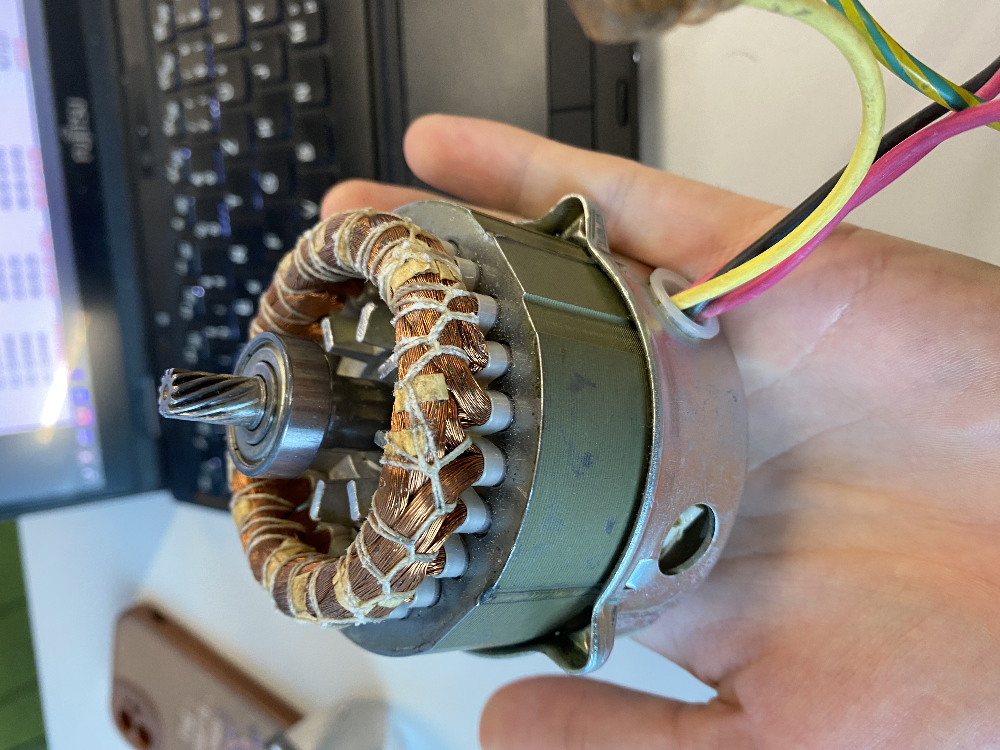
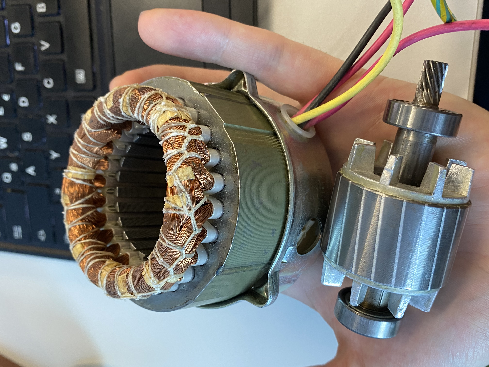

 

# Synchronmaschine

**Funktion:** Es werden im Stator Pole nacheinander im Kreis geschalten welchen der Rotor folgt
**Merkmale:** Drehzahl entspricht genau der Frequenz mit der die Pole geschalten werden

|  |  |
| --------------------------- | --------------------------- |
