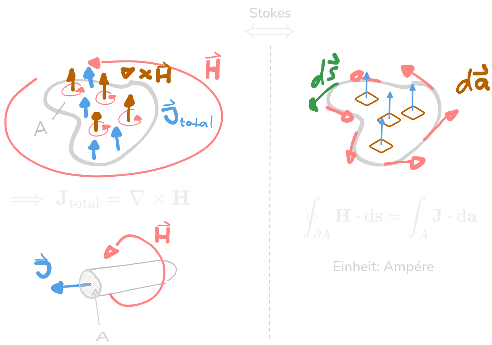
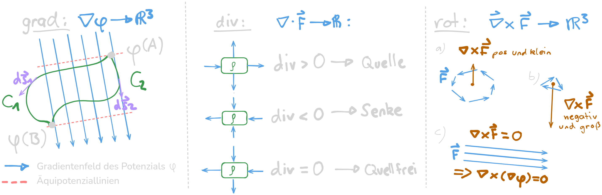

---
tags:
aliases:
  - Durchflutungssatz
  - MWG
  - Gaußsches Gesetz
keywords:
  - GHFT-V1
subject:
  - VL
  - Elektrotechnik
  - Grundlagen der Hochfrequenztechnik
semester: WS25
created: 15th January 2026
professor:
  - Bernhard Jakoby
def:
  - M1
  - M2
  - M3
satz:
  - MW1
  - MW2
  - MW3
  - MW4
release: true
title: Maxwell Gleichungen
---

# Maxwell Gleichungen

1. [MWG](#1.%20MWG%20-%20Durchflutungssatz): Durchflutungssatz nach Ampère
2. [MWG](#2.%20MWG%20-%20Induktionsgesetz): Induktionsgesetz nach Faraday
3. [MWG](#3.%20MWG%20-%20Gaußsches%20Gesetz): Gaußsches Gesetz: $\mathbf{D}$ ist ein Quellenfeld
4. [MWG](#4.%20MWG%20-%20Quellenfreiheit%20des%20B-Feldes): $\mathbf{B}$ ist Quellfrei

## Übersicht

|    Symbol    | Bedeutung                                         |                                               |             Einheit             |
| :----------: | :------------------------------------------------ | :-------------------------------------------- | :-----------------------------: |
|  $\mathbf{E}$ | [elektrische Feldstärke](Elektrisches%20Feld.md)  | Intesitätsgröße                               | $\operatorname{V} / \mathrm{m}$ |
|  $\mathbf{B}$ | [magnetische Flussdichte](Magnetisches%20Feld.md) | Intesitätsgröße                               |  $\mathrm{Vs} / \mathrm{m}^2$   |
|  $\mathbf{H}$ | magnetische Feldstärke                            | Quantitätsgröße                               |    $\mathrm{A} / \mathrm{m}$    |
|  $\mathbf{D}$ | elektrische Flussdichte                           | Quantitätsgröße                               |  $\mathrm{As} / \mathrm{m}^2$   |
|  $\mathbf{J}$ | elektrische [Stromdichte](Stromdichte.md)         |                                               |   $\mathrm{A} / \mathrm{m}^2$   |
|  $\mathbf{M}$ | magnetische Stromdichte                           | (fiktive größe, vereinfacht oft Berechnungen) |   $\mathrm{V} / \mathrm{m}^2$   |
|    $\rho$    | Raumladungsdichte                                 |                                               |  $\mathrm{As} / \mathrm{m}^3$   |

Fettgedruckte Größen sind Vektorfelder mit den wichtigsten $\mathbf{E}$ und $\mathbf{B}$. Alle diese Vektorfelder hängen sowohl vom ort als auch von der Zeit ab:

$$
\mathbf{E,B,H,D,J} : \mathbf{F}(x,y,z,t)
$$

Mit $x,y,z$ als kartesische Koordinaten. Es sind auch Polar- $(r,\theta,\varphi)$ oder Zylinderkoordinaten $(r,h,\varphi)$ möglich.

Für spezielle Bedingungen können die Maxwellgleichungen auch in [Phasorschreibweise](Wechselstromtechnik.md#Phasorschreibweise%20der%20Maxwellgleichungen) Angeschreieben werden.

## Differentielle und integrale Formulierung

Die Umrechnung zwischen der differentiellen und integralen Formulierung der Maxwell Gleichung erfolgt mit den Integralsätzen:

| [Divergenz](../Mathematik/Analysis/Vektoranalysis/Divergenz.md)              |     [Rotor](../Mathematik/Analysis/Vektoranalysis/Rotor.md)     |
| :--------------------------------------------------------------------------: | :-------------------------------------------------------------: |
|  |  |

### 1. MWG - Durchflutungssatz

> [!quote] Auch *Ampèresches Gesetz*

| **differentielle Form**                                                                                                              | **Integralform**                                                                                                                                                                               |
| ------------------------------------------------------------------------------------------------------------------------------------ | ---------------------------------------------------------------------------------------------------------------------------------------------------------------------------------------------- |
| Die Wirbel des Magnetfelds hängen von der Leitungsstromdichte $\mathbf{J}_{l}$ und von der elektrischen Flussdichte $\mathbf{D}$ ab. | Die magnetische Zirkulation über der Randkurve $\partial A$ einer Fläche $A$ ist gleich der Summe aus dem Leitungsstrom und der zeitlichen Änderung des elektrischen Flusses durch die Fläche. |

> [!satz] **S1 - 1. Maxwell Gleichung)** Durchflutungssatz ^MW1
> $$
> \operatorname{rot} \mathbf{H} = \nabla \times \mathbf{H}=\mathbf{J}_{l}+\underbrace{ \frac{\partial \mathbf{D}}{\partial t} }_{ \mathbf{J}_{v} }
> \quad\underset{ \text{ Stokes } }{ \iff }\quad
> \oint_{\partial A} \mathbf{H} \cdot \mathrm{d} \mathbf{s} =\int_A \mathbf{J}_{l} \cdot \mathrm{d} \mathbf{a}+\int_A \frac{\partial \mathbf{D}}{\partial t} \cdot \mathrm{d} \mathbf{a} \tag{MW1}
> $$

> [!hint] **Aussage:** Ein Stromdurchflossener Leiter erzeugt um sich herum ein Magnetfeld

 

> [!info] Die zeitliche änderung von $\mathbf{D}$ wird auch als Verschiebungsstromdichte $\mathbf{J}_{v}$ bezeichnet. 
> Die Summe von $\mathbf{J}_{l}$ und $\mathbf{J}_{v}$ ergibt die totale Stromdichte $\mathbf{J}_{\text{total}}=\mathbf{J}_{l}+\mathbf{J}_{v}$ 

#### Verschiebungsstromdichte

> [!hint]- Physikalische Interpretation
Gezeigt ist ein Modell einer Leiterschleife mit einem Spalt[1] und einer Quelle.
>
> 
> 
> %% [Edit in Excalidraw](../_assets/Maxwell%202025-01-15%2018.06.16.excalidraw.md) %%
> 
> Würde die 1. MWG $\operatorname{rot}\mathbf{H}=\mathbf{J}$ lauten, so würde nach dem Einschaltzeitpunkt kein Strom Fließen. Jedoch Verschieben sich sie Ladungen an die Ränder des Spalts. Während dieser verschiebung fließt jedoch der Entsprechende Strom. Jedoch nur während sich das Elektrische feld Aufbaut, daher der Term $\frac{\mathrm{d}\mathbf{D}}{\mathrm{d}t}$.
> 
> Während dieser Strom fließt wird natürlich trotzdem ein Magnetfeld aufgebaut, welches die Leiterschleife umgibt.
>
> [1] Je nach [Dielektrikum](Dielektrikum.md) (Isolator) ergibt sich eine Andere Feldstärke: $\mathbf{D}=\varepsilon \mathbf{E}$

> [!hint]- Mathematische Interpretation
> Der Verschiebungsstrom wird durch die zeitliche veränderung der elektrischen Flussdichte $\mathbf{D}$ hervorgerufen. Dies ist nötig, damit die [[Kontinuitätsgleichung]] erfüllt ist:
> 
> - Ohne die Verschiebungsstromdichte lautet die 1. MWG: $\operatorname{rot}\mathbf{H}=\mathbf{J}$
> - Eine Rechenregel der Vektoranalysis besagt, dass Wirbelfelder Quellenfrei sind, sodass gilt: $\operatorname{div}(\operatorname{rot}\mathbf{H})= \operatorname{div}\mathbf{J}=0$
> - Diese Gleichung kann aber nur gelten wenn lt. der Kontinuitätsgleichung $\frac{\partial \rho}{\partial t}=0$ ist.
> 
> Jedoch ist auch $\operatorname{div} \mathbf{J} \neq 0$ möglich, da:
> - das elektrisches Feld ein Quellenfeld ist (MW3)
> - und $\mathbf{J}$ proportional zu $\mathbf{E}$ ist (M3)
> 
> Daher wird der Term $\frac{\partial \mathbf{D}}{\partial t}$ eingeführt, um die Kontinuitätsgleichung zu erfüllen, während Mathematische Sätze eingehalten werden.
> 

### 2. MWG - Induktionsgesetz

> [!quote] Auch *Faradaysches Induktionsgesetz*

| **differentielle Form**                                                                                                                                                                    | **Integralform**                                                                                                                                                       |
| ------------------------------------------------------------------------------------------------------------------------------------------------------------------------------------------ | ---------------------------------------------------------------------------------------------------------------------------------------------------------------------- |
| Jede Änderung des $\mathbf{B}$-Feldes führt zu einem elektrischen Gegenfeld. Die Wirbel des elektrischen Feldes sind von der zeitlichen Änderung der magnetischen Flussdichte abhängig. | Die (elektrische) Zirkulation über der Randkurve $\partial A$ einer Fläche $A$ ist gleich der negativen zeitlichen Änderung des magnetischen Flusses durch die Fläche. |

> [!satz] **S2 - 2. Maxwell-Gleichung)** Faradaysches Induktionsgesetz ^MW2
> $$
> \operatorname{rot} \mathbf{E} = \nabla \times \mathbf{E}=-\frac{\partial \mathbf{B}}{\partial t} - \mathbf{M}
> \quad\underset{ \text{ Stokes } }{ \iff } \quad 
> \oint_{\partial A} \mathbf{E} \cdot \mathrm{d} \mathbf{s} =-\int_A \frac{\partial \mathbf{B}}{\partial t} \cdot \mathrm{d} \mathbf{a} \tag{MW2}
> $$

$\mathbf{M}$ ist die fikitve größe der magnetischen Stromdichte und hat physikalisch keine Bedeutung. Durch das Einführen dieser größe, vereinfachen sich oft Rechnungen, und das Induktionsgesetz ist symmetrisch zum [Durchflutingssatz](#^MW1). Das Induktionsgesetz ist auch ohne diesen Term gültig.

> [!hint] **Aussage:** Ein Sich zeitlichveränderlichs Magnetfeld erzeugt ein Elektrisches Feld.

Das Vorzeichen bewirk, dass die elektrische Feldstärke entgegen der Änderung des magnetischen Flusses wirkt. Also Entgegen der Richtung des Linienintegrals in Rechtsschrauben Regel. Begründet durch die Lenzsche Regel.

Ist $\frac{\partial \mathbf{B}}{\partial t}=0$ so sind die Bedingungen der Arbeit im Elektrostatischen Feld erfüllt und es gilt dass das Linien Integral über eine geschlossene Kurve gleich $0$ ist. Siehe Erläuterung zum [Gradientenfeld](Maxwell.md#Mathematische%20Grundbegriffe).

### 3. MWG - Gaußsches Gesetz

| **differentielle Form**                                                                                              | **Integralform**                                                                                                                                                |
| -------------------------------------------------------------------------------------------------------------------- | --------------------------------------------------------------------------------------------------------------------------------------------------------------- |
| Das $\mathbf{D}$-Feld ist ein Quellenfeld. Die Ladung (Ladungsdichte $\rho$) ist die Quelle des elektrischen Feldes. | Der (elektrische) Fluss durch die geschlossene Oberfläche $\partial V$ eines Volumens $V$ ist direkt proportional zu der elektrischen Ladung in seinem Inneren. |

> [!satz] **S3 - 3. Maxwell-Gleichung)** Gaußsches Gesetz ^MW3
> $$
> \operatorname{div} \mathbf{D} = \nabla \cdot \mathbf{D}=\rho
> \quad\underset{ \text{ Gauss } }{ \iff } \quad 
> \oint_{\partial V} \mathbf{D} \cdot \mathrm{d} \mathbf{a} =\int_V \rho \mathrm{d} V \tag{MW3}
> $$

### 4. MWG - Quellenfreiheit des B-Feldes

| **differentielle Form**                                                                                                                 | **Integralform**                                                                                                                                                                   |
| --------------------------------------------------------------------------------------------------------------------------------------- | ---------------------------------------------------------------------------------------------------------------------------------------------------------------------------------- |
| Das $\mathbf{B}$-Feld ist quellenfrei. Es gibt keine magnetischen Monopole. Das heißt es muss zu jedem Nordpol auch einen Südpol geben. | Der magnetische Fluss durch die geschlossene Oberfläche eines Volumens ist gleich der magnetischen Ladung in seinem Inneren, nämlich Null, da es keine magnetischen Monopole gibt. |

> [!satz] **S4 - 4. Maxwellgleichung)** Quellenfreiheit des B-Feldes ^MW4
>$$
> \operatorname{div} \mathbf{B} = \nabla \cdot \mathbf{B}=0
> \quad\underset{ \text{ Gauss } }{ \iff } \quad
> \oint_{\partial V} \mathbf{B} \cdot \mathrm{d} \mathbf{a}=0
> \tag{MW4}
>$$

## Materialgleichungen

## Mathematische Grundbegriffe

- [Nabla Operator](../Mathematik/Analysis/Vektoranalysis/Nabla%20Operator.md): $\nabla$

| [Gradient](../Mathematik/Analysis/Vektoranalysis/Gradient.md)         | [Divergenz](../Mathematik/Analysis/Vektoranalysis/Divergenz.md)                | [Rotation](../Mathematik/Analysis/Vektoranalysis/Rotor.md)                                              |
| :------------------------------------------------------: | :---------------------------------------------------------------: | :-----------------------------------------------------------------: |
| $\operatorname{grad} \,\mathbf{F} = \nabla \mathbf{F}$ | $\operatorname{div}\, \mathbf{F} \equiv \nabla \cdot\mathbf{F}$ | $\operatorname{rot}\, \mathbf{F} \equiv \nabla \times \mathbf{F}$ |

> [!hint] Gradient
> 
> - Der Gradient eines Skalarfeldes $\varphi$ ist ein Vektorfeld, das die Richtung und die Steigung des Skalarfeldes angibt.
> - $\varphi(A)$ hat hier ein höheres Potenzial als $\varphi(B)$.
> - Es Gilt Wegunabhängigkeit: 
> $$\int_{C_{1}} \nabla \varphi \cdot\mathrm{d}\vec{s}_{1} = \int_{C_{2}} \nabla \varphi \cdot\mathrm{d}\vec{s}_{2} = \varphi(A)-\varphi(B) $$
> - Wandert man in einem Gradientenfeld über eine Geschlossene Kontur, ist man auf dem Gleichen Potenzial wie zu Beginn.
> $$\oint_{C} \nabla\varphi\mathrm{~d}\vec{s} = 0 \iff \sum_{\text{Masche}} \varphi = 0 $$
> - Damit wird die Kirchhoffsche [Maschenregel](Kirchhoffsche%20Regeln.md) begründet
> 

# Tags

