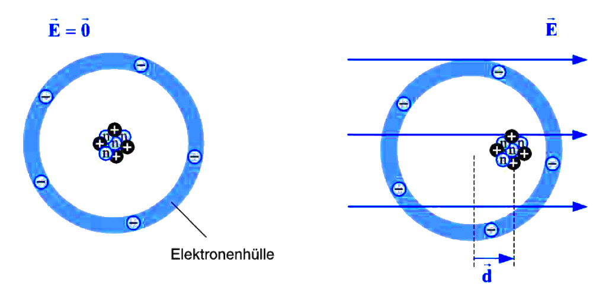

---
tags:
aliases:
  - Polarisieren
  - Polarisierung
  - Polarisierbar
keywords:
subject:
  - VL
  - Einführung Elektrotechnik
semester: WS23
created: 10. März 2024
professor:
  - Bernhard Jakoby
title: Polarisation
---
 

# Polarisierung

> [!important] Polarisation: Ladungsschwerpunkte des Moleküls, richten sich nach dem [elektrischen Feld](Elektrostatik/Elektrisches%20Feld.md) aus

In der Regel erzeugen Atomgebundene [Moleküle](Atombindung.md) trotz Ladungsdifferenz eines [Dipols](Dipol%20(Chemie).md) kein [Elektrisches Feld](Elektrostatik/Elektrisches%20Feld.md). Das liegt daran dass diese [Ladungen](Elektrostatik/elektrische%20Ladung.md) nicht gerichtet sind.

Zeigt der [Vektor](../Mathematik/Algebra/Vektor.md) des [Dipolmoments](Dipol%20(Chemie).md) im Stoff überwiegend in die selbe Richtung (durch Einbringen in ein [statisches E-Feld](Elektrostatik/Elektrisches%20Feld.md)), ist der Stoff Polarisiert. Dieses E-Feld wird durch die ausgerichteten ladungsschwerpunkte Abgeschwächt. Das Ausmaß dieser Abschwächung hängt von der [Permittivität](../Elektrotechnik/Dielektrikum.md) des [Dielektrikums](../Elektrotechnik/Dielektrikum.md) ab.

Dies ist nützlich für:
- [Kondensator](Elektrische%20Netzwerke/Kapazität.md) 
- [Dielektrikum](../Elektrotechnik/Dielektrikum.md) in einem Leiterplattensubstrat

# Tags

[Polarität (Chemie) – Wikipedia](https://de.wikipedia.org/wiki/Polarit%C3%A4t_(Chemie))
[Permittivität – Wikipedia](https://de.wikipedia.org/wiki/Permittivit%C3%A4t)