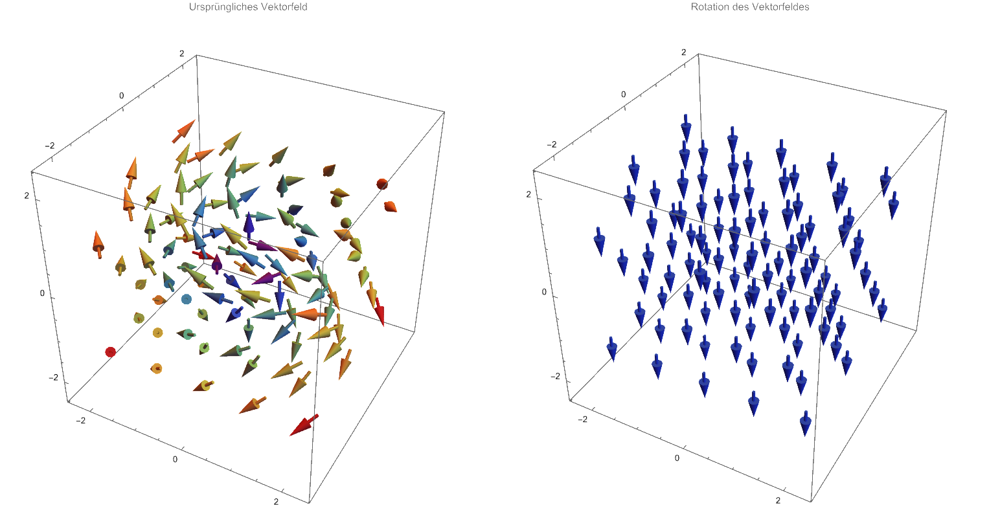

 

# Rotor

Der Rotor ist ein Vektoroperator, der auf ein [Vektorfeld](Vektorfeld.md) im $\mathbb{R}^3$ angewendet wird.

> [!warning] Nur im $\mathbb{R}^3$
> Der Rotor eines Vektorfeldes liefert wiederum Vektorfeld, das die lokale Drehung des ursprünglichen Vektorfeldes beschreibt.

> [!def] **D1 - ROT)** Der Rotor eines $\mathbb{R}^3$ Vektorfeldes $\mathbf{F} = (F_x, F_y, F_z)$ ist definiert als:
>
>$$\mathrm{rot} \,\mathbf{F} := \nabla \times \mathbf{F}$$

Die Richtung des Rotors ist senkrecht zur ebene in der das Vektorfeld Rotiert (Aufgrund des Kreuzproduktes) und die Länge des Rotors gibt die Stärke der Rotation an.

Mit der Rechten hand Regel kann man darauf schließen in welche richtung das Vektorfeld rotiert.
ändert sich die Richtung des Vektorfeldes entlang der gekrümmten Finger, so zeigt der Daumen in die Richtung des Rotors.

Das kann man an diesem Plot Ausprobieren. Hier ist die Rotation sogar konstant, sodass der rotor davon gerade nach unten zeigt

<a href="Mathematik/Simulationen/Rotor.nb" class="internal-link">📈Mathematica Notebook</a>

## Eigenschaften

Konservative Vektorfelder sind wirbelfrei. Das bedeutet, dass das Vektorfeld in einem konservativen Vektorfeld keine Drehung aufweist bzw. einen verschwindenden Rotor haben. 

> [!satz] Der Rotor eines Gradientenfeldes ist immer Null:
>
> $$\operatorname{rot}\operatorname{grad}f = 0 \iff \nabla \times \nabla f = 0$$
> 
> Das Vektorfeld ist genau dann der Gradient einer Funktion, wenn die Rotation des Vektorfeldes im betrachteten Gebiet gleich null ist. Ein Vektorfeld ist in jedem Fall [konservativ](../Mathematik/Analysis/Wegunabhängig.md), wenn im Ausdruck $\operatorname{grad}f$ gilt, dass $f$ ein Skalarfeld ist.

## Anwendung

Ein wichtiger Satz, der den Rotor verwedet ist der [Stokessche Integralsatz](../Mathematik/Stokesscher%20Integralsatz.md) der den Zusammenhang zwischen der Rotation eines Vektorfeldes und dem Linienintegral über den Rand einer Fläche beschreibt.
Dieser Satz ist wichtig für das Rechnen mit den [Maxwell](Maxwell.md)-Gleichungen