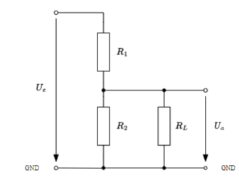

# Spannungsteiler

## Belasteter Spannungsteiler

| Schaltung                                       | Rechung                                                    |
| ----------------------------------------------- | ---------------------------------------------------------- |
|  | ![[../Hardwareentwicklung/assets/Ohmsches Gesetz 2024-01-18 22.37.14.excalidraw]] |

## Frequenzkompensierter Spannungsteiler

> [!info] Ein rein ohmscher Spannungsteiler teilt die Spannung **frequenzunabhängig**
> - In der Praxis besteht häufig einer der beiden Zweipole des Spannungsteilers aus einer $R C$-Parallelschaltung, z.B. wegen des Vorhandenseins einer parasitären [[Kapazität]]
> $\Rightarrow$ Damit wird die Spannungsteilung frequenzabhängig
> - Wenn der andere [[Zweipol]] nun ebenfalls frequenzabhängig realisiert wird, dann kann erreicht werden, dass der gesamte Spannungsteiler wieder frequenzunabhängig arbeitet
>
> - Wir betrachten als Beispiel die Spannungsmessung mit Hilfe eines [[Oszilloskop|Oszilloskops]], wobei die gemessenen Spannung mit Hilfe eines sogenannten *Tastkopfs* geteilt wird, um die am Oszilloskopeingang maximal erlaubte Spannung nicht zu überschreiten
> ![[../assets/Excalidraw/Spannungsteiler 2024-04-15 10.40.20.excalidraw]]

![[assets/OszTastkopfSpgTeiler.png]]