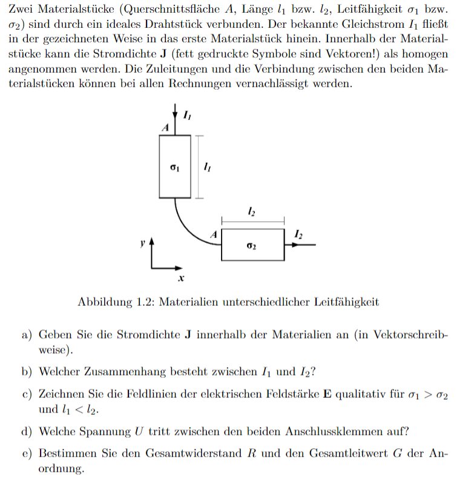

---
tags:
  - E-Feld
aliases: 
keywords: 
subject:
  - Einf. ET
  - "335.005"
semester:
  - WS23
  - "1"
created: 21. Januar 2024
professor:
  - Bernhard Jakoby
---
 

# Statisches E-Feld

> [!info] Das elektrische Feld beschreibt Kraftwirkungen auf Objekte, die eine elektrische Ladung tragen.

> [!INFO] Statisch:  
> es änderst sich nichts mehr (eingeschwungener Zustand)

Ähnlich wie das Schwerefeld einer Masse, kann auch einer einzelnen Ladung ein elektrisches Feld $E$ zugeordnet werden.  
Die Kraft auf eine Ladung 𝑞, die in dieses Feld eingebracht wird ergibt sich dann aus

$$\vec{F}=q\cdot \vec{E}$$

> [!success] Die Kraft auf eine Ladung $Q$ in einem externen Elektrischen Feld ist proportional zu $Q$ und $E$  

Das Feld das eine Ladung $Q$ um sich herum erzeugt ist, ähnlich wie beim Schwerefeld mit sternförmig auseinander gehenden Feldlinien verknüpft und mit mit dem Quadrat des Abstandes ab; sein [Betrag](../Mathematik/Betrag.md) reduziert sich mit dem Quadrat des Abstands zu dieser Ladung:

$$
|\vec{E}| = \frac{Q}{4\pi\varepsilon_{0}r^{2}}
$$

Die Einheit der elektrischen Feldstärke ist $1 \frac{V}{m}$.

> [!success] Die Coulomb-Kraft sinkt Betragsmäßig mit dem Quadrat der Entfernung des betreffenden Teilchens.  
> ![[../assets/Excalidraw/Drawing 2024-01-28 14.24.08.excalidraw]]

## Feldstärke in einem Leiter

$$
\begin{align}
&\vec{E} = \frac{\vec{J}}{\sigma}=\vec{J}\cdot \rho
\end{align}
$$

## Potenzielle Energie im elektrischen Feld

# Beispiele

> [!EXAMPLE]- Stromfluss in Leitern  
> 
>
> > [!SUCCESS]- Lösung  
> > 

> [!EXAMPLE]- Stromfluss in Leitern 2  
> 
>
> > [!SUCCESS]- Lösung  
> > 

# Tags

[ESD](../Hardwareentwicklung/ESD.md)

## Flashcards

Was beschreibt das elektrische Feld?;;Das elektrische Feld beschreibt Kraftwirkungen auf Objekte, die eine elektrische Ladung tragen.

In welchem Verhältnis steht die Coulomb Kraft zum Abstand?
?
Die Coulomb-Kraft sinkt Betragsmäßig mit dem Quadrat der Entfernung des betreffenden Teilchens.
$$|\vec{F}|=F = \frac{Q_{1}Q_{2}}{4\pi\varepsilon_{0}r^{2}}$$

