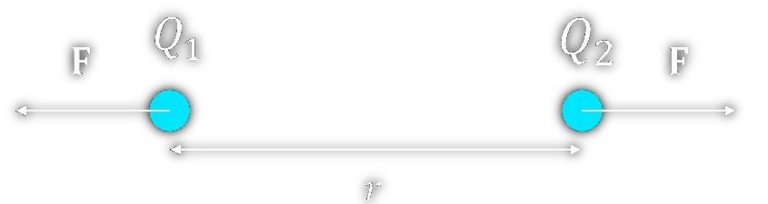

---
tags:
  - E-Feld
aliases:
  - Ladung
  - elektrisch geladen
  - geladen
  - Ladungen
keywords: 
subject:
  - Einf. ET
  - "335.005"
semester:
  - WS23
  - B1
created: 21. Januar 2024
professor:
  - Bernhard Jakoby
---
 

# Statisches [E-Feld](Elektrisches%20Feld.md)

> [!INFO] Statisch:  
> es ändert sich nichts mehr (eingeschwungener Zustand)
> Keine ruckartigen/schnelle Änderungen
> in der HF Technik sind einige Vereinfachungen der Elektrostatik nicht mehr gültig

> [!info] [Coulomb-Kraft](Elektrische%20Kraft.md)
>Ähnlich wie das Schwerefeld einer Masse, kann auch einer einzelnen Ladung ein [elektrisches Feld](Elektrisches%20Feld.md) $E$ zugeordnet werden.  
> Die [Kraft](../Physik/Newtonsche%20Axiome.md) auf eine Ladung 𝑞, die in dieses Feld eingebracht wird ergibt sich dann aus:
> $$\vec{F}=q\cdot \vec{E}$$
> 
>> [!success] Die [Kraft](../Physik/Newtonsche%20Axiome.md) auf eine Ladung $q$ in einem von $Q$ hervorgerufenen externen [Elektrischen Feld](Elektrisches%20Feld.md) ist proportional zu $q$ und $E$  
>

Das Feld das eine Ladung $Q$ um sich herum erzeugt ist, ähnlich wie beim Schwerefeld mit sternförmig auseinander gehenden Feldlinien verknüpft und mit mit dem Quadrat des Abstandes ab; sein [Betrag](../Mathematik/Betrag.md) reduziert sich mit dem Quadrat des Abstands zu dieser Ladung:

$$|\vec{E}| = \frac{Q}{4\pi\varepsilon_{0}r^{2}}$$

Die Einheit der elektrischen Feldstärke ist $1 \frac{V}{m}$.

> [!important] Wie im Schwerefeld der Erde gilt auch im [Elektrischen Feld](Elektrisches%20Feld.md) der Energie-Erhaltungssatz 
> Die [Arbeit](../Physik/Mechanische%20Arbeit.md) und das Potenzial (von Potentielle Energie) im Statischen E-Feld führt uns zur [elektrischen Spannung](elektrische%20Spannung.md)

## Statisches [E-Feld](Elektrisches%20Feld.md) $\iff$ Gravitationsfeld

|                Gravitationskraft                 |                  [Elektrische Kraft](Elektrische%20Kraft.md) / [Coulomb-Kraft](Elektrische%20Kraft.md)                  |
|:------------------------------------------------:|:-------------------------------------------------------------------:|
|            $\vec{F} = m\cdot \vec{g}$            |                     $\vec{F} = q \cdot \vec{E}$                     |
| $\vec{F} = m\cdot \dfrac{G\cdot M}{\vec{r}^{2}}$ | $\vec{F} = q \cdot \dfrac{Q}{4\pi\varepsilon_{0}\cdot \vec{r}^{2}}$ |
|                    |                                                                     |

|               Gravitationsfeld der Erde mit der Masse $M$                | [Elektrisches Feld](Elektrisches%20Feld.md) einer Ladung $Q$ |
| :----------------------------------------------------------------------: | :----------------------------------------------------------: |
| $\vec{g} = -G\cdot M\cdot \dfrac{1}{ \mid \vec{r}\mid^{3}}\cdot \vec{r}$ |   $\mid\vec{E}\mid = \dfrac{Q}{4\pi\varepsilon_{0}r^{2}}$    |
|                                             |                                    |

| $F_{G}$                                                                                 | $F_{E}$                                                                                  |
| --------------------------------------------------------------------------------------- | ---------------------------------------------------------------------------------------- |
| auf eine Masse $m$ wirkt im Gravitationsfeld $\vec{g}$ der Masse $M$ eine [Kraft](../Physik/Newtonsche%20Axiome.md) $F_{G}$ | Auf eine Ladung $q$ wirkt durch das durch $Q$ hervorgerufene [E-Feld](Elektrisches%20Feld.md) $\vec{E}$ eine [Kraft](../Physik/Newtonsche%20Axiome.md) |

> [!warning] Unterschied zum G-Feld
> Ladungen können unterschiedliche Vorzeichen haben, Massen nicht. Elektrische Ladungen können sich daher anziehen und abstoßen, während sich massebehaftete Körper immer anziehen.

## Feldstärke in einem Leiter

$$
\begin{align}
&\vec{E} = \frac{\vec{J}}{\sigma}=\vec{J}\cdot \rho
\end{align}
$$

# Beispiele

- Überlegung zu [Linienladung](Linienladung.md)
- Überlegung zu [Flächenladung](Flächenladung.md)

> [!EXAMPLE]- Stromfluss in Leitern  
> 
>
> > [!SUCCESS]- Lösung  
> > 

> [!EXAMPLE]- Stromfluss in Leitern 2  
> 
>
> > [!SUCCESS]- Lösung  
> > 

# Tags

[ESD](../Hardwareentwicklung/ESD.md)

## Flashcards

Was beschreibt das elektrische Feld?;;Das elektrische Feld beschreibt Kraftwirkungen auf Objekte, die eine elektrische Ladung tragen.
<!--SR:!2024-03-01,1,210-->
Wie verhält sich ein *Elektron* (kinematisch), welches in ein *in x-Richtung orientiertes* homogenes [elektrisches Feld](Elektrisches%20Feld.md) eingebracht wird?;;es beschleunigt in negative x-Richtung.
<!--SR:!2024-03-02,3,250-->