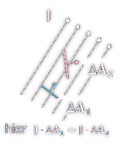

 

# Stromdichte

> [!info] Die Stromdichte J gibt die [Stromanteil](elektrischer%20Strom.md) $\Delta I$ pro Fläche $\Delta A$ an.
>  Dabei ist die Orientierung (Ausrichtung) der Fläche in Bezug auf die lokale Stromrichtung natürlich wesentlich.

> [!question] Vektorielles Flächenelements $\Delta \vec{A}$ 
> Zeigt in Richtung der Flächennormale & der [Betrag](../Mathematik/Betrag.md) entspricht der Fläche.

> [!question] Die Stromdichte ist ebenfalls eine [vektorielle](Vektor.md) Größe
> und zeigt in Richtung der lokalen Stromrichtung
> - (Richtung der mittleren [Geschwindigkeit](../Physik/Kinematik.md) bei positiven Ladungsträgern bzw. entgegengesetzt bei negativen).

$\Delta I$ durch eine Fläche $\Delta \vec{}{A}$ daher: $\Delta I=\vec{J} \cdot \Delta \vec{A}$

Da die Stromdichte lokal variieren kann, ist die exakte Definition eine differenzielle bzw. muss für einen endlichen Bereich integriert werden:
$$
d I=\vec{J} \cdot d \vec{A} \quad \Rightarrow \quad I=\int_A \vec{J} \cdot d \vec{A}
$$

> [!success] Hier kommt das [Flächenintegral](Flächenintegral.md) ($\int _{A}$) zum Einsatz.

---

> [!warning] Begriff Dichte
> Dicht kann alle mögliche bedeuten:
> - x pro Volumen
> - x pro Fläche (wie hier)