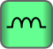
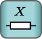
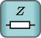
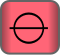
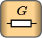
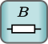
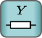
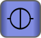

 

# Zweipol

## Duale Zweipole

- Zwei Zweipole sind zueinander dual wenn der $u$-$i$-Zusammenhang bei wechselseitiger Vertauschung von Strom und Spannung erhalten bleibt

| Widerstand  | Induktivität | Reaktanz | Impedanz | Spannungsquelle |
| :---------------: | :---------------: | :---------------: | :---------------: | :---------------: |
|  |  |  |  |  |
|  |  |  |  |  |
| Leitwert | Kapazität | Suszeptanz | Admittanz | Stromquelle |

>[!example] $L$ und $C$ sind zueinander dual
> d.h. wenn wir die Vertauschungen $u \rightarrow i, i \rightarrow u$ und $L \rightarrow C$ durchführen, wird aus $u=L \frac{\mathrm{d}i}{\mathrm{d}t}$ die Beziehung $i=C \frac{\mathrm{d}u}{\mathrm{d}t}$

- Zueinander duale Zweipole:
  - Widerstand $\leftrightarrow$ Leitwert
  - Induktivität $\leftrightarrow$ Kapazität
  - Spannungsquelle $\leftrightarrow$ Stromquelle

Serienschwingkreis $\iff$ Paralleschwingkreis

---

[Duale Netzwerke – Wikipedia](https://de.wikipedia.org/wiki/Duale_Netzwerke)