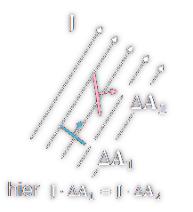

---
tags:
  - SI-Einheit
aliases:
  - Strom
  - Stromstärke
  - Stroms
keywords: 
subject:
  - VL
  - "335.005"
  - Einf. ET
semester:
  - B1
  - WS23
created: 1. März 2024
professor:
  - Bernhard Jakoby
---
 

# Elektrischer Strom

Die Stromstärke $I$ gibt an, wie viel [Ladung](Statisches%20E-Feld.md) $\Delta Q$ pro Zeiteinheit $\Delta t$ durch einen *bestimmten Querschnitt* (Bei Drähten üblicherweise der Drahtquerschnitt, außer beim [Skineffekt](Skineffekt.md)) fließt.

Da die Stromstärke natürlich auch *zeitlich variieren* kann, definiert man (wie üblich) diese Änderungsrate [differenziell](../Mathematik/mathe%20(3)/Differenzialrechnung.md):

$$
I = \lim_{ \Delta t\to 0 } \frac{\Delta Q}{\Delta t} = \frac{dQ}{dt} 
$$

> [!success] Die Einheit der Stromdichte ist das *Ampere* ($A$);
> es entspricht einer [Ladung](Statisches%20E-Feld.md) von einem [Coulomb](Elektrische%20Kraft.md) ($C$) pro Sekunde ($s$).
> (Daher ist auch $1C=1As$)

---

Während bei der [Influenz](../Elektrotechnik/elektrische%20Influenz.md) die Ladungsträgerbewegung relativ rasch wieder zum Erliegen kommt (typischerweise Pikosekunden!), wird im Falle eines kontinuierlichen elektrischen Stromflusses das treibende Feld aufrecht erhalten indem man die Elektronen am einen Ende aufnimmt und am anderen einspeist.

Dies kann durch eine elektrische [Spannungsquelle](../Elektrotechnik/elektrische%20Spannung.md) bewerkstelligt werden – dadurch bleibt das treibende elektrische Feld trotz der Elektronenbewegung aufrecht.

 > [!info] Mit dem [Drude-Modell](Drude-Modell.md) lässt sich die Elektronenbewegung statistisch Auswerten 

---

> [!info] Technische Stromrichtung
> *==Positive==* [Ladung](Statisches%20E-Feld.md) *in* die definierte **Stromrichtung** sowie ***==negative==*** [Ladung](Statisches%20E-Feld.md) in die *Gegenrichtung* werden *positiv* gezählt (und vice versa).
> Dies entspricht der sogenannten ***technischen Stromrichtung***

 > [!hint] In [Metallen](../Chemie/Metallbindung.md) tragen **nur** negativ geladene Elektronen zum Storm bei!
 > In einem metallischen Leiter sind nur die negativ geladenen Elektronen beweglich, die positiv geladenen Atomrümpfe sind im Gitter verankert und sind nicht beweglich.

## 1 Stromdichte

> [!info] Die Stromdichte J gibt die Stromanteil $\Delta I$ pro Fläche $\Delta A$ an.
> Dabei ist die Orientierung (Ausrichtung) der Fläche in Bezug auf die lokale Stromrichtung natürlich wesentlich.

> [!question] Vektorielles Flächenelements $\Delta \mathbf{A}$ 
> Zeigt in Richtung der Flächennormale & der Betrag entspricht der Fläche.

Die Stromdichte ist ebenfalls eine vektorielle Größe und zeigt in Richtung der lokalen Stromrichtung (Richtung der mittleren Geschwindigkeit bei positiven Ladungsträgern bzw. entgegengesetzt bei negativen).
$\Delta I$ durch eine Fläche $\Delta \mathbf{A}$ daher: $\Delta I=\mathbf{J} \cdot \Delta \mathbf{A}$
Da die Stromdichte lokal variieren kann, ist die exakte Definition eine differenzielle bzw. muss für einen endlichen Bereich integriert werden:
$$
d I=\mathbf{J} \cdot d \mathbf{A} \quad \Rightarrow \quad I=\int_A \mathbf{J} \cdot d \mathbf{A}
$$

---

> [!warning] Begriff Dichte
> Dicht kann alle mögliche bedeuten:
> - x pro Volumen
> - x pro Fläche (wie hier)