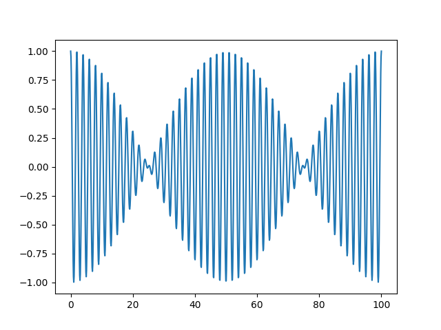

---
tags:
aliases:
keywords:
subject:
  - KV
  - Elektronische Systeme 1
semester: WS25
created: 2. Dezember 2022
professor:
release: true
title: Amplitudenmodulation
---

# Amplituden Modulation

> [!question] [Analoge Modulation](HF-Technik/Analoge%20Modulation.md)

Bei der einfachsten art der Modulation wird das Nutzsignal mit einem Träger **Multipliziert**. Dadurch wird die Amplitude des hochfrequenten Trägers mit dem niederfrequenten Nutzsignal eingehüllt.

$$
s_{\text{AM}}(t) = A(t) \cdot \cos(2\pi f_{0}t) = s_{\text{IF}}(t) \cdot s_{\text{LO}}(t)
$$
> [!important] Die Information steckt in $A(t)$.
> Vorteile:
> - Einfache Schaltung
> 
> Nachteile:
> - Empfänger muss Synchron in Phase und Frequenz zum Träger sein (siehe [Kohärente Demodulation](#Kohärente%20Demodulation))
> - Belegt Doppelte Bandbreite
> - Empfindlich gegen Amplitudenrauschen

| Mischer                                  | Spannungsgesteuerter Verstärker (VCA)  |
| :--------------------------------------: | :--------------------------------------: |
|  |  |

- $s_{\text{IF}}(t)$: Nutzsignal als Schmalbandiges Zwischenfrequenzband (intermediate Frequency)
- $s_{\text{LO}}(t)$: Träger (Local Oscillator)
- $s_{\text{AM}}(t)$: Modulationsergebnis

## Mathematische Grundlagen

### Betrachtung im Zeitbereich

Für den einfachsten Fall ist das Nutzsignal ein einfacher Kosinus-Ton

- $s_{\text{IF}}(t) = \cos(\alpha(t))$, mit $\alpha(t) = 2\pi f_{\text{tone}}t + \phi$
- $s_{\text{LO}}(t) = \cos(\beta(t))$, mit $\beta(t) = 2\pi f_{0}t$

Mit einem [trigonometrischen Multiplikationssatz](Mathematik/Trigonometrische%20Funktionen.md#^TMUL) folgt
$$
\begin{align}
s_{\text{AM}}(t) &= \cos(\alpha(t))\cos(\beta(t)) \\
&= \frac{1}{2}\Big[ \cos(\alpha(t) + \beta(t)) + \cos(-\alpha(t) + \beta(t)) \Big]  \\
&= \frac{1}{2}\Big[ \cos(2\pi({\color{green}f_{0}+f_{\text{tone}}})t +\phi) + \cos(2\pi({\color{green}f_{0}-f_{\text{tone}}})t +\phi) \Big]  \\
\end{align}
$$

Man erkennt, dass die Nutzfrequenz $f_{\text{tone}}$ **zwei mal** um den Träger vorkommt.

### Betrachtung im Spektrum

Die modulation mit einem **reellen Signal** $A(t)=\cos(\alpha(t))$. Für die Fouriertransformation eines reellen Signals $s_{\text{real}}(t)\multimap S(f)$ gilt die Eigenschaft, dass

- der Realteil eine gerade Funktion ist: $\Re\{S(f)\} = \Re\{S(-f)\}$
- der Imaginärteil eine ungerade Funktion ist: $\Im\{S(f)\} = \Im\{-S(-f)\}$ 

> [!hint] Die Modulation eines reelwertigensignals ist daher immer symmetrisch um den Träger
> Dies führt zu einem großen **Nachteil** der primitiven Amplitudenmodulation. Man benötigt die **doppelte Bandbreite**.

Im Umkehrschluss gilt, dass ein **komplexwertiges nutzsignal** benötigt werden würde, um ein asymmetrisches Spektrum zu erzeilen. Weitere [Modulationsarten](HF-Technik/Modulation.md) funktionieren auf diese Art und Weise. Einen Einstiegspunkt dazu bietet das Konzept der 
[Momentanphase und Momentanfrequenz](HF-Technik/Momentanphase%20und%20Momentanfrequenz.md)

#### Frequenzverschiebung im Spektrum

- Wie [hier](HF-Technik/Modulation.md#Frequenzverschiebung) geziegt, äußert sich eine Frequenzverscheibung unter anderem durch eine multiplikation von Winkelfunktionen.
- Eine Multiplikation im Zeitbereich führt zu einer Faltung im Bildbereich ([Fourier-Rechenregel (xiii)](../Systemtheorie/Frequenzbereichsmethoden/Korrespondenzen/Fourier.md#^T1)).
- Ein Kosinus $s_{\text{LO}}(t)=\cos(2\pi f_{0}t)$ korrespondiert zu zwei [Dirac-Impulse](../Mathematik/Delta-Impuls.md) bei der Positiven und negativen frequenz ([Fourier-Korrespondenz (ii)](../Systemtheorie/Frequenzbereichsmethoden/Korrespondenzen/Fourier.md#^T2))
- Faltung mit einem Dirac Delta wertet das Spektrum des Nutzsignals an seiner Stelle aus ([Abstasteigenschaft](../Mathematik/Delta-Impuls.md#^ABT))

%%[🖋 Edit in Excalidraw](../_assets/Excalidraw/Amplitudenmodulation%202025-11-15%2001.57.14.excalidraw.md)%%

> [!question]- Mathematische herleitung
> 
> - $s_{\text{LO}}(t) \cdot s_{\text{IF}}(t) \multimap (S_{\text{LO}}*S_{\text{IF}})(f)$
> - $s_{\text{LO}}(t) =\cos(2\pi f_{0}t) \multimap \delta(f-f_{0}) + \delta(f+f_{0})$
> - $S(f)*\delta(f-f_{0}) = S(f-f_{0})$ 
> $$
> \begin{align}
> \implies (S_{\text{LO}}*S_{\text{IF}})(f) &= S_{\text{IF}}(f)*\delta(f-f_{0}) + S_{\text{IF}}(f)*\delta(f+f_{0}) \\
> &= S_{\text{IF}}(f-f_{0}) + S_{\text{IF}}(f+f_{0}) 
> \end{align}
> $$

## Einseitenbandmodulation

## Modulationsgrad

## Kohärente Demodulation

