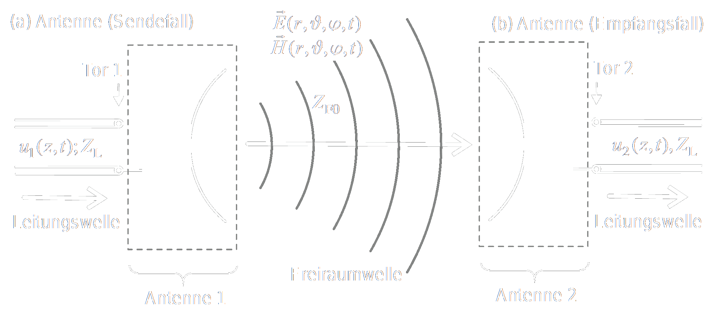
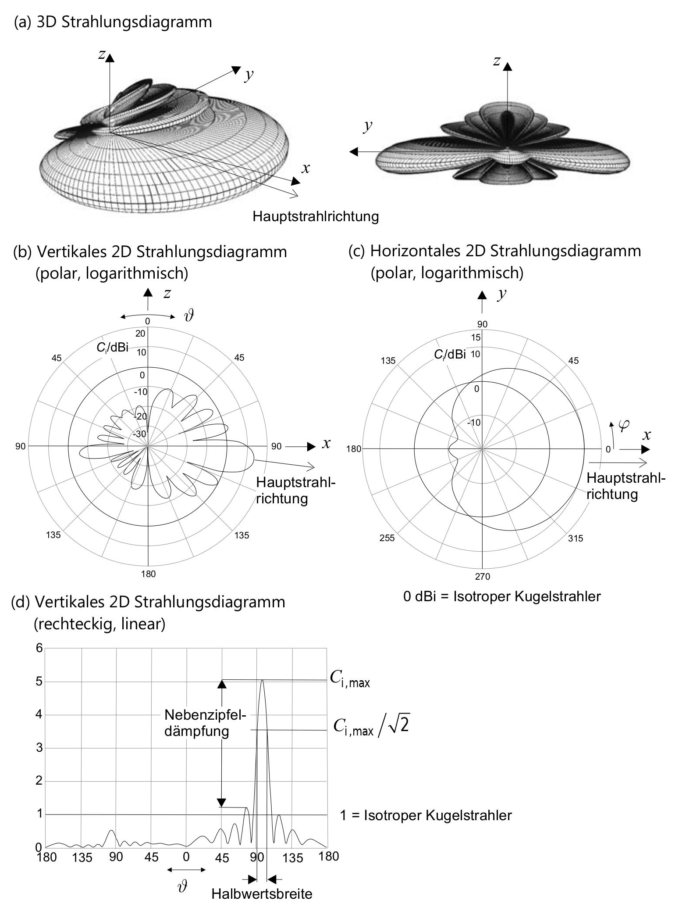

# Antennen

## Grundbegriffe und Kenngrößen

Antennen erzeugen und empfangen [Elektromagnetische Wellen](../Physik/Elektromagnetische%20Wellen.md), die sich im freien Raum ausbreiten:
- Im Sendefall: Antenne wandelt an die an ihrem [Tor](Streuparameter.md) zugeführte [Leistung](../Elektrotechnik/elektrische%20Leistung.md) möglichst effizient in eine [EM-Welle](../Physik/Elektromagnetische%20Wellen.md) um.
- Im Empfangsfall: Die Antenne nimmt aus einen [EM-Wellenfeld](../Physik/Elektromagnetische%20Wellen.md) [Leistung](../Elektrotechnik/elektrische%20Leistung.md) auf und stellt diese an ihrem [Netzwerktor](Streuparameter.md) zur Verfügung.

### Antennen als Wellentypwandler

- Zumeist ist nur das ferne [EM-Feld](../Physik/Elektromagnetische%20Wellen.md) von technischem Interesse
- Da jede Antenne in hinreichend großem Abstand als klein angesehen werden kann, ist eine Beschreibung in Kugelkoordinaten zweckmäßig.
- Die Antenne erzeugt ein Wellenfeld (Freiraumwelle), welches [Leistung](../Elektrotechnik/elektrische%20Leistung.md) von der Antenne fortführt (a).
- Im Empfangsfall (b) nimmt eine Antenne Energie aus einem Wellenfeld auf und regt eine Leitungswelle an ihrem Netzwerktor (Tor 2) an.

>[!summary] Sende- & Empfangsfall  
>

> [!INFO] Der Sendeund Empfangsfall sind [reziprok](Reziprozität.md).

- [[Fernfeld und Nahfeld]]

#### Feldkomponenten $\vec{E}$ und $\vec{H}$

$\vec{E}\dots$ [E-Feldstärke](../Elektrotechnik/elektrisches%20Feld.md#Elektrische%20Feldstärke)  
$\vec{H}\dots$ [H-Feldstärke](../Elektrotechnik/magnetisches%20Feld.md#Magnetisches%20Feld)  
Das [Kreuzprodukt](../Mathematik/Algebra/Vektor.md) beider [Vektoren](../Mathematik/Algebra/Vektor.md) ergibt den [Poynting Vektor](Poynting%20Vektor.md):

$$\vec S=\frac{1}{2}\vec E\times \vec H^{\ast}$$

- [Transversale Elektromagnetische Welle](Transversale%20Elektromagnetische%20Welle.md)

### Kenngrößen für das Strahlungsfeld einer Antenne

#### Richtcharakteristik $C_{i}$

#### Richtfunktion $D$

# Antennenbauformen

- Drahtantennen
- [Richtantennen](Richtantennen.md)
- Hertzscher Dipol
- Halbwellendipol

# Quellen

- Fringing Field -> Randfeld

## 9:27

- [TEM-Welle](Transversale%20Elektromagnetische%20Welle.md) -> Amplituden sind Normal zur Ausbreitungsrichtung
- $\vec E\times\vec H$ visualisiert

## 25:30

Quadratur Amplituden [Modulation](Modulation.md) ([QAM](Quadratur%20Amplituden%20Modulation.md))
