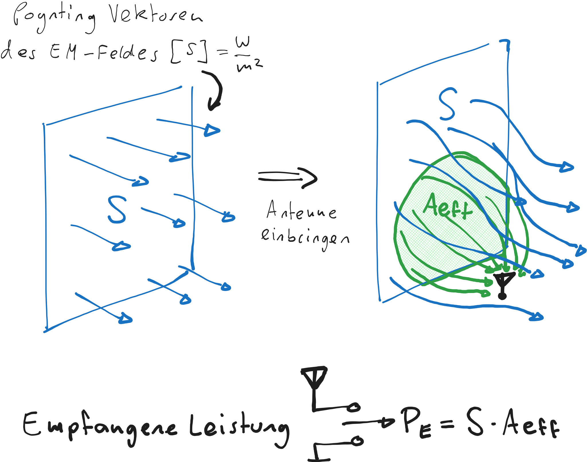

---
tags:
aliases:
keywords:
subject:
  - KV
  - Elektronische Systeme 1
semester: WS25
created: 15th November 2025
professor:
  - Reinhard Feger
release: true
title: Antennenwirkfläche
---

# Antennenwirkfläche

Die Einheit der Leistungsdichte ist $[S] = \mathrm{\frac{W}{m^{2}}}$. Das impliziert, dass eine Antenne eine gewisse fläche aufweisen muss, um die Leistung aus dem EM-Feld aufzunehmen. Jedoch weist z.B. eine Stabantenne, der Dipol oder der isotrope kugelstrahler garkeine geometrische Fläche auf. 

> [!satz] **Antennenwirkfläche** (Effective Area of an Antenna) $A_{\mathrm{eff}}$^AEFF
> Die Effektive Fläche ist nicht unbedingt gekoppelt mit der physikalischen Größe
> 
> 
>  $$
> A_{\mathrm{eff}}(\theta,\phi) = G_{\mathrm{dBi}}(\theta,\phi)A_{\mathrm{eff,iso}}, \quad A_{\mathrm{eff,iso}} = \frac{\lambda^{2}}{4\pi}
> $$

Dabei ist die Antennenwirkfläche des [Isotropen Kugelstrahlers](HF-Technik/Isotroper%20Kugelstrahler.md#Antennenwirkfläche) $A_{\mathrm{eff,iso}}$ bekannt und der [Antennengewinn](HF-Technik/Antenne.md#Antennengewinn) muss bezogen auf den Isotropenkugelstrahler sein, also in $\mathrm{dBi}$.

## Praktische Methode zur ermittlung der Antennen wirkfläche

Wenn man einen Simulator zur verfügung hat, lässt sich folgender Versuch durchführen

- Es wird die Antenne in ein Homogenes EM-Feld eingebracht.
- Man sucht die grenze zu den Feldlinien, welche in der Antenne enden, versus welche an der Antenne vorbei Strahlen.
- Diese Fläche ist die Antennenwirkfläche

%%[🖋 Edit in Excalidraw](../_assets/Excalidraw/Effektivflaeche.md)%%

Somit lässt sich die Antennenwirkfläche numberisch feststellen. Ein geschlossener Ausdruck ist Simulatorisch jedoch nicht ermittelbar.