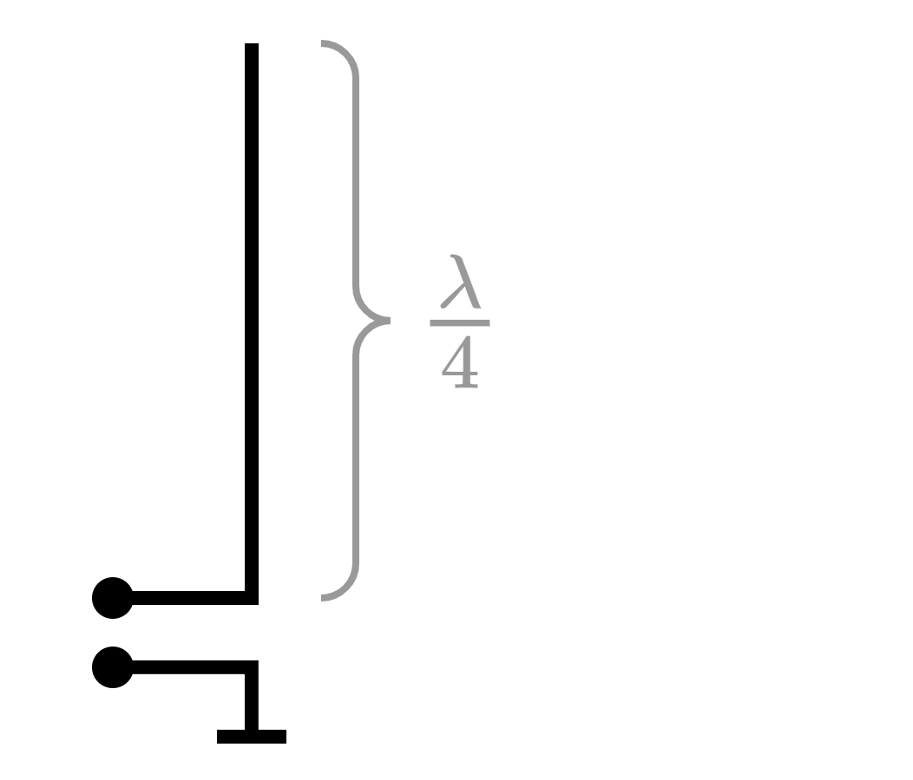
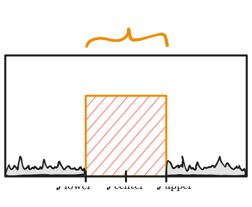
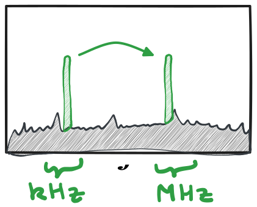

---
tags:
aliases:
  - Funk
  - Drahtlos
keywords:
subject:
  - KV
  - Elektronische Systeme 1
semester: WS25
created: 11th November 2025
professor:
  - Reinhard Feger
release: true
title: Drahtlose Übertragung
---

# Drahtlose Datenübertragung

Um Daten Drahtlos zu übertragen benötigt man ein elektronisches System, welches das Nutzsignal so aufbereitet, um es mit einer Antenne über den Freiraum als Elektromagnetische Welle auszustrahlen. 

> [!example] z.B. Praktische Implementierung am [CC1101](../Digital-Design/Devices/CC1101.md)-Radarchip

## Wieso finden drahtlose Übertragungen immer mit hohen frequenzen statt?

> [!question] Was bedeuted hochfrequent: [Leitungstheorie](Leitungstheorie.md)

> [!info] Mit steigender Frequenz hat man...
> 
> **Kleinere Antennen:** Die Länge der Antenne ist oft proportional zur optimalen Wellenlänge $\lambda = \dfrac{c}{f}$
> 
> 
> 
> **Größere Bandbreite:** Das die Benötigte bandbreite ist für den selben datendurchsatz im verhältnis zur Mittelfrequenz gleich
> 
> 
> %%[🖋 Edit in Excalidraw](../_assets/Excalidraw/Bandbreite1.md)%%
> 
> $$
> \frac{f_{\text{upper}}-f_{\text{lower}}}{f_{\text{center}}} = \frac{B}{f_{\text{center}}} \approx \text{const.}
> $$

Ein wichtiges Ziel ist es also das Nutzsignal im Spektrum Verschieben zu können

%%[🖋 Edit in Excalidraw](../_assets/Excalidraw/VerschiebungImSpektrum.md)%%

Zur verschiebung des Nutzsignals in ein gewünschtes Frequenzband kommen verschiedene [Modulationsarten](Modulation/index.md) zum einsatz.

