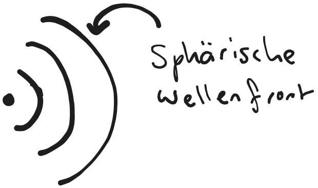
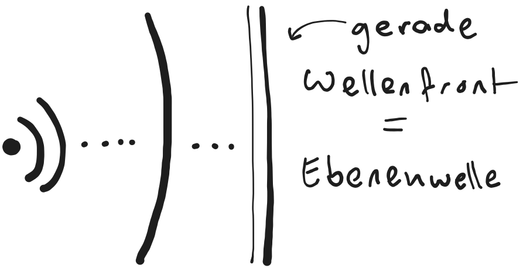

---
tags:
aliases:
  - Fernfeld
  - Nahfeld
  - Radiansphäre
  - Fraunhofer Zone
  - Rayleigh Zone
  - Fersnel Zone
keywords:
subject:
  - VL
  - EMV und SI
  - KV
  - Elektronische Systeme 1
semester: WS25
created: 16. Oktober 2024
professor:
  - Reinhard Feger
release: true
title: Nah- und Fernfeld
---
 

# Nahfeld und Fernfeld

Bei der Beschreibung von [Antennen](Antenne.md) macht es einen großen Unterschied, ob man sich für die Feldverteilung im unmittelbaren Umfeld der Antenne (==Nahfeld==) oder nur für Beobachtungspunkte in größerer Entfernung (==Fernfeld==) interessiert

> [!caution] Die wichtigen Antennenkenngrößen sind alle für das Fernfeld einer Antenne definiert

>[!summary] Feldzonen  
>

- Das Nahfeld zeichnet sich durch starke reaktive Feldanteile aus, in denen elektrische und magnetische Energie gespeichert wird.
- Im Fernfeld dominiert hingegen der radial orientierte Leistungstransport.

Der *Fernfeldabstand* hängt von der verwendeten Wellenlänge $\uplambda$ und den geometrischen Abmessungen der Antenne ab.

## Reaktives Nahfeld

> [!quote]- Rayleigh-Zone: 
> - Reaktives Nahfeld

> sFür kleine Antennen: $r < \dfrac{\lambda}{2\pi}$  (unterschiedlich für große Antennen)

- keine Energieabstrahlung. Das Feld verschindet sofort, wenn die Quelle abgeschalten wird.
- Blindleistungsaustausch zwischen Antenne und Umgebung dominiert.
- $E$ und $H$ sind gegeneinander phasenverschoben und stehen nicht senkrecht aufeinander. Nicht [Transversal](Transversale%20Elektromagnetische%20Welle.md)
- Kein reeller Feldwellenwiderstand

> [!warning] aus dem $\mathbf{E}$-feld kann man nicht auf das $\mathbf{H}$-Feld Schließen und umgekehrt.

## Strahlendes Nahfeld

> [!quote]- Fresnel-Zone
> - Strahlendes Nahfeld  
> - Radiatives Nahfeld
> - en. radiating near Field

> $\dfrac{\lambda}{2\pi} < r < \dfrac{2D^{2}}{\lambda}$ ($D$... Antennengröße)

- Blindleistung und Wirkleistung gleichen sich aus
- Strahlungsfeld überwiegt im Vergleich zum reaktiven Feld
- $E$ und $H$ stehen (noch) nicht senkrecht aufeinander
- noch keine ebene Welle sondern sphärische Wellenfront

%%[🖋 Edit in Excalidraw](../_assets/Excalidraw/SpericalWavefront.md)%%

### Radiansphäre

Die Radiansphäre ist die Grenze, an der die Blind und Wirkleistung gleich groß sind.

## Fernfeld

> [!quote]- Fraunhofer-Zone
> - Fernfeld

> $r > \dfrac{2D^{2}}{\lambda}$

Im Fernfeld sind sämtliche **partikuläre Lösungen** der Raumwelle, also alle anregungen der Quelle abgeklungen. Die Welle breitet sich von selbst aus.

- Feldvektoren E und H stehen senkrecht aufeinander und sind in Phase ([TEM-Welle](HF-Technik/Transversale%20Elektromagnetische%20Welle.md))
- Das richtungsfeld der Leistungsdichte ist homogen $\iff$ die [Poynting Vektoren](HF-Technik/Poynting%20Vektor.md) sind Parallel
- der Feldwellenwiderstand ist reell
- Es findet reiner Wirkleistungstransport statt
- Die Welle ist eine Ebene Welle (Planewave)
- Im Fernfeld ist die [Friisgleichung](HF-Technik/Friisgleichung.md) gültig.

%%[🖋 Edit in Excalidraw](../_assets/Excalidraw/GeradeWellenfront.md)%%