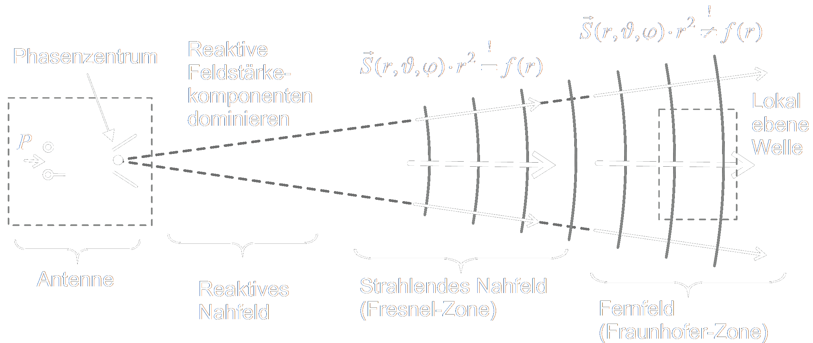

 

# Nahfeld und Fernfeld

Bei der Beschreibung von [Antennen](Antenne.md) macht es einen großen Unterschied, ob man sich für die Feldverteilung im unmittelbaren Umfeld der Antenne (==Nahfeld==) oder nur für Beobachtungspunkte in größerer Entfernung (==Fernfeld==) interessiert

> [!caution] Die wichtigen Antennenkenngrößen sind alle für das Fernfeld einer Antenne definiert

>[!summary] Feldzonen  
>

## Vereinfachungen beim Übergang vom Nah ins Fernfeld

- Das Nahfeld zeichnet sich durch starke reaktive Feldanteile aus, in denen elektrische und magnetische Energie gespeichert wird.
- Im Fernfeld dominiert hingegen der radial orientierte Leistungstransport.

Der *Fernfeldabstand* hängt von der verwendeten Wellenlänge $\uplambda$ und den geometrischen Abmessungen der Antenne ab.

Feldabstand bei:
- elektrisch kleinen Antennen: $r\geq 2\uplambda$
- elektrisch großen Antennen: $r\dots$

## Reaktives Nahfeld

> [!quote]- Rayleigh-Zone
> - Reaktives Nahfeld

- keine Energieabstrahlung
- dominierend: Blindleistungsaustausch zwischen Antenne und Umgebung
- $E$ und $H$ sind gegeneinander phasenverschoben und stehen nicht senkrecht aufeinander.
    - nicht [Transversal](Transversale%20Elektromagnetische%20Welle.md)
- Kein reeller Feldwellenwiderstand

> [!warning] aus dem $\mathbf{E}$-feld kann man nicht auf das $\mathbf{H}$-Feld Schließen und umgekehrt.

## Strahlendes Nahfeld

> [!quote]- Fresnel-Zone
> - Strahlendes Nahfeld  
> - Radiatives Nahfeld

- Strahlungsfeld überwiegt im Vergleich zum reaktiven Feld
- $E$ und $H$ stehen (noch) nicht senkrecht aufeinander
- noch keine ebene Welle

## Fernfeld

> [!quote]- Fraunhofer-Zone
> - Fernfeld

- Feldvektoren E und H stehen senkrecht aufeinander und sind in Phase
- der Feldwellenwiderstand ist reell
- Es findet reiner Wirkleistungstransport statt
