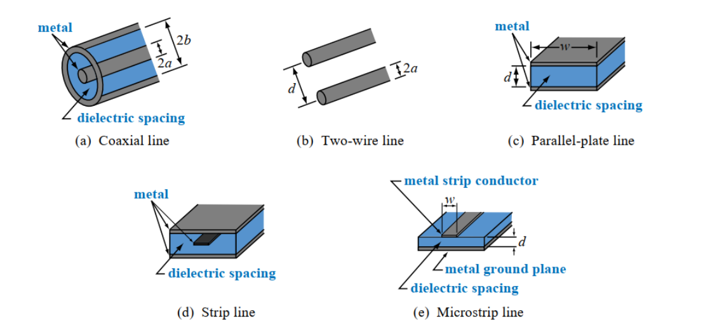
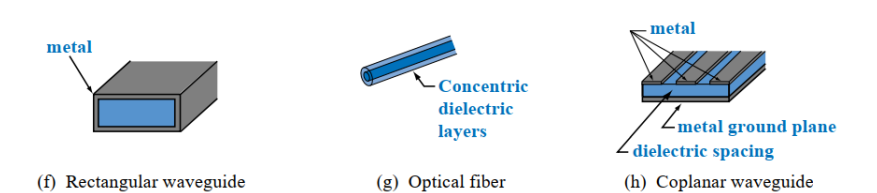
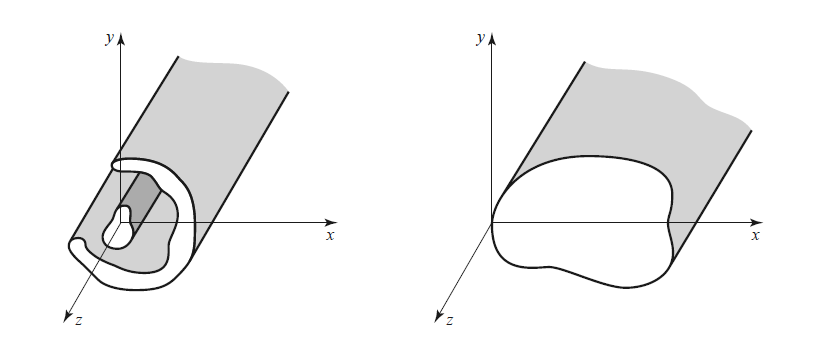

---
tags:
  - Maxwell
aliases:
  - TE TM und TEM Lösungen
keywords:
  - Herleitung Leitermodell
  - MWG
  - Herleitung Beläge
subject:
  - KV
  - HF-Systemtechnik 1
  - VL
  - Grundlagen der Hochfrequenztechnik
semester: WS24
created: 10. Oktober 2024
professor:
  - Reinhard Feger
release: true
---
 
# Leitergeometrien von HF-Leitungen

> [!success] Die charakteristische Impedanz $Z_{0}$ beschreibt unter anderem die Geometrie einer Leitung
> Man muss daher nicht immer die Maxwellgleichungen für eine Leitungsgeometrie lösen, sondern kann mit der charateristischen Impedanz das Verhältnis von Strom und Spannung einer bestimmten Geometrie Ermitteln

## TEM - Transversale EM Mode

> [!success] Nicht frequenzabhängig. Funktionieren für Alle frequenzen (auch DC $\iff$ Elektrostatik) gleich

c) [Parallelplattenleitung](Parallelplattenleitung.md)

## TE- und TM-Moden

HF-Leitungen höherer ordnung

> [!warning] Funktionieren nicht für alle Frequenzen gleich
> Es gibt eine Maximalwellenlänge für die der Wellenleiter für eine Wellenausbreitung funktioniert, ohne das dass Feld zusammenbricht ([Grenzwellenzahl](../Physik/Feldtheorie/Wellenzahl.md))

- Rectangular Waveguide (Rechteck Hohlleiter)
- [LWL](Lichtwellenleiter.md) - Dielektrischer Wellenleiter Licht Als EM-Welle durch nicht leitendes [Dielektrikum](../Elektrotechnik/Dielektrikum.md)
- Coplanarer Microstrip

## Modellbildung

Die zugrunde Liegenden Modelle sind:

- [Transmission Line](Transmission%20Line.md): Zweileiter Modell
- Wellenleiter: Einleiter Modell

Beide Modelle haben eine geliebige Geometrie unter der Bedunging dass die **Ränder** des Leiters **Parallel** zur **Ausbreitungsrichtung** sind (hier $z$). Mit dieser Bedingung gilt:

- Der **Querschnitt** entlang von $z$ ändert sich nicht.
- Es gibt **keine Kurven**.

> [!hint] **Annahmen:**  Für die Herleitungen gilt: ^ANNAHMEN
> 
> - Die Feldkomponenten sind **eingeschwungen** $\to$ Felder als [Phasor](../Elektrotechnik/Wechselstromtechnik.md)
> - Wellenasubreitung in $z$-Richtung
> - Der betrachtete Teil des Leitermodells ist **Quellfrei**
> 
> Die Felder können dann wiefolg beschreiben werden
> 
> $$
> \begin{align}
> \underline{\mathbf{E}}(x,y,z) &= [\mathbf{e}(x,y) + \mathbf{\hat{z}} e_{z}(x,y)] e^{ -j\beta z } \tag{3.1a}\\
> \underline{\mathbf{H}}(x,y,z) &= [\mathbf{h}(x,y) + \mathbf{\hat{z}} h_{z}(x,y)] e^{ -j\beta z } \tag{3.1b}
> \end{align}
> $$
> 
> - $\mathbf{e}(x,y)$ und $\mathbf{h}(x,y)$ sind die Transversalen Feldkomponenten in $x$ und $y$ Richtung
> - $e_{z}(x,y)$ und $h_{z}(x,y)$ sind die Longitudinalen Feldkomponenten (Bei TEM: $e_{z} = h_{z} = 0$)
> 
>  Die Feldkomponenten sind an sich nur von $x$ und $y$ abhängig. Die einzige Änderung in $z$-Richtung ist mit  $e^{ -j\beta z }$ beschrieben.

[Phasorschreibweise der Maxwellgleichungen](../Elektrotechnik/Wechselstromtechnik.md#Phasorschreibweise%20der%20Maxwellgleichungen):

$$
\begin{align}
\nabla \times \underline{\mathbf{E}} &= -j\omega \mu\underline{\mathbf{H}} \tag{MW2b}\\
\nabla \times \underline{\mathbf{H} } &= j\omega \epsilon\underline{\mathbf{E}} \tag{MW1b}\\
\end{align}
$$

Für diesen Fall ist die einzige $z$ Abhängigkeit in dem $e^{ -j\beta z }$ Term.

$$
\begin{pmatrix}
\frac{ \partial }{ \partial x } \\ \frac{ \partial }{ \partial y} \\ \frac{ \partial }{ \partial z }
\end{pmatrix} \times \begin{pmatrix}
E_{x} (x,y)e^{ -j\beta z } \\
E_{y} (x,y)e^{ -j\beta z } \\
E_{z} (x,y)e^{ -j\beta z } \\
\end{pmatrix} = \begin{pmatrix}
\frac{\partial }{\partial y} E_{z} (x,y)e^{ -j\beta z } - \frac{\partial }{\partial z} E_{y} (x,y)e^{ -j\beta z } \\ 
\frac{\partial }{\partial x} E_{z} (x,y)e^{ -j\beta z } - \frac{\partial }{\partial z} E_{x} (x,y)e^{ -j\beta z } \\ 
\frac{\partial }{\partial x} E_{y} (x,y)e^{ -j\beta z } - \frac{\partial }{\partial y} E_{x} (x,y)e^{ -j\beta z }
\end{pmatrix} =-j\omega\mu \begin{pmatrix}
H_{x} e^{ -j\beta z } \\ H_{y}e^{ -j\beta z } \\ H_{z}e^{ -j\beta z }
\end{pmatrix}
$$

Die Zeilen des Resultierenden Vektors werden dann einzeln betrachtet:

$$
\begin{align}
&\frac{\partial }{\partial y} E_{z} (x,y)e^{ -j\beta z } - \frac{\partial }{\partial z} E_{y} (x,y)e^{ -j\beta z }  \\
=& \, e^{ -j\beta z } \frac{\partial }{\partial y} E_{z}(x,y) - E_{y}(x,y) \underbrace{ \frac{ \partial }{ \partial z } e^{ -j\beta z } }_{ =-j\beta e^{ -j\beta z } } \\
=& \, \cancel{ e^{ -j\beta z } } \left( \frac{ \partial }{ \partial y } E_{z}(x,y) + j\beta E_{y}(x,y) \right) =-j\omega \mu H_{x} \cancel{ e^{ -j\beta z } }
\end{align}
$$

Diese vorgehensweise auf alle Zeilen in **beiden Maxwellgleichungen** Angewandt leifert:

$$
\begin{gather}
\frac{\partial E_z}{\partial y}+j \beta E_y =-j \omega \mu H_x \quad\text{(3.3a)} && \frac{\partial H_z}{\partial y}+j \beta H_y =j \omega \epsilon E_x \quad\text{(3.4a)} \\
-j \beta E_x-\frac{\partial E_z}{\partial x} =-j \omega \mu H_y \quad\text{(3.3b)} && -j \beta H_x-\frac{\partial H_z}{\partial x} =j \omega \epsilon E_y \quad\text{(3.4b)} \\
\frac{\partial E_y}{\partial x}-\frac{\partial E_x}{\partial y} =-j \omega \mu H_z \quad\text{(3.3c)}  && \frac{\partial H_y}{\partial x}-\frac{\partial H_x}{\partial y} =j \omega \epsilon E_z \quad\text{(3.4c)} 
\end{gather}
$$

> Die Abhängigkeit von $x$ und $y$ ist für die $E$ und $H$ komponenten nicht mehr explizit angegeben.

Die Gleichungen lassen sich umformen, sodass $x$ und $y$ komponenten in abhängigkeit von den $y$ Komponenten schreiben.

Umformungen:

- (3.3a) $\overset{ E_{y} }{ = }$ (3.4b) $\implies$ $H_{x} = f(E_{z},H_{z})$

$$
H_{x} = \frac{j}{k_{c}^{2}} \left( \omega\epsilon \frac{ \partial E_{z} }{ \partial y } - \beta \frac{ \partial H_{z} }{ \partial x } \right) \tag{3.5a}
$$

- (3.3b) $\overset{ E_{x} }{ = }$ (3.4a) $\implies$ $H_{y} = f(E_{z},H_{z})$

$$
H_{y} = -\frac{j}{k_{c}^{2}} \left( \omega\epsilon \frac{ \partial E_{z} }{ \partial x } + \beta \frac{ \partial H_{z} }{ \partial y } \right) \tag{3.5b}
$$

- (3.3a) $\overset{ H_{y} }{ = }$ (3.4b) $\implies$ $E_{x} = f(E_{z},H_{z})$

$$
E_{x} = -\frac{j}{k_{c}^{2}} \left( \beta \frac{ \partial E_{z} }{ \partial x } + \omega\mu \frac{ \partial H_{z} }{ \partial y } \right) \tag{3.5c}
$$

- (3.3a) $\overset{ H_{x} }{ = }$ (3.4b) $\implies$ $E_{y} = f(E_{z},H_{z})$

$$
E_{y} = \frac{j}{k_{c}^{2}} \left( \beta \frac{ \partial E_{z} }{ \partial y } - \omega\mu \frac{ \partial H_{z} }{ \partial x } \right) \tag{3.5d}
$$

mit der Grenzwellenzahl (*Cutoff Wavenumber*) $k_{c}^{2} = k^{2} -\beta^{2}$

> [!hint] Diese Gleichungen sind Grundlage für die Weiteren Vereinfachungen die für die Lösungen von
> 
> - TE Wellen
> - TM Wellen
> - TEM Wellen
> 
> getroffen werden Können