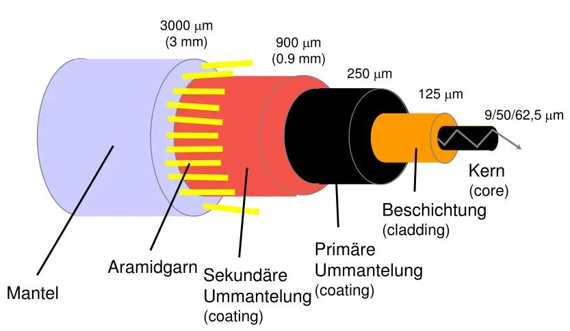
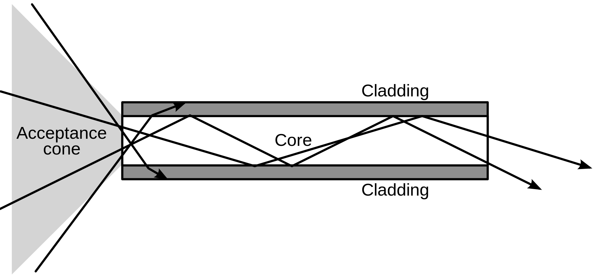

---
tags:
  - Nachrichtentechnik
aliases:
  - LWL
  - LLK
  - Lichtleitkabel
  - Glasfaserkabel
subject:
  - ksn
created: 28th March 2022
---

# Lichtwellenleiter

## Eigenschaften

### Vorteile

1. Schneller
2. Keine EM Störung
3. Höhere Bandbreite/ [Kanalkapazität](../Netzwerktechnik/Kanalkapazität.md)

## Aufbau

## Arten

### 1. Monomode Faser

### 2. Multimode Faser

Jede weitere Ausbreitungsmöglichkeit des Lichtes im Kern wird als **Mode** Bezeichnet  
Die Fortplanzung der Lichtwelle, die im Leiter durch das Material mit unterschiedlichen Brechungsindizes strahlt, wird mit dem [Brechungsgesetz](../Physik/Feldtheorie/Snelliussches%20Brechungsgesetz.md) bestimmt.

#### 1. Stufenprofil

#### 1. Gradientenprofil

Hier wird die unterschiedliche ankunftszeit jeder Mode kompensiert

## Kenngrößen (Stufenindexfaser)

 

### 1. Lichtgeschwintigkeit in einer Mode

### 2. Akzeptanzwinkel $\theta_{max}$

 

#### Totalreflexion

$$
\begin{align*}
n_{0} \cdot \sin(\theta_{max}) &= n_{1}\cdot\sin(90° -\theta_c)\\
\sin(\theta_{max}) &= \frac{n_{1}}{n_{0}}\cdot\cos(\theta_{c})\\
&= \frac{n_{1}}{n_{0}}\cdot\sqrt{1-\sin^{2}(\theta_{c})}\\
&= \frac{n_{1}}{n_{0}}\cdot\sqrt{1-\sin^{2}\left(\arcsin\left(\frac{n_{2}}{n_{1}}\right)\right)}\\
&= \frac{n_{1}}{n_{0}}\cdot\sqrt{1-\left(\frac{n_{2}}{n_{1}}\right)^{2}}\\
\sin(\theta_{max}) &= \frac{1}{n_{0}}\cdot\sqrt{n_{1}^{2}-n_{2}^{2}}
\end{align*}
$$

### 3. Numerische Apertur

Ist eine dimensionslose Größe zur beschreibung der Öffnungsweite als Zahl.  
Der Zahlenwert ist vom **Akzeptanzwinkel (Öffnungswinkel)**, sowie vom **Brechungsindex des umgebenden Mediums** Abhängig.  
$$NA = \sin(\theta_{max})=\frac{1}{n_{0}}\cdot\sqrt{n_{1}^{2}-n_{2}^{2}}$$

>[!EXAMPLE] Aufgabe: Die Kernbrachzahl eines LWL beträgt $1.55$, die des Matels $1.51$. Einspeisung erfolgt durch *[Luft](../Chemie/Lufthülle%20der%20Erde.md)*. Kerndurchmesser beträgt $50\mu m$, der LWL wird bei einer Wellenlänge von $0.8\mu m$ betrieben.
> ##### 1. Lichtgeschwindigkeit im Kern:
> $$c_{1}= \frac{c_{0}}{n_{1}}=\frac{3\cdot10^{8} \frac{m}{s}}{1.55}=1.94\cdot 10^{8} \frac{m}{s}$$
> ##### 2. Grenzwinkel der Totalreflexion
> $$\frac{\sin(\theta_{1})}{\sin(\theta_{2})}=\frac{n_{1}}{n_{2}}$$  
> $$\text{für }\sin(\theta_{2})=1 \rightarrow \theta_{1} = \arcsin\left(\frac{n_{2}}{n_{1}}\right) = \arcsin\left(\frac{1.51}{1.55}\right) = 76.95°$$
> ##### 3. Numerische Apertur
> ##### 4. Akzeptanzwinkel

---

# Tags