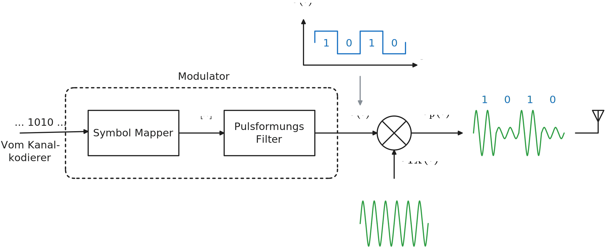
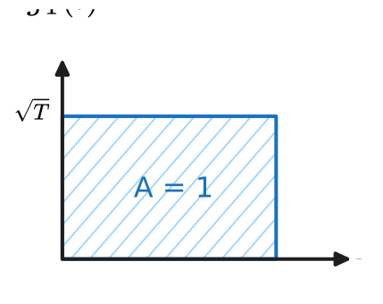
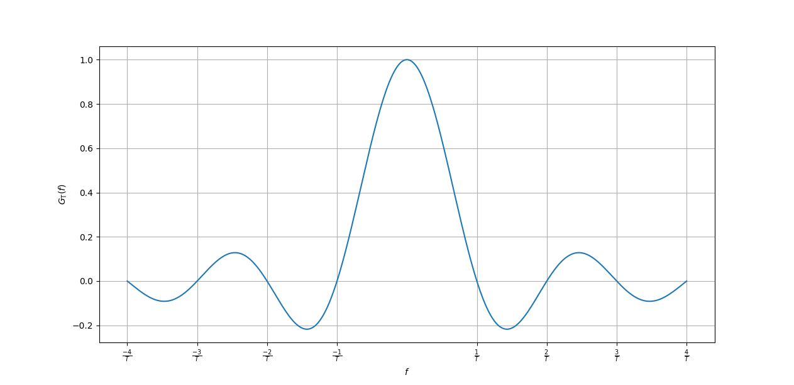
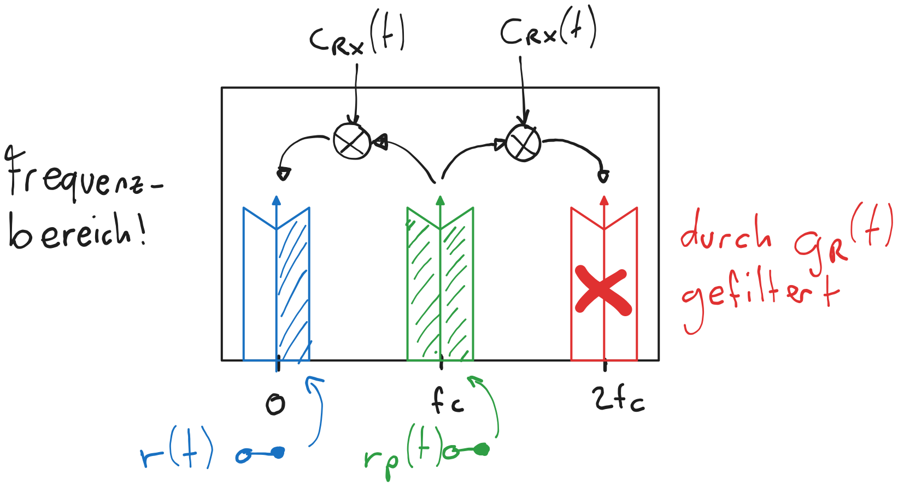
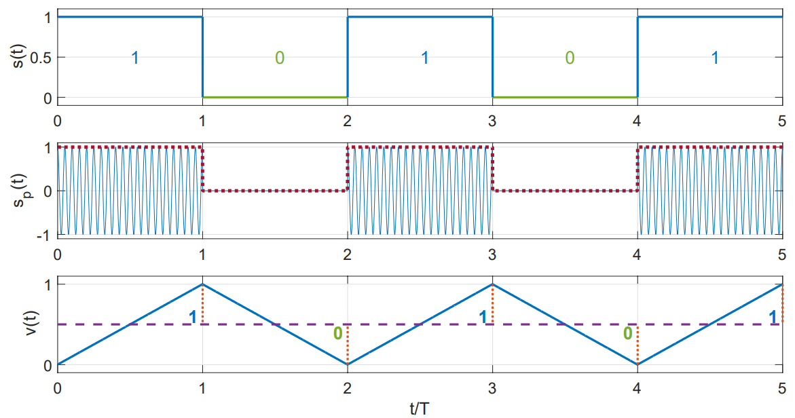
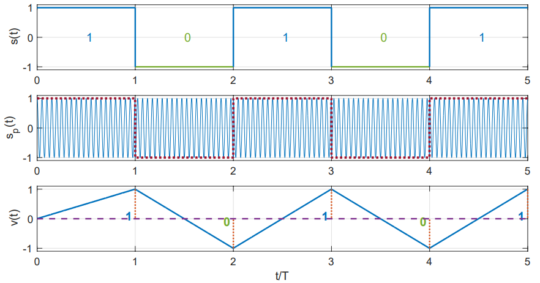
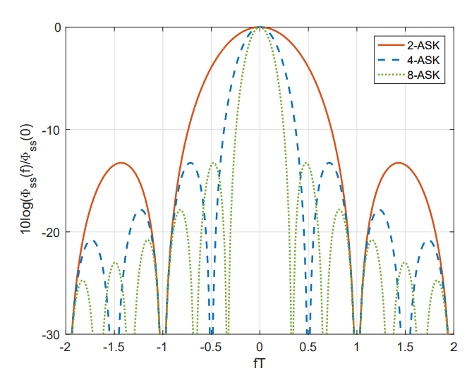
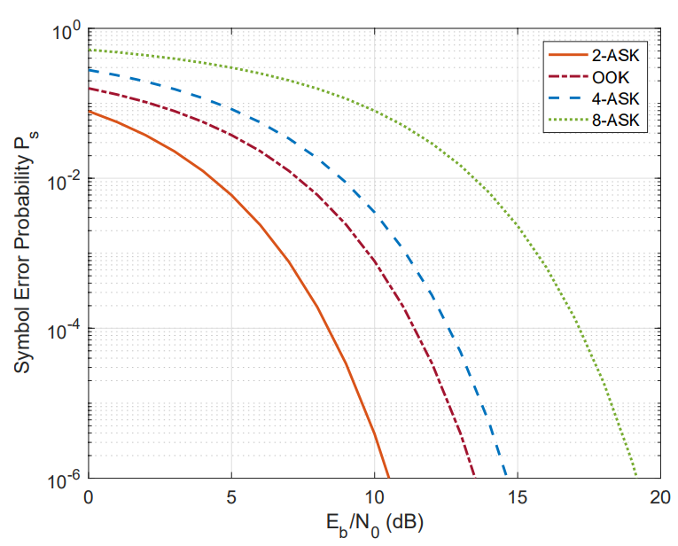
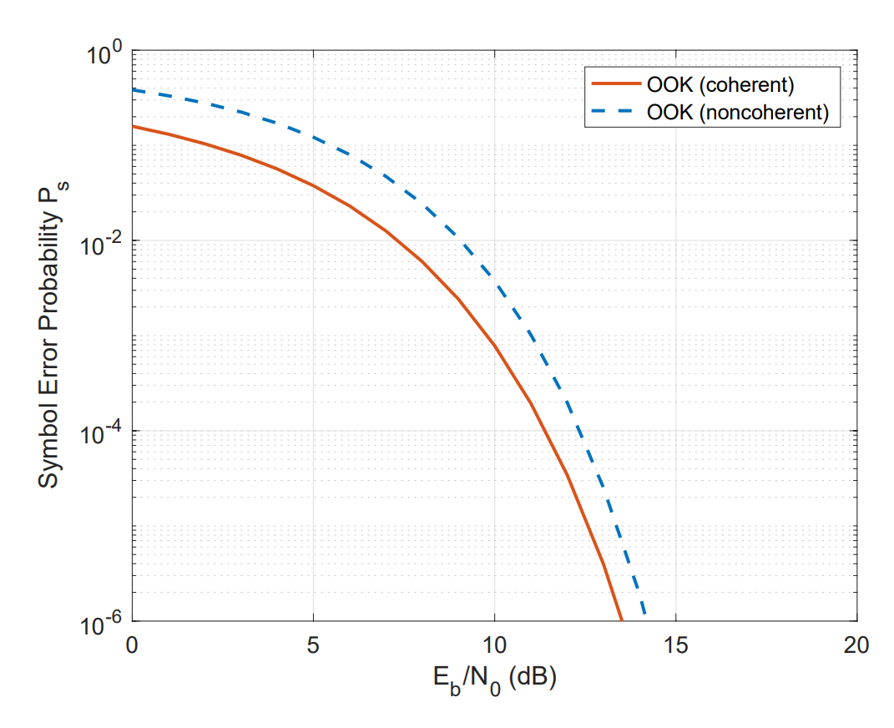

---
tags:
aliases:
  - ASK
  - OOK
  - On-Off-Keying
keywords:
subject:
  - KV
  - Elektronische Systeme 1
semester: WS25
created: 5th November 2025
professor:
  - Reinhard Feger
release: true
title: Amplitude Shift Keying (ASK)
---

# Amplitude Shift Keying (ASK)

> [!question] ASK ist eine Lineare [Modulation](Digitale%20Modulation.md) Digitaler Signale

Die Amplitude des Trägers wird in Diskreten Werten entsprechend dem Informationssignal verändert. Es gibt also endlich viele unterschiedliche amplituden

> [!info] Eigenschaften
> 
> **Vorteile**
> - Hohe Bandbreiteneffizienz
> - Einfaches Transciever Design
> 
> **Nachteile**
> 
> - Schlechter Leistungswirkungsgrad
> - Empfindlich für Amplitudenrauschen

## Modulation

%%[🖋 Edit in Excalidraw](../../_assets/Excalidraw/ASK-BSB.md)%%

### Moduliertes Signal

- $s_{\mathrm{p}}(t)$ ... Passbandsignal
- $s(t)$ ... Basisbandsignal
- $g_{T}(t)$ ... Pulsformungs einhüllende. Übertragungsfunktion des Pulsformungsfilter im Zeitbereich.

$$
s_{\mathrm{p}}(t)=s(t)c_{\mathrm{TX}}(t) = \sum_{k}A[k] ~\underbrace{ g_{\mathrm{T}}(t-kT) }_{ \text{Pulse Formung} }~ \cos(2\pi f_{c}t)
$$
### Pulsformungsfilter

#### Rechteckpuls

Einfach, um das Konzept zu erklären

$$
g_{T}(t) = \frac{1}{\sqrt{ T }} \operatorname{rect}\left( \frac{t-T/2}{T} \right)
$$
|  |  |
| ----------------------------------------------------------- | --------------------------------------------------- |

%%[🖋 Edit in Excaidraw](../../_assets/Excalidraw/Pulseshaper.md)%%

> [!warning] Problem: Rechteckeck puls im Frequenzbereich ist die Sinc-Funktion.
> Die Sinc-Funktion ist nicht Bandbegrenzt und erstreckt seine Seitenkeulen über das gesamte spektrum. In der Realität ungeeignet.

#### Root Raised Cosine

> [!question]  [Raised-Cosine-Filter – Wikipedia](https://de.wikipedia.org/wiki/Raised-Cosine-Filter)

Man kehrt nun die Situation um, sodass man eine Sinc-Artige Funkton als Impulsantwort im Zeitbereich verwendet um ein Bandbegrenztes Signal zu erhalten. Ein Perfekter Sinc ist dann jedoch auch im Zeitbereich Unendlich Ausgedehnt weshalb der Realisierbare und trotzdem mathematisch beschreibare **Root-Raised-Cosine** Pulse zum Einsatz kommt.

## Symbol Mapping

Mit dem Symbol Mapper Wird festgelegt wieviele Diskrete Stufen es gibt und welchen Wert $A[k]$ sie für jedes Bitmuster haben.

- Es werden Bits Gruppiert und ordnet dem Bit-Pattern eine Amplitude zu
- Jedes Symbol (Gruppe an Bits) wird einer Amplitude Zugeordnet

Dadurch Wird die Ordnung der ASK definert

- Eine **M-ASK** hat $M$ unterschiedliche Amplitudenpegel (=Symbole) und gruppiert $q=\operatorname{ld}(M)$ bits.
- **Beispiel:** (4-ASK): $\{00; 01; 10; 11\} \mapsto \mathbf{A} = \{A_{1};A_{2};A_{3};A_{4}\} = \{-3;-1;1;3\}$

Die Einfachste version ist On-Off-Keying. Dabei wird der Sender einfach für 1 eingeschalten und für 0 ausgeschalten.

---

## Kohärente Demodulation

Die Frequenz und die Phase des Trägersignal stimmt am empfänger **exakt** mit dem am Sender überein.

%%[🖋 Edit in Excalidraw](../../_assets/Excalidraw/Amplitude-Shift-Keying%202025-11-16%2015.18.47.excalidraw.md)%%

- $r_{\mathrm{p}}(t)$ ... Rekonstruiertes Basisbandsignal. 
- $r(t)$ ... Aufgenommenes Passbandsignal
	- Heruntergemischt mit dem Träger $c_{\mathrm{TX}}(t)$
	- Vorerst wird eine Perfekte Übertragung ohne rauschen Angenommen
- $k$ ... Anzahl der Symbole. Für **1 Symbol** ist $k=0$.

$$
\begin{align}
r(t) &= r_{\mathrm{p}}(t) c_{\mathrm{RX}}(t) = \overbrace{ A[0] g_{\mathrm{T}}(t)\cos(2\pi f_{c}t) }^{\text{vom TX }(=s_{\mathrm{p}}(t))} \overbrace{\cos(2\pi f_{c}t)}^{\text{generiert in RX}}  \\
&= A[0]g_{\mathrm{T}}(t) \frac{1}{2}(\cos(2\pi 2f_{c}t)+1)
\end{align}
$$

Vereinfachung: siehe [Doppelwinkelsätze](Mathematik/Trigonometrische%20Funktionen.md#^DOPW)

### Tiefpassfilter

Tiefpassfilter mit der [Impulsanwort](Systemtheorie/Impulsanwort.md) $g_{\mathrm{G}}(t)$. Filtert die von der Doppelten Trägerfrequenz heruntergemischten anteile

- Ähnlich zum Pulse Filter in $g_{\mathrm{T}}(t)$
- Filtert das Signal bei $2\pi{\color{orange}2f_{c}}t$
- Maximiert SNR

Ohne dem Anteil bei der Doppelten Trägerfrequenz erhält man $\dfrac{A[0]g_{\mathrm{T}}(t)}{2}$

%%[🖋 Edit in Excalidraw](../../_assets/Excalidraw/ASK-DemodSpektrum.md)%%

Man wählt die Impulsantwort speziell $g_{\mathrm{R}}=2g_{\mathrm{T}}(T-t)$.

- Gespiegiegelt und Verschoben um $T$
- Skaliert um $2$ zur Korrektur des Faktors $\frac{1}{2}$ aus dem Doppelwinkelsatz.

Dadurch erhält man exakt das Übertragene Symbol am Ausgang

$$
\begin{align}
r[0] &= v(t)\Big|_{t=T}=r(t) * g_{\mathrm{R}}(t)\Big|_{t=T} \\
&= A[0] (g_{\mathrm{T}}(t)*g_{\mathrm{T}}(T-t))\Big|_{t=T} \\
&= A[0]\operatorname{tri}\left( \frac{t-T}{T} \right) \Big|_{{t=T}} =A[0]
\end{align}
$$
> [!hint]- Wenn man Zwei Rechteckfunktionen faltet, erhält man eine Trapez- oder im spezialfall eine Dreiecksfunktion
> 

### Threshold Detector

Der Thresholdetector entscheidet, welches Symbol am Eingang anliegt.

> [!example]- **Beispiel:** Binäre ASK (2-ASK): Bits $(0,1) \mapsto$ Symbole: $(A_{1}=0, A_{2}=1)$
> 
> - Spezialfall: Als On-Off-Keying (OOK) Beziechnet
> - Threshold bei $\frac{A_{1}+A_{2}}{2}=0.5$
> 
> 

> [!example]- **Beispiel:** Binäre ASK (2-ASK): Bits $(0,1) \mapsto$ Symbole: $(A_{1}=-1, A_{2}=1)$
> 
> - Threshold bei $\frac{A_{1}+A_{2}}{2}=0$
> 
> 

## Nicht-Kohärente Demodulation

- **Vorteil**: Träger des Empfängers muss nicht Synchron zum Passband sein. Man erspart sich die Synchronisierung
- **Nachteil**: Die Fehlerperformance ist schlechter

Da man bei der Demodulation $A[0]^{2}$ erhält, kann man negative Symbole nicht mehr von positiven unterscheiden.

Abhilfe:

1. Nur Positive Werte im Symbolalphabet definieren
2. Offset einführen

---

## Spektralleistungsdichte

> [!quote] 🇺🇸 **Power Spectral Density** (PSD)

Die Bandbreite ist eine wichtige Kenngröße des Passband-Signals $s_{p}(t)$ in [Drahtlosen Übertragung](HF-Technik/Drahtlose%20Übertragung.md).

Wie Verteilt sich die Signalleistung im Spektrum? Welche Bandbreite wird das Signal im Passband belegen

Die PSD ist hauptsächlich durch der [Pulsformungsfilter](#Pulsformungsfilter) $g_{\mathrm{T}}(t)$ definiert. Betrachtet man dessen Übertragungsfunktion sieht man bei welchen Frequenzen um den Träger das Signalübertragen wird.

> [!def] Basisband PSD $\Phi_{ss}(f)$ in $\mathrm{\frac{W}{Hz}}$
>
> $$
> \Phi_{ss}(f) = \frac{\left| \mu_{A}^{2} \right|}{T^{2}}\delta(f) + \frac{\left| G_{\mathrm{T}}(f) \right|^{2} }{T}
> $$

- $\mu_{A}$ ... Mittelwert der Amplitudenpegel im Symbolalphabet. Ein Symmetrisches Symbolalphabet liefert $\mu_{A}=0$
- $\delta(f)$ ... Dirac-Distribution, sodass nur eine Spektrallinie an der Frequenz $f$ aufscheint ([Ausblendeigenschaft](../../Mathematik/Delta-Impuls.md#^AUSB))
- $T$ ... Pulsbreite des Rechteckfilters (=Dauer eines Symbols)

Für den [Rechteckpulsfilter](#Rechteckpuls) gilt $\left| G_{\mathrm{T}}(f) \right|^{2} = T\operatorname{sinc}^{2}(fT)$

$$ \Phi_{ss}(f) = \frac{\left| \mu^{2}_{A}\right|}{T^{2}}\delta(f) + T\operatorname{sinc}^{2}(fT) $$

Die Passband PSD $\Phi_{s_{\mathrm{p}}s_{\mathrm{p}}}(f)$ ist dann die Basisband PSD um die Träger Frequenz verschoben.
$$
\Phi_{s_{\mathrm{p}}s_{\mathrm{p}}}(f) = \frac{1}{2}(\Phi_{ss}(f-f_{c})+\Phi_{ss}(f+f_{c}))
$$

> [!example] Vergleich von $\Phi_{ss}(f)$ einer 2-, 4- und 8-ASK mit Rechteckpulsfilter
> 
> 
> Je höher die Ordnung N desto geringer die benötigte Bandbreite, jedoch ist die Fehlerrate auch höher. 

Da für höhere Ordnungen mehr Bit pro Symbol Übertragen werden, kann für die selbe Bitrate eine längere Symboldauer gewählt werden. Ein Längerer Puls im zeitbereich korrespondiert zu einem Spitzeren Sinc im Frequenzbereich. Die Bandbreite und die Spektralleistungsdichte in den Nebenkeulen sinken.

Die M-ASK ist aufgrund der schrumpfenden Bandbreite in höheren Ordnungen ein **Bandbreiteneffizientes** Modulationesverfahren

## Fehler Performance

Die Symbol pro Bit Fehlerwahrscheinlichkeit $\frac{P_{s}}{P_{b}}$  ist die durchschnittliche Anzahl an Fehlerhaften bits pro Symbol. Der Jeweilige Fehler ergibt sich durch Auswerten der [Q-Funktion](../../Mathematik/Statistik/Zentraler%20Grenzwertsatz.md#Q-Funktion). Es stellt sich heraus, dass die Fehlerwahrscheinlichkeit immer von $\frac{E_{b}}{N_{0}}$ abhängt.

### Durchschnittliche Bit Energie $E_{b}$

die Durchschnittliche Energie eines Bit ist gegeben durch die Energie der Symbolamplitude gewichtet mit der Impulsantwort $g_{\mathrm{T}}(t)$des Pulsformungsfilters ([Energie eines Signals](Systemtheorie/Energiesignal.md)) dividiert durch die Anzahl an Bit Pro Symbol.

%%[🖋 Edit in Excalidraw](../../_assets/Excalidraw/Amplitude-Shift-Keying%202025-11-16%2021.37.11.excalidraw.md)%%

### Einfluss der ASK Ordnung

| Ordnung | Formel |
| ------- | --------------------------------------------------------------------------- |
| OOK     | $P_{\mathrm{b}} = P_{\mathrm{s}} = Q\left( \sqrt{ \frac{E_{b}}{N_{0}} } \right)$  |
| 2-ASK   | $P_{\mathrm{b}} = P_{\mathrm{s}} = Q\left( \sqrt{ \frac{2E_{b}}{N_{0}} } \right)$ |
| M-ASK   | $P_{\mathrm{s}} = \frac{2(M-1)}{M} Q\left( \sqrt{ \frac{6\operatorname{ld}(M)\bar{E}_{\mathrm{b}}}{(M^{2}-1)N_{0}} } \right)$ |

> [!example] Vergleich der Fehlerwahrscheinlichkeit einer 2-, 4-, 8-ASK und OOK mit **kohärenter** Demodulation
> Fehlerkurvenplot mit der Symbolfehlerwahrscheinlichkeit auf der Abzisse
> 
> 
> 
> - $N_{0}$ ... Spektral-Rauschleistungsdichte ([AWGN-Kanalmodell](HF-Technik/AWGN-Kanalmodell.md))
> - $E_{b}$ ... Durchschnittliche Bit Energie
> - $SNR = \frac{E_{b}}{N_{0}}$ ... Normiertes Signal zu Rauschverhältnis in dB

- $P_{s} = 10^{-4}$ ... Durchschnittlich 1 Fehlerhaftes Symbol auf $10^{4}$ Symbole.

Interpretation der Fehlerkurvenplots

- Mit einem Höheren SNR sinkt die Fehlerwahrscheinlichkeit
- Um für eine ASK höherer Ordnung die selbe Fehlerwahrscheinlichkeit zu erreichen, benötigt man ein höheres SNR, also Mehr Energie pro Symbol.
- Für fixes SNR hat die ASK mit einem größeren Alphabet, eine höhere Fehlerwahrscheinlichkeit

### Fehler Bei Kohärenter und Nicht-Kohärenter Demodulation

Vergleich der OOK bei kohärenter und nicht kohärenter Demodulation

| Demodulations Art | Formel (OOK)                                                                                                                                                                   |
| ----------------- | ------------------------------------------------------------------------------------------------------------------------------------------------------------------------------ |
| Kohärent          | $P_{\mathrm{b,co}} = P_{\mathrm{s,co}} = Q \left( \sqrt{ \frac{E_{\mathrm{b}}}{N_{0}} } \right)$                                                                               |
| Nicht-Kohärent    | $P_{\mathrm{b,nco}} = P_{\mathrm{s,nco}} = \frac{1}{2} Q\left( \sqrt{ \frac{E_{\mathrm{b}}}{N_{0}} } \right) + \frac{1}{2} \exp \left( -\frac{E_{\mathrm{b}}}{2N_{0}} \right)$ |
