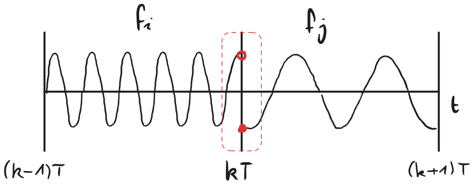
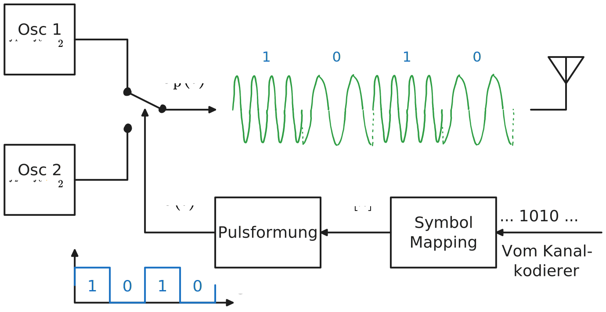
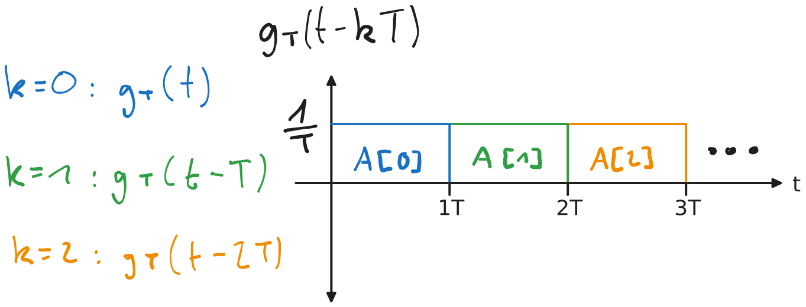
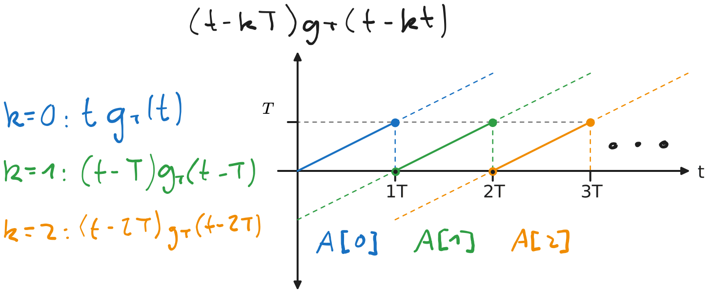
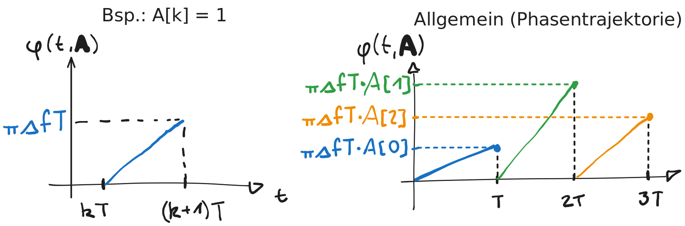
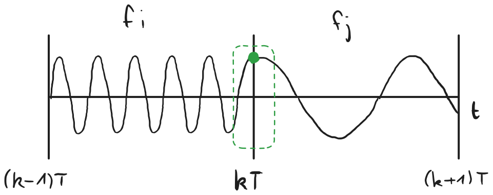
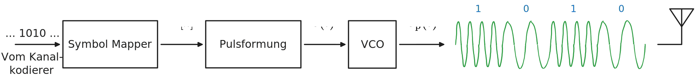
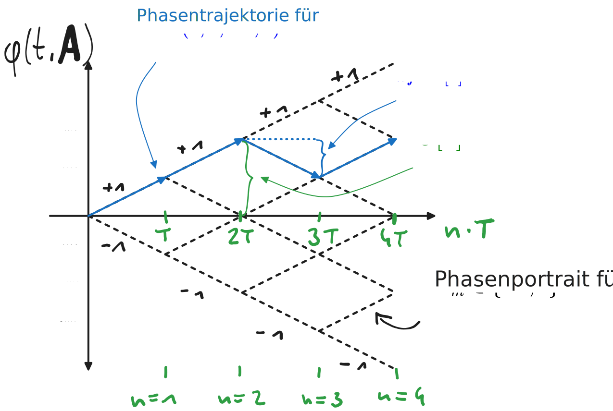
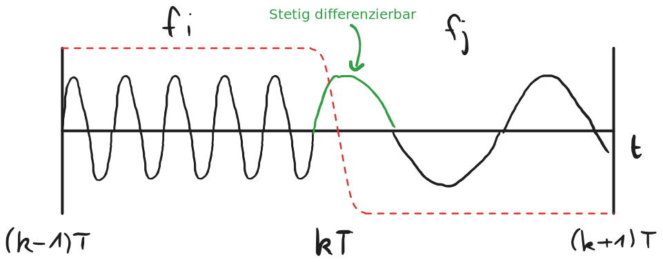

---
tags:
aliases:
  - FSK
  - CPFSK
  - NCPFSK
  - GFSK
keywords:
subject:
  - KV
  - Elektronische Systeme 1
semester: WS25
created: 5th November 2025
professor:
  - Werner Haselmayer
release: true
title: Frequency Shift Keying (FSK)
---

# Frequency Shift Keying (FSK)

> [!question] FSK ist eine Nicht Lineare Modulationsart Digitaler Signale
> Das Mapping des Symbols erfolgt auf das Argument des Trägers (Cosinus)

## Non Continuous Phase FSK (NCPFSK)

- Hin und Her schaltung zwischen oszillatoren mit unterschiedlicher Frequenz

%%[🖋 Edit in Excalidraw](../../_assets/Excalidraw/NCPFSK.md)%%

Durch die Sprünge in der Phase, wird das Spektrum breiter.

Beispeil für die Binäre 2-FSK

%% [🖋 Edit in Excalidraw](../../_assets/Excalidraw/2-FSK-mod-BSB.md)%%

Für die M-FSK kann das Blockschaltbild auf $M$-oszillatoren erweitert werden. Es erfolgt ein **nicht-lineares** Mapping der Symbole $A_{m}$ auf $s_{\mathrm{p},m}(t)$

### Moduliertes Signal und Informationstragende Phase

#### Darstellung für 1 Symbol ($k=0$)

$$
s_{\mathrm{p}}(t) = \sqrt{ 2 } \cos \left( 2\pi \left( f_{\mathrm{c}}+A_{m} \frac{\color{orange}\Delta f}{2} \right) t \right) \quad \text{mit } 0 \leq t \leq T
$$
- $\Delta f$: Frequenzabstand zweier Symbole
- Symbolalphabet: $A_{m} \in \{\pm 1, \pm 3, \dots, \pm(M-1)\}$
- $\sqrt{ 2 }$: Skalierungsfaktor um die Energie auf 1 zu Normieren

#### Darstellung für eine Symbolsequenz

Um nun das Umschaltverhalten der Oszillatoren mathematisch zu beschrieben, definiert man allgemein die **Informationstragende Phase** $\varphi(t,\mathbf{A})$
$$
\begin{align}
s_{\mathrm{p}} (t) &= \sqrt{ 2 }\cos(2\pi f_{\mathrm{c}}t+ \varphi(t, \mathbf{A})) \\
\varphi(t, \mathbf{A}) &:= 2\pi \frac{\Delta f}{2} T \sum_{k} A[k](t-kT)g_{\mathrm{T}}(t-kT)
\end{align}
$$
- Symbolsequenz: $\mathbf{A} = (A[0], A[1], \dots)$
- Rechteckpuls $g_{\mathrm{T}}(t-kT)$: sorgt dafür, dass sich die Symbole nicht gegenseitig überschneiden. Modelliert, dass nur ein Oszillator auf einmal durchgeschalten wird. 

%% [🖋 Edit in Excalidraw](../../_assets/Excalidraw/FSK-GT.md) %%

- Linearer Anstieg ($t-kT$): Der Rechteckimpuls mit dem Symbol Alleine ergäbe nur eine konstante [Momentanphase](Momentanphase%20und%20Momentanfrequenz.md). Der Lineare Term Sorgt um eine **linear ansteigende Phase** um eine Konstante [Momentanfrequenz](Momentanphase%20und%20Momentanfrequenz.md) während der Symbolperiode darzustellen.

%%[🖋 Edit in Excalidraw](../../_assets/Excalidraw/FSK-tgT.md)%%

#### Informationstragende Phase in einem Symbolintervall

In einem einzigen Symbolintervall $kT \leq t \leq (k+1)T$ vereinfacht sich das Rechteck zur konstante $\frac{1}{T}$ und die informationstragende Phase lautet

$$
\varphi(t,\mathbf{A}) = 2\pi \frac{\Delta f}{2} T A[k](t-kT) \frac{1}{T} = \pi\Delta fA[k](t-kT)
$$

Daran kann man den Linearen Phasenanstieg in abhängigkeit des Symbols erkennen.

%%[🖋 Edit in Excalidraw](../../_assets/Excalidraw/FSK-InfoPhase.md)%%

> [!def] **Modulationsindex** $h$: Der Term $\Delta f T = h$ wird als Modulatiosindex beziechnet

Das Passbandsignal $s_{\mathrm{p}}(t) = \sqrt{ 2 }\cos (2\pi f_{\mathrm{c}}t + \varphi(t, \mathbf{A}))$ ist dann

$$
s_{\mathrm{p}}(t) = \sqrt{2} \cos \left( 2\pi \left( f_{\mathrm{c}}t +\frac{\Delta f}{2} A[k] (t-kT)\right) \right) 
$$

## Continuous Phase FSK (CPFSK)

Das Symbol wird auf die Frequenzbestimmende Steuerspannung eines einzelnen [VCO](../../Analog-Design/Oszillatoren/Voltage%20Controlled%20Oscillator.md) gemappt.

Der VCO besitzt implizit ein **Integrales verhalten** bezüglich der Phase. D.h. die Phase wird auf-akkumuliert und führt zu einem **Memory-Effekt**. Die Phase ist also anders als beim NCPFSK Abhängig vom Symbol aus der Vorherigen Periode

%%[🖋 Edit in Excalidraw](../../_assets/Excalidraw/CPFSK.md)%%

Blockschaltbild

%%[🖋 Edit in Excalidraw](../../_assets/Excalidraw/CPFSK-BSB.md)%%

### Informationstragende Phase

Als Pulsformung wird wieder eine Rechteckfunktion für $g_{\mathrm{T}}(t)$ gewählt. Diese modelliert ein Sprungförmiges Umschalten der Steuerspannung des VCO.

Das Umschalten des VCO muss nicht unbedingt sprungförmig sein und es können andere Verteilungen statt der Rechteckfunktion verwendet werden (siehe [Gaussches FSK (GFSK)](#Gaussches%20FSK%20(GFSK))).

$$
\begin{align}
s_{\mathrm{p}}(t) &= \sqrt{ 2 }\cos (2\pi f_{\mathrm{c}}t+\varphi(t, \mathbf{A})) \\
\varphi(t, \mathbf{A}) &= 2\pi \frac{\Delta f}{2} T \int\limits_{-\infty}^{t} \sum_{k=-\infty}^{n} A[k] g_{\mathrm{T}}(\tau-kT)\mathrm{~d}\tau
\end{align}
$$

Das Integral beschreibt nun das Integrierende Verhalten des VCO

#### Betrachtung in einem Symbolintervall

$$
\varphi(t, \mathbf{A}) = 2\pi \frac{\Delta f}{2} T \int\limits_{-\infty}^{t} \sum_{k=-\infty}^{n} A[k] g_{\mathrm{T}}(\tau-kT)\mathrm{~d}\tau \\
$$
Man extrahiert die Letzte iteration $k=n$ der summe und erhält

$$
\varphi(t,\mathbf{A})= \pi \Delta fT \sum_{k=-\infty}^{n-1}A[k] \underbrace{ \int\limits_{-\infty}^{nT}g_{\mathrm{T}}(t-kT)\mathrm{~d}\tau }_{=1} \quad+\quad \pi\Delta fTA[n]\underbrace{ \int\limits_{nT}^{t}g_{\mathrm{T}}(\tau-nT)\mathrm{~d}\tau }_{ q(t-nT)= (t-nT)/T }
$$

Die Auswertung des Integrals über die Rechteckfuktion liefert $q(t-nT) = \frac{1}{T}(t-nT)$. Diese stimmt exakt mit der Funktion zur linearen Phasenänderung der NCPFSK $(t-nT)g_{\mathrm{T}}(t-nT)$ überein.

$$
\varphi(t,\mathbf{A}) = \underbrace{ \pi\Delta fT \sum_{k=-\infty}^{n-1}A[k] }_{ \Theta[n] } + \pi \Delta fT A[n]q(t-nT)
$$
Der Term $\Theta[n]$ beschreibt die Akkumulation der Phasen aller vorherigen Symbole (spiegelt den **Memoryeffekt** wieder). Der zweite Term ist identisch mit der Phasentrajektorie der NCPFSK. $\Theta[n]$ führt also einen offset ein, damit die Phasentraketorie keine Sprünge enthält.

$$
\varphi(t, \mathbf{A}) = \Theta[n] + \pi h A[n]q(t-nT)
$$

%%[🖋 Edit in Excalidraw](../../_assets/Excalidraw/CPFSK-Traj.md)%%

## Frequenzabstand

Für die kohärente demodulation muss der frequenzabstand $\Delta f$ so gewählt werden, dass die Frequenzen $f_{\mathrm{c}} + \Delta f$ und $f_{\mathrm{c}}-\Delta f$ **orthogonal** zu eineander sind

Die kleinste frequenz bei der die orthogonalität erfüllt ist, ist $\Delta f_{\min} = \frac{1}{2T}$, also $h=0.5$

## Gaussches FSK (GFSK)

Spezialfall der CPFSK bei der für $g_{\mathrm{T}}(t)$ statt einer rechteckfunktion ein [Gauss Impuls](HF-Technik/Gauss%20Impuls.md) verwendet.

- Symbole sind nicht limitiert auf eine feste Symbolperiode und können in das nächste Symbol Abklingen
- Kontinuierlicher Übergang zwischen den Frequenzen
- Der Übergang ist nicht nur (wie bei der CPFSK) stetig, sondern auch **Stetig Differenzierbar**
- Führt zu einem niedrigerem Bandbreitenbedarf

%%[🖋 Edit in Excalidraw](../../_assets/Excalidraw/GFSK.md)%%