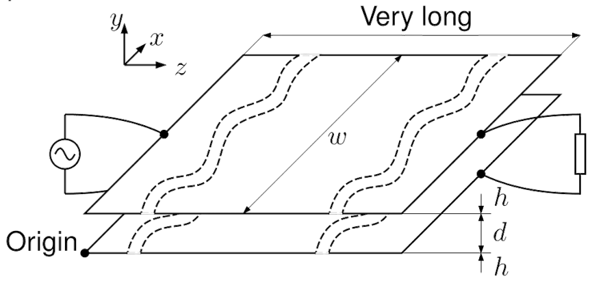

 

# Herleitung eines HF-Modells für eine Parallelplattenleitung

> [!hint] Herleitung der Parallelplattenleitung mittels der [Maxwell](../Elektrotechnik/Maxwell.md)-Gleichungen
> Das Verfahren ist gleich für andere [Leitergeometrien](Leitergeometrie.md)

## Dimensionen

> [!info] Dimensionen der Platten, sodass Vereinfachungen der Berechnungen möglich sind.
> 
> 
> 
> - Platte ist sehr Lang in $z$-Richtung.
> - $h$ ist vernachlässigbar dünn. 
> - Verhältnis $\frac{w}{d}$ ist *groß*, sodass die Feldlinien innerhalb des Leiters als parallel angenommen werden. 

Mit diesen Annahmen kann der Parallelplattenleiter als [TE-Mode](Leitergeometrie.md) betrachtet werden.

## Annahmen zum Feldverlauf

Vorraussetzung für TEM-Moden:

> [!info] E-Feld
> - E-Feld hat keine komponente die in $z$-Richtung zeigt
> - wir nehmen an dass die E-Feld Komponente in $x$-Richtung 0 ist
> 
> $$\mathbf{E} = \begin{bmatrix} 0 \\ E_{y}(x,y,z,t) \\ 0 \end{bmatrix} = E_{y}(x,y,z,t)\cdot \mathbf{e}_{y}\quad \text{für} \quad 0 < y < d$$
> 

 > [!info] H-Feld
 > - H-Feld hat auch keine komponente in $z$-Richtung
 > - wir nehmen an dass das H-Feld nur in $x$-Richtung zeigt (gegensatz zum E-Feld)
 >
 > $$\mathbf{H}=\begin{bmatrix} H_{x}(x,y,z,t) \\ 0 \\ 0\end{bmatrix} = H_{x}(x,y,z,t)\cdot \mathbf{e}_{x} \quad \text{für} \quad 0<y<d$$
 
Vereinfachte Lösung mit annahme einer idealen TEM mode (es gibt genauere Lösungen)

### Herleitung der Telegrafengleichung

| Anwendung des [Induktionsgesetzes](../Elektrotechnik/Maxwell.md#^MW2)                                                                                                                                                 |
| --------------------------------------------------------------------------------------------------------------------------------------------------------------------------------------------------------------------- |
| $$\nabla \times \mathbf{E}=-\frac{\partial}{\partial t} \mathbf{B} \implies \oint_C \mathbf{E} \cdot \mathrm{d} \mathbf{l}=-\frac{\partial}{\partial t} \iint_S \mu \mathbf{H} \cdot \mathrm{d} \mathbf{s}\tag{MW2}$$ |
|                                                                                                                                                                             |
| Nur E-Feldlinien *entlang* der Kontur $C$ werden Integriert.                                                                                                                                                          |
| Nur H-Feldlinien *normal* zur Fläche $S$ werden Integriert.                                                                                                                                                        |

> [!question] In das Modell eingezeichnet
> 

#### Folgerungen der Kontur $C_{0}$

> [!hint] Dieser Ansatz zeigt uns:
> - $E_{y}$ über den Abstand $d$ der Platten integriert liefert die Propagierende Spannungswelle $V(z,t)$
> - diese ändert sich auch nicht über die $x$-Achse, sondern nur in $z$-Richtung.

> [!question]- Herleitung
> **Linke Seite** der Integralform von MW2:
> 
> Mit dem [Skalarprodukt](../Mathematik/Algebra/Skalarprodukt.md) fallen nur die $x$-$y$-Komponenten ins Gewicht:
> 
> $$
> \begin{aligned}
> \oint_{C_0} \mathbf{E} \cdot \mathrm{~d} \mathbf{l}=\int_0^d E_y\left(x_0, y, z_0, t\right) \mathrm{d} y & +\int_{x_0}^{x_1} E_x\left(x, d, z_0, t\right) \mathrm{d} x -\int_0^d E_y\left(x_1, y, z_0, t\right) \mathrm{d} y-\int_{x_0}^{x_1} E_x\left(x, 0, z_0, t\right) \mathrm{d} x
> \end{aligned}
> $$
> 
> Unter den Annahmen des Feldverlaufts ist $E_{x}=0$. Tangentiale Feldanteile bei $y=0$ und $y=d$ fallen aber sowieso weg.
> 
> $$
> \oint_{C_0} \mathbf{E} \cdot \mathrm{~d} \mathbf{l}=\int_0^d E_y\left(x_0, y, z_0, t\right) \mathrm{d} y-\int_0^d E_y\left(x_1, y, z_0, t\right) \mathrm{d} y
> $$
> 
> **Rechte Seite** der Integralform von MW2:
> 
> Da der Flächenvektor der Fläche $S_{0}$ in $z$-Richtung zeigt, also nur $H_{z}$ mit ihm über das Skalarprodukt korrilieren kann, verschwindet das Flächenintegral:
> 
> $$
> \begin{align}
> \iint_S \mu \mathbf{H} \cdot \mathrm{d} \mathbf{s} =-\frac{\partial }{\partial t} \int _{0}^{d}\!\!\!\int _{x_{0}}^{x_{1}} \mu H_{z}(x,y,z,t)\mathrm{~d}x\mathrm{~d}y=0 
> \end{align}
> $$
> 
> **Gleichsetzen** der beiden seiten liefert:
> 
> $$
> \begin{align}
> \int_0^d E_y\left(x_0, y, z_0, t\right) \mathrm{~d} y&-\int_0^d E_y\left(x_1, y, z_0, t\right) \mathrm{~d} y = 0 \\
> \implies\int_0^d E_y\left(x_0, y, z_0, t\right) \mathrm{~d} y&=\int_0^d E_y\left(x_1, y, z_0, t\right) \mathrm{~d} y
> \end{align}
> $$
> Was bedeuted, dass $E_{y}$ nicht über $x$ Variiert, also **konstant** in $x$ ist. Dies führt uns dazu, das integral als Funktion über $z$ und $t$ zu schreiben, nämlich als die Propagierende Spannungswelle $V(z,t)$:

$$\int_{0}^{d}E_{y}(y,z,t)\mathrm{~d}y = -V(z,t)\tag{1}$$ ^1

#### Folgerungen der Kontur $C_{1}$

 > [!hint] Dieser Ansatz zeigt uns:
 > - Variation des E-Feldes über die $z$-Richtung (also $V(z,t)\mapsto V(z+\Delta z, t)$)
 > - liefert eine weitere Gleichung in abhängigkeit von $H_{x}$ mit welchem man mit dem Durchflutungssatz auf die Stromwelle $I(z,t)$ schließen kann.

> [!question]- Herleitung
> 
> **Linke Seite** der Integralform von MW2:
> 
> Wir wissen bereits, dass die Spannung über $x$ konstant ist. Dabei kann [(1)](#^1) Eingesetzt werden
> 
> $$
> \oint_{C_{1}} \mathbf{E}\cdot\mathrm{d}\mathbf{l} = \underbrace{ \int_{0}^{d}E_{y}(y, z_{0},t)\mathrm{~d}y}_{ -V(z_{0},t) } - \underbrace{ \int_{0}^{d}E_{y}(y, z_{0} + \Delta z,t)\mathrm{~d}y }_{ -V(z_{0}+\Delta z,t) }
> $$
> 
> **Rechte Seite** der Integralform von MW2:
> 
> Das Dazugehörige Flächenintegral über $S_{1}$ liefert
> 
> $$
> -\frac{\partial }{\partial t} \iint_{S_{1}}\mu \mathbf{H}\cdot \mathrm{d}\mathbf{s}=-\frac{\partial }{\partial t}\int_{0}^{d}\!\!\!\int_{z_{0}}^{z_{0}+\Delta z} \mu H_{x}(x,y,z,t)\mathrm{~d}z\mathrm{~d}y
> $$
> 
> 
> **Gleichsetzen** der beiden seiten liefert:
> 
> $$-V(z_{0},t) + V(z_{0}+\Delta z,t)=-\frac{\partial }{\partial t}\int_{0}^{d}\!\!\!\int_{z_{0}}^{z_{0}+\Delta z} \mu H_{x}(x,y,z,t)\mathrm{~d}z\mathrm{~d}y$$
> 
> Aus [DIFQ](../Mathematik/Analysis/Differenzialrechnung.md#^DIFQ) (Durch $\Delta z$ dividieren, dann $\Delta z\to 0$) folgt:
> 
> $$\frac{\partial }{\partial z}V(z,t) = -\frac{\partial}{\partial t}\int_{0}^{d} \mu H_{x}(x,y,z,t) \mathrm{~d}y$$
> 
> Aus den [Annahmen zum Feldverlauf](#Annahmen%20zum%20Feldverlauf) ist $H_{x}$ in $y$ und $x$ konstant, also nur in $z$ abhängig:
> 
> $$=\frac{\partial}{\partial t}\mu H_{x}(z,t) \int_{0}^{d} 1\mathrm{~d}y \implies$$
> 

$$\frac{\partial }{\partial z}V(z,t) = -\frac{\partial }{\partial t}\mu H_{x}(z,t)\cdot d\tag{2}$$ ^2

#### Herstellung einer U-I Beziehung

Das resultierende Integral über $H_{x}$ kann mit dem [Durchflutungssatz](maxwell.md#^MW1) evaluiert werden:

$$\oint_{C_{2}} \mathbf{H}\cdot\mathrm{d}\mathbf{l} = \iint_{S_{2}}\mathbf{J}\cdot \mathrm{d}\mathbf{s}\tag{MW1}$$

(wegen der TEM ist die Verschiebungsstromdichte 0)

| Stromdichte $\mathbf{J}$ Entlang des Leiters                  | Kontur $C_{2}$ Umkreist eine der Platten                                    |
| ------------------------------------------------------------- | --------------------------------------------------------------------------- |
|  |  |

- $h$ ist vernachlässigbar klein.
- $\mathbf{H}$ existiert nur in $x$-Richtung zwischen den Platten und ist in $y$ **konstant**
- $\implies$ Also wird nur über $w$ in $H_{x}$ Richtung Integriert

$$\int_{0}^{w}H_{x}(z,t)\mathrm{~d}x = H_{x}(z,t)w=I(z,t) \implies H_{x}(z,t)= \frac{I(z,t)}{w}\tag{3}$$ ^3

---

### Die Telegrafengleichung

[(3)](#^3) in [(2)](#^2) eingesetzt ergibt:

$$
\boxed{ \frac{\partial }{\partial z}V(z,t)=- \frac{\mu d}{w} \frac{\partial}{\partial t}I(z,t) = -L' \frac{\partial}{\partial t}I(z,t) }
$$

Der Gleiche [Ansatz für die Kontur](#Folgerungen%20der%20Kontur%20$C_{1}$) $C_{1}$ aber mit dem Durchflutungssatz (wo $I(z_{0},t)\mapsto I(z_{0}+\Delta z,t)$) liefert:

$$
\boxed{ \frac{\partial }{\partial z} I(z,t)=- \frac{\varepsilon w}{d} \frac{\partial}{\partial t}V(z,t) = -C' \frac{\partial}{\partial t}V(z,t) }
$$

Somit erhalten wir die [Telegraphengleichung](Telegraphengleichung.md) als gekoppelte PDGL, mit den Leitungsbelägen $L'$ und $C'$:

- Kapazitätsbelag $C' = \frac{\varepsilon w}{d}$
- Induktivitätsbelag $L' = \frac{\mu d}{w}$

Für Andere [TEM-Leitergeometrien](Leitergeometrie.md) sind diese Beläge anders, aber die Form der Gleichung bleibt gleich.