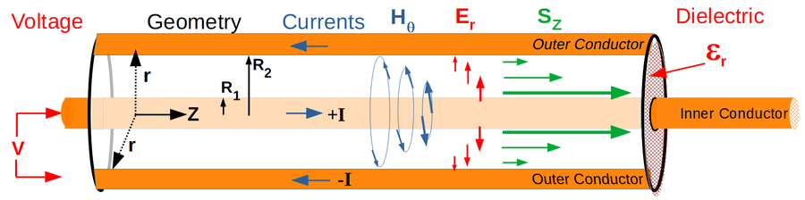

# Poynting [Vektor](../Mathematik/mathe%20(3)/Vektor.md)

Der Poynting-[Vektor](../Mathematik/mathe%20(3)/Vektor.md) $\vec S$ kennzeichnet in der Elektrodynamik die Dichte und die Richtung des Energietransportes (Energieflussdichte) eines elektromagnetischen Felds $(\vec E,\vec H)$.

Der Begriff des Energieflusses ist identisch mit dem physikalischen Begriff der Leistung, die Bezeichnung Energieflussdichte ist daher gleichwertig zur Leistungsdichte.

## Beim Koaxialleiter

https://www.youtube.com/watch?v=oI_X2cMHNe0