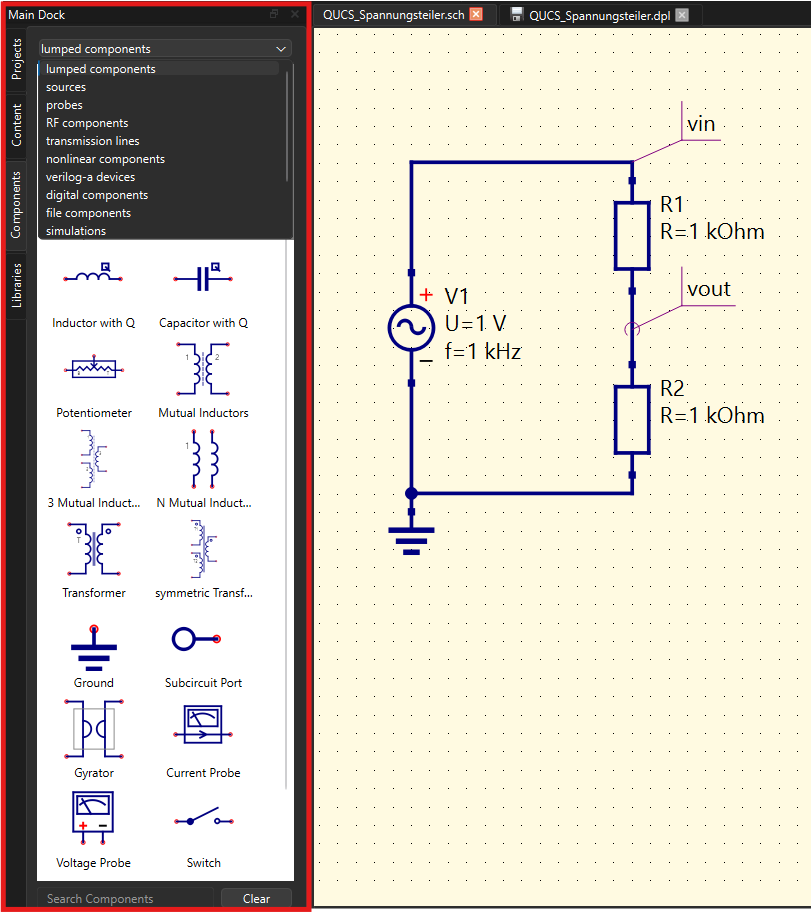
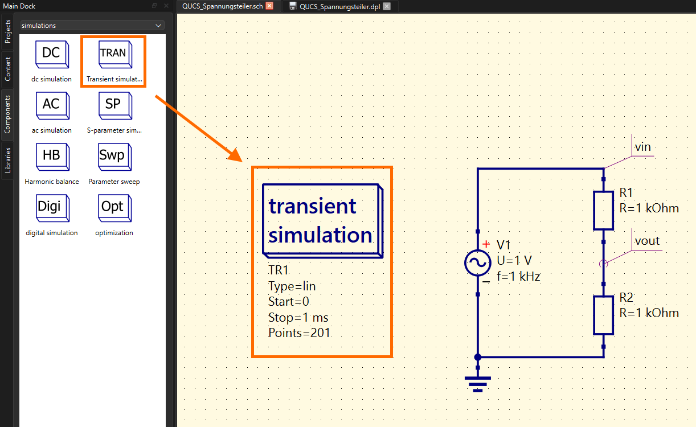
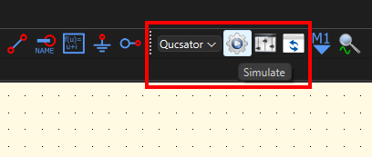
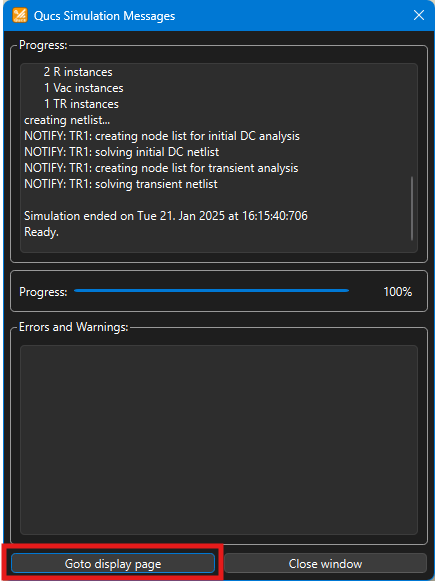

 

# QUCS - Quite Universal Circuit Simulator

> [Qucs-S: Qucs with SPICE](https://ra3xdh.github.io/)

## Erstellen einer Simulation

**Schaltung Zeichnen**

**Simulationsart festlegen**

- Komponenten -> Simulations -> DC, Transient ...
- Parameter Einstellen: Typ, Start, Stop, Schrittweite, Schritte

**Simulation Starten**

- Gegebenfalls Simulationsengine wählen: ngspice, Qucsator

| | |
| ---------------------------- | ---------------------------- |
|  |  | 

**Diagramm anzeigen Lassen**

- Components -> diagrams -> Cartesian, Polar, ...
- Parameter einstellen und Signale zu Anzeige *Doppelclicken*

| | |
| ----------------------------------------------- | -------------------------------------------------- |
|  |  |

 