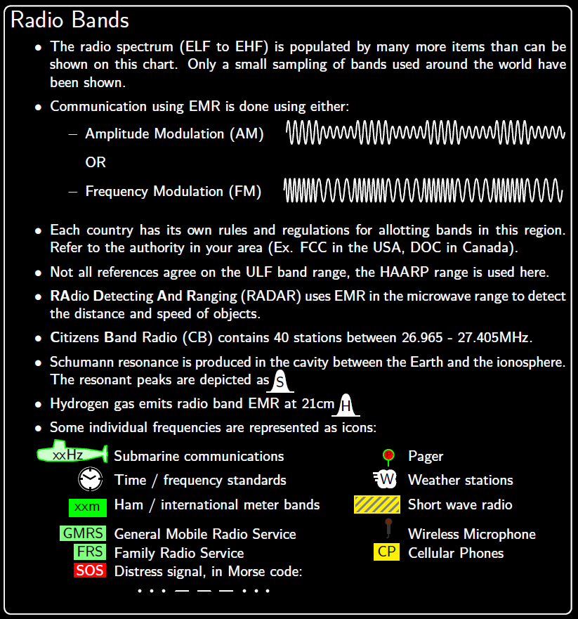
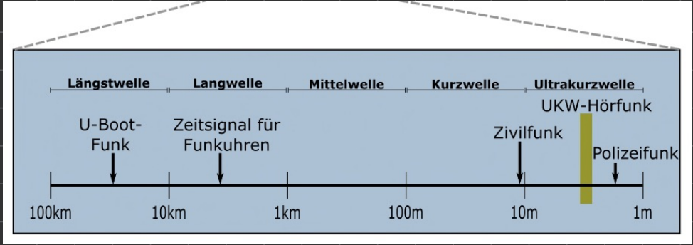

# Rundfunk

Der Rundfunk dient als Kommunikationsmedium für die Öffentlichkeit.  

## Radiowellen

### [index](../Physik/Feldtheorie/index.md)

Die Funkbänder im Rundfunkspektrum:  

### Fortbewegung Der Funkwelle

Eine Radiowelle ist eine [EM-Welle](../Physik/Feldtheorie/index.md) und benötigt somit kein Medium, um sich Fortbewegen zu können.  

### Energie Der Welle

[EM-Wellen](../Physik/Feldtheorie/index.md) Transportieren Energie  
$E=h\cdot f$ 

## Vom Sprachsignal Zur Funkwelle

Durch **[Modulation](Modulation.md)** wird ein Niederfrequentes Sprachsignal auf ein Hochfrequentes Trägersignal aufgemischt.  
Somit kann das Sprachsignal die Eigenschaften einer HF-[EM-Welle](../Physik/Feldtheorie/index.md) annehmen und zur Übertragung verwendet werden.  
Durch **Demodulation** erhält der Empfänger das Nutzsignal zurück.

- Verschieden Arten von [Modulation](Modulation.md)
- Eine [Antenne](Antenne.md) 

# Tags

- [Rundfunk](../_assets/pdf/Rundfunk.pdf)
- [Elektromagentisches Spektrum](../_assets/pdf/spectrum_20090210.pdf)
