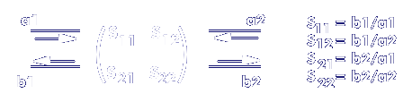

# [Streuparameter](https://de.wikipedia.org/wiki/Streuparameter)

**Streuparameter**, abgekürzt **S-Parameter** dienen zur Beschreibung des Verhaltens linearer elektrischer Komponenten und Netzwerke im **Kleinsignalverhalten** mittels Wellengrößen.

- Beschreiben z.B. [Filter](../Hardwareentwicklung/Filter.md), [Antenne](Antenne.md), [Mischer](Mischer.md)
- Wellenparameter = Teilspannungen 
- Messen nicht einfach normal wegen $u_{h}$ und $u_{r}$ (hinlaufende und rücklaufende [elektrische Spannung](../Elektrotechnik/elektrische%20Spannung.md))
- Widerstandsparameter bei Serienschaltung
- Leitwert bei Parallelschaltungen

## Allgemein

Ausgehend von der **[Impedanz](../Elektrotechnik/Impedanz.md)** $Z_\nu$ des **Messsystems** am Tor $\nu$ lassen sich die beiden Darstellungen nach folgenden Gleichungen, welche auch als **[Heaviside-Transformation](../Systemtheorie/Einheitssprungfunktion.md)** bezeichnet wird, in Bezug setzen (Wir setzen im Folgenden voraus, dass $Z_0$ positiv reell ist):

$$a_\nu = \dfrac{1}{2} \cdot \left( \dfrac{U_\nu}{\sqrt{Z_0}} + I_\nu\sqrt{Z_0} \right)$$$$b_\nu = \dfrac{1}{2} \cdot \left( \dfrac{U_\nu}{\sqrt{Z_0}} - I_\nu\sqrt{Z_0} \right)$$
  
> [!hint] *Die Einheit der Streuparameter ist $\sqrt{W}$*

und durch Umkehrung der Beziehungen:  

$$U_\nu = \sqrt{Z_0} \cdot (a_\nu + b_\nu)$$

$$I_\nu = \dfrac{1}{\sqrt{Z_0}} \cdot (a_\nu - b_\nu)$$

Die [elektrische Spannung](../Elektrotechnik/elektrische%20Spannung.md) $U_\nu$ und der [Strom](../Elektrotechnik/elektrischer%20Strom.md) $I_{\nu}$ am Tor $\nu$ stehen über die nach außen wirkende [Impedanz](../Elektrotechnik/Impedanz.md) $Z_\nu$ miteinander in Beziehung:  

$$Z_\nu = \dfrac{U_\nu}{I_\nu}$$

womit sich mit der [Impedanz](../Elektrotechnik/Impedanz.md) $Z_{0}$ des Messsystems der [Reflexionsfaktor](Reflexionsfaktor.md) $r_{\nu}$ beschreiben lässt als:  

$$r_\nu = \dfrac{b_\nu}{a_\nu} = \dfrac{Z_\nu - Z_0}{Z_\nu + Z_0}, \qquad b_\nu = r_\nu \cdot a_\nu$$

Im einfachsten Fall eines **Eintors** ist der skalare [Reflexionsfaktor](Reflexionsfaktor.md) $r$ gleich dem einen und **einzigen S-Parameter $S_{11}$**.

Bei elektrischen Netzwerken mit mehr als einem Tor wird dieser Zusammenhang mit Hilfe einer [Matrixgleichung](Matrix.md) in Form eines [LGS](Lineare%20Gleichungssysteme.md) ausgedrückt.

Allgemein werden die S-Parameter eines n-Tors als eine n×n-[Matrix](Matrix.md) $S$ und die beiden je n Elemente umfassenden [Vektoren](../Mathematik/Algebra/Vektor.md) $a$ und $b$ als [Matrixgleichung](Matrix.md) ausgedrückt:

$$\mathbf{b} = \mathbf{S} \times \mathbf{a}$$

oder in der Elementschreibweise:

$$
\begin{pmatrix}
    b_1    \\
    \vdots \\
    b_n
\end{pmatrix}
=
\begin{pmatrix}
    S_{11} & \dots &S_{1n} \\
    \vdots &\ddots &\vdots \\
    S_{n1} & \dots &S_{nn}
\end{pmatrix}
\times
\begin{pmatrix}
    a_1    \\
    \vdots \\
    a_n
\end{pmatrix}
$$

## [Zweitor](../Hardwareentwicklung/Zweitor.md) Gleichungen

Die Anzahl der Streuparameter ergibt sich aus dem Quadrat der Tore: [Zweitor](../Hardwareentwicklung/Zweitor.md) -> 4 S-Parameter.

- ==$a_{1}$== ist die am *Tor 1* einlaufende Welle
- ==$a_{2}$== ist dei am *Tor 2* einlaufende Welle
- ==$b_{1}$== ist die vom Eingang (*Tor 1*) auslaufende Welle
- ==$b_{2}$== ist die vom Ausgang (*Tor 2*) auslaufende Welle
  

$$
\begin{pmatrix}
     b_1\\
     b_2
\end{pmatrix}
=
\begin{pmatrix}
    S_{11} & S_{12}\\
    S_{21} & S_{22}
\end{pmatrix}\times
\begin{pmatrix}
     a_1\\
     a_2
\end{pmatrix}
$$

### Darstellung der S-Parameter an einem [Zweitor](../Hardwareentwicklung/Zweitor.md)

### Bedeutung der S-Parameter

|          |                               |                                                       |                                                              |
| -------- | ----------------------------- | ----------------------------------------------------- | ------------------------------------------------------------ |
| $S_{11}$ | Eingangsreflexionsfaktor      | $S_{11}=\left. \dfrac{b_{1}}{a_{1}}\right._{a_{2}=0}$ | stellt die Reflexion am Eingang ohne Anregung an Tor 2 dar   |
| $S_{22}$ | Ausgangsreflexionsfaktor      | $S_{22}=\left. \dfrac{b_{2}}{a_{2}}\right._{a_{1}=0}$ | stellt die Reflexion am Tor 2 ohne Anregung an Tor 1 dar     |
| $S_{21}$ | Vorwärts-Transmissionsfaktor  | $S_{21}=\left. \dfrac{b_{2}}{a_{1}}\right._{a_{2}=0}$ | stellt die Vorwärts-Transmission ohne Anregung an Tor 2 dar  |
| $S_{12}$ | Rückwärts-Transmissionsfaktor | $S_{12}=\left. \dfrac{b_{1}}{a_{2}}\right._{a_{1}=0}$ | stellt die Rückwärts-Transmission ohne Anregung an Tor 1 dar | 

### 

Standard [Zweitor](../Hardwareentwicklung/Zweitor.md)

> [!EXAMPLE] T-Gleid

### 

# Einführung von Streuparametern und Wellengrößen