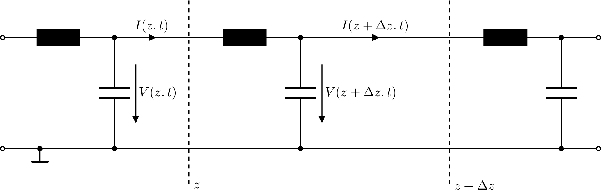

---
tags:
aliases:
keywords:
subject:
  - VL
  - Grundlagen der Hochfrequenztechnik
semester: WS25
created: 22nd January 2026
professor:
release: false
title: Telegrafenleitungsgleichung
---

# Telegrafenleitungsgleichung - Ausbreitung von Spannungs und Stromwellen auf einer Leitung

> [!question] Vergleiche [Telegrafengleichung](../Elektrotechnik/Telegrafengleichung.md)

Die Telegrafenleitungsgleichungen sind ein Modell zur beschreibeung der ausbreitung von Strom und Spannungswellen eines [RF-Signals](Leitungstheorie.md) auf einer [Transmission Line](Transmission%20Line.md).

> #incomplete Ersetzten durch allgemein verlustbehaftete Leitung

^TL-Modell

> Lumped Elements Model

Für **Sinusförmige Größen** erhält man aus dem Leitermodell zunächst ein gekoppeltes [PDGL](../Mathematik/Analysis/Partielle%20Differenzialgleichung.md)-System, welche **Spannungswelle** $U(z,t)$ und die **Stromwelle** $I(z,t)$ verknüpft.

$$
\frac{\partial \underline{U}}{\partial z}(z) = -(R'+j\omega L')\cdot \underline{I}(z),\quad \frac{\partial \underline{I}}{\partial z}(z) = -(G'+j\omega C')\cdot \underline{U}(z)
$$

Herleitung und Entkoppelung

%% [Edit in Excalidraw](../_assets/Telegraphengleichung%202025-01-21%2023.00.48.excalidraw.md) %%

> [!def] **D - TFGL)** Telegraphenleitungsgleichungen in Form einer Helmholtzschen Differenzialgleichung der Ausbreitungswelle für **Sinusgrößen**
> $$\dfrac{\mathrm{d}^{2}u}{\mathrm{d} z^{2}}=u(z)\gamma^{2}, \quad \frac{\mathrm{d}^{2}i}{\mathrm{d}z^{2}}=i(z)\gamma^{2}\tag{TFGL}$$
^TFGL

> [Helmholtzsche Differenzialgleichung](Helmholtzsche%20Differenzialgleichung.md)

## Lösung der Telegrafenleitungsgleichung

Als Lösung der Telegraphengleichung ergibt sich die Überlagerung gegenläufiger, exponentiell gedämpfter Spannungswellen.

- $U^+, I^+$ ... Amplituden der Hinlaufenden Wellen
- $U^-, I^-$ ... Amplituden der Rücklaufenden Wellen
 
> [!success] Lösung der Telegraphengleichung für die Ausbreitungswellen für **Sinusgrößen**
>
> $$
> \begin{align}
> U(z) &= U^+ e^{-\gamma z}+ U^- e^{\gamma z} \\
> I(z) &= I^+ e^{-\gamma z} - I^- e^{\gamma z}
> \end{align}
> $$
> 
^LSGTFGL

### Ausbreitungskoeffizient

> [!hint] Vergleiche [Fortpflanzungskonstante](../Physik/Feldtheorie/Wellenzahl.md) für EM-Wellen in verlustbehafteten Medien.

> [!def] **D)** komplexer Ausbreitungskoeffizient $\gamma$ ^PROP
> Die Ausbreitungskonstante $\gamma$ beschreibt die Verlustgrößen der Leitergeometrie.
> 
> $$
> \gamma = \sqrt{(R'+j\omega L')(G'+j\omega C')} = \alpha + j\beta
> $$
> 
> $(\,\cdot\,)'\,$: **Leitungsbeläge**
> $\alpha\,$: **Dämpfungsbelag** (Dämpfung der Signalamplitude)
> $\beta\,$: **Phasenbelag** (Verzögerung der Ausbreitungsgeschwindigkeit $=k$ ... [Wellenzahl](../Physik/Feldtheorie/Wellenzahl.md))

## Zeitbereichs Lösung

$$\frac{\partial }{\partial z} I(z,t)= -C' \frac{\partial}{\partial t}V(z,t),\quad\frac{\partial }{\partial z}V(z,t)= -L' \frac{\partial}{\partial t}I(z,t)$$

$$
\frac{\partial}{\partial t} \frac{\partial V(z, t)}{\partial z}=-L^{\prime} \frac{\partial^2 I(z, t)}{\partial t^2},\quad \frac{\partial^2 I(z, t)}{\partial z^2}=-C^{\prime} \frac{\partial}{\partial z} \frac{\partial V(z, t)}{\partial t}
$$

Die Lösung für die Ausbreitungs-Wellen von Strom und Spannung auf einer Leitung, ist eine Überlagerung von Hin und Rücklaufender Welle:

$$
\begin{align}
u(z)&= U_{h}\left( t-\tfrac{z}{c} \right)+ U_{r}\left( t+\tfrac{z}{c} \right)\\
i(z)&= I_{h}\left( t-\tfrac{z}{c} \right) - I_{r} \left( t+\tfrac{z}{c} \right)
\end{align}
$$

Die Grenzbedingungen sind hier der Anfang und das Ende der Leitung (die Eingangs und Abschluss impedanz). Dabei haben $U_{h}, U_{r}, I_{h}$ und $I_{r}$ eine **beliebige** Wellenform

> [!question] Das $-$ vor $I_{r}\left( t+\frac{z}{c} \right)$ ist durch die Zählpfeilrichtung für [Zweitore](../../Hardwareentwicklung/Vierpol.md) gegeben, da in die Tore hineinfließende Ströme positiv sind.