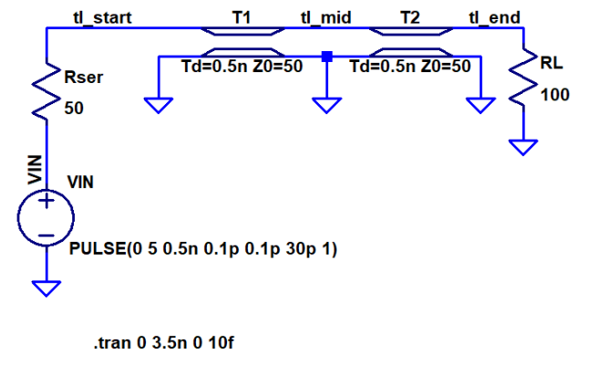

---
tags:
  - RF
  - tikz/circuitikz
aliases:
  - HF-Übertragungsleitung
  - Leitungstheorie
  - Leitermodell
keywords: 
subject:
  - VL
  - KV
  - HF-Systemtechnik 1
  - EMV und SI
semester: WS24
created: 4. Oktober 2024
professor:
  - Reinhard Feger
---
 

# Transmission Line (TL)

> [!important] Eine Leitung wird als TL behandelt wenn das Signal auf dieser Leitung als ein [RF-Signal](RF-Signal.md) klassifiziert wird.
> Hier kann die Verbindung zwischen Toren/Komponenten nicht mehr Vernachlässigt werden und wird in der Schaltung mit modelliert:

^TL-CIRC

> [!hint] Eine TL ist elektrisch kurz: ${ l > \frac{\lambda}{10} }$ (Faustregel)

Eine TL wird mit seriellen Induktivitäts-Belägen und parallelen Kaüazitäts-Belägen modelliert (Leitermodell):

^TL-Modell

> [!important] Dieses Modell führt zur [Telegrafengleichung](Telegrafengleichung.md),
> einem gekoppelten [PDGL](../Mathematik/Analysis/Partielle%20Differenzialgleichung.md)-System, welche **Spannungswelle** $V(z,t)$ und die **Stromwelle** $I(z,t)$ verknüpft.
> 
> Diese Gleichung gilt für alle [Leitergeometrien](Leitergeometrie.md), welche den [TE-Mode](Transversale%20Elektromagnetische%20Welle.md) erfüllen. Je nach Geometrie ändert sich nur die Art, wie die Leitungsbeläge, $L'$ und $C'$ berechnet werden. Die Gleichung hat jedoch immer die selbe form. 
> Für TEM ist die Telegrafengleichung außerdem *unabhängig* von der Wellenlänge.

## Leitungskenngrößen

### Ausbreitungsgeschwindigkeit einer Welle

Wie Schnell sich die Welle auf der Leitung ausbreitet, ist durch die Material größen $L'$ und $C'$ gegeben:

$$c=\frac{1}{\sqrt{ L'C' }}$$

### Wellenwiderstand

> [!quote] Auch: Charakteristische Impedanz, Leitungswellenwiderstand

**Verlustlose Leitung mit beliebiger Wellenform**
$$
Z_{0} = \frac{U_{h}\left( t-\frac{z}{c} \right)}{I_{h}\left( t-\frac{z}{c} \right)}= \frac{U_{r}\left( t+\frac{z}{c} \right)}{I_{r}\left( t+\frac{z}{c} \right)} = \sqrt{\frac{L'}{C'}} = c\cdot L'= \frac{1}{c\cdot C'}
$$

Mit $U$ und $I$ als Funktion von Spannung und Strom der hinlaufenden und rücklaufenden Welle, beleibiger Form (Puls, Sinus, Dirac, Rampe). Man erhält nur $Z_{0}$ wenn hin bzw rücklaufende Welle getrennt, also nicht überlagert betrachtet werden.

**Verlustbehaftete Leitung mit Sinusförmiger Wellenform**

Hergeleitet aus der [Lösung der Telegrafengleichung](Telegrafengleichung.md#^LSGTFGL) eingesetzt in die gekoppelte PDGL der TFGL für Sinusgrößen: Im Allgemeinen komplex

$$
\underline{ Z }_{0} = \sqrt{ \frac{R'+j\omega L'}{G'+j\omega C'} } \tag{Z0}
$$
^Z0

### Leitungsabschluss

Solange die Welle entlang der Leitung nur $Z_{0}$ sieht, wandert diese ungestört weiter.
Wie im [Schaltbild](#^TL-CIRC) einer Leitung zu sehen gibt es jedoch eine Last $Z_{L}$ bzw einen *Abschluss* der Leitung. Je nachdem, wie dieser Abschluss gewählt wird, hat diese Auswirkungen auf die Welle. Die Lösung der Wellengleichung am Abschluss wird von der Abschlussimpedanz **erzwingt** ([Randwert](../Mathematik/Analysis/Randwertprobleme.md)).

$$\underline{Z}_{L} = \frac{\underline{ U }_{\text{last}}}{\underline{ I }_{\text{last}}}= \frac{\underline{ U }_{h}+\underline{ U }_{r}}{\underline{ I }_{h}-\underline{ I }_{r}}\tag{ZL}$$
^ZL

> [!info] $Z_{L}$ ist komplex, wenn für Sinusgrößen mit der komplexen [Wechselstromtechnik](../Elektrotechnik/Wechselstromtechnik.md) gerechnet wird.

> [!hint] Angepasste Leitung: (Leistungsanpassung)
> Ist $\underline{Z}_{L} = \underline{Z}_{0}$ muss gelten, dass $U_{r}=0$ und $I_{r} = 0$.
> Das Heißt es gibt keine rücklaufende Welle und die gesamte Energie wird in die Last abgegeben.

#### Randwerte bei $Z_{L} \neq Z_{0}$

> [!info] Wird für Sinusgrößen mit der komplexen Wechselstromrechnung gerechnet, treten hier im allgemeinen die komplexen Phasoren der Wellen auf.

>[!example] $Z_{\text{load}}=0$ (Kurzschluss): Erzwingt, dass die Spannung an der Last 0 ist
> 
> $$U_{\text{short}}=U_{h}+U_{r}=0\implies U_{r}=-U_{h}$$
> 
> Da die Gleichung für [Z0](#^Z0) erfüllt sein muss gilt:
> 
> $$I_{r}=\frac{U_{r}}{Z_{0}}=-\frac{U_{h}}{Z_{0}}=-I_{h}$$
> 
> $\implies I_{\text{short}}=I_{h}-I_{r}=I_{h}+I_{h}=2I_{h}$
> 

>[!example] $Z_{\text{load}}=\infty$ (Leerlauf): Erzwingt, dass der Strom an der Last 0 ist
> 
> $I_{\text{open}}=I_{h}-I_{r}=0\implies I_{h}=I_{r}$
> 
> Da die Gleichung für [Z0](#^Z0) erfüllt sein muss gilt:
> 
> $$U_{r} = Z_{0}\cdot I_{r}=Z_{0}\cdot I_{h}=U_{h}$$
> $\implies U_{\text{short}}=U_{h}+U_{r}=U_{h}+U_{h}=2U_{h}$

#### Reflexionsfaktor

Das Verhalten der Wellen an einem Abschluss, befindet sich nun zwischen den Randbedingungen ($Z_{\text{load}}=0, \to \infty$). Die Zwischengrößen werdn durch das Verhältnis von rück- und hinlaufender Welle mit dem Reflexionsfaktor $\Gamma$ beschrieben:

> [!def] **D - RFLX)**
> 
> $$\underline{ \Gamma } = \frac{\underline{ U }_{r}}{\underline{ U }_{h}} = -\frac{\underline{ I }_{r}}{\underline{ I }_{h}} \overset{ (*) }{ = } \frac{\underline{ Z }_{L}-\underline{ Z }_{0}}{\underline{ Z }_{L}+\underline{ Z }_{0}}\tag{RFLX}$$
> 
> $(*)$: Ergibt sich durch Umformen von [Z0](#^Z0) und [ZL](#^ZL)
> 
> $$\underline{ Z }_{L} = \underline{ Z }_{0}\cdot \frac{1+\underline{ \Gamma }}{1-\underline{ \Gamma }}$$

> [!important] Wichtige Fälle:
> 1. Angepasste Leitung: $Z_{L}=Z_{0}\implies\Gamma=0$
> 2. Offene Leitung: $Z_{L}=\infty\implies\Gamma=1$ ([L'Hospital](../Mathematik/Analysis/L'Hospital.md))
> 3. Kurzgeschlossene Leitung: $Z_{L}=0\implies\Gamma=-1$

Mit dem Relexionsfaktor lässt sich die Welle am Abschluss ermitteln:

$$
U_{\text{last}} = U_{h}\cdot \left( 1+\Gamma \right)\quad \text{und} \quad I_{\text{last}} = I_{h}\cdot \left( 1-\Gamma \right)
$$

## Puls auf einer Leitung

## Sinusförmiges Signal auf der Leitung

## TL in LTSpice

T. Lossless Transmission Line

Symbol Name: `TLINE`
Syntax: `Txxx L+ L- R+ R- Zo=<value> Td=<value>`
$L+$ und $L-$ sind die Noden am Eingang.
$R+$ und $R-$ sind die Noden am Ausgang.
$Z_{0}$ ist die characteristische Impedanz.
Die Länge der Leitung ist gegeben durch das propagation Delay $T_{d}$.

