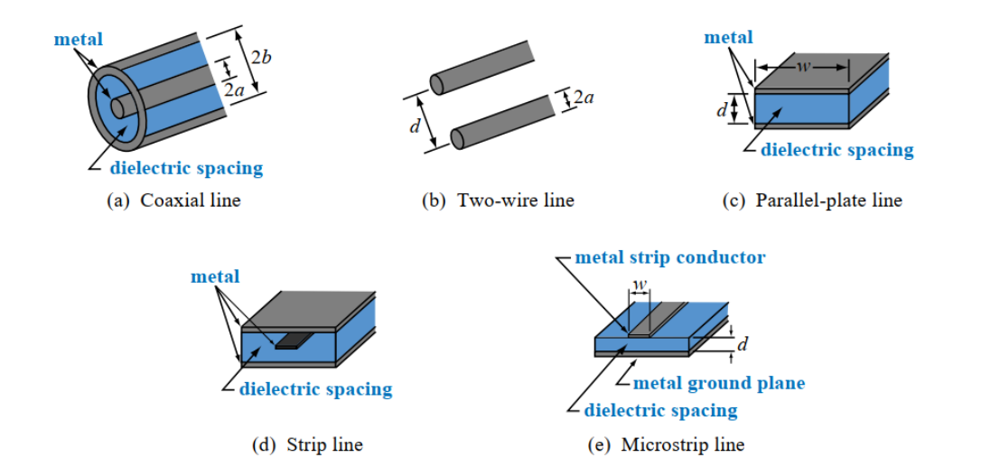
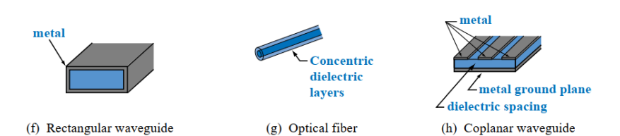

---
tags:
  - RF
aliases:
  - HF-Übertragungsleitung
keywords: 
subject:
  - KV
  - HF-Systemtechnik 1
semester: WS24
created: 4. Oktober 2024
professor:
  - Reinhard Feger
---
 

# Transmission Line (TL)

> [!important] Eine Leitung wird als TL behandelt wenn das Signal auf dieser Leitung als ein [RF-Signal](RF-Signal.md) klassifiziert wird.

Hier kann die Verbindung zwischen Toren/Komponenten nicht mehr Vernachlässigt werden und wird in der Schaltung mit modelliert:

```tikz
\usepackage[european, straightvoltages]{circuitikz}
\usepackage{amsmath}

\begin{document}
\begin{circuitikz}[thick]
	% Paths, nodes and wires:
	\draw (3, 5) to[sinusoidal voltage source, l={$V_{\text{in}}(t)$}] (3, 7);
	\node[ocirc] at (4, 7) {};
	\node[ocirc] at (4, 5) {};
	\node[ocirc] at (8, 7) {};
	\node[ocirc] at (8, 5) {};
	\draw (9, 5) to[american resistor, l={$R_{\text{load}}$}] (9, 7);
	\draw (4, 7) to[mstline] (8, 7);
	\draw (4, 5) to[mstline] (8, 5);
	\node[ground] at (3, 5) {};
	\draw (3, 7) -- (4, 7);
	\draw (3, 5) -- (4, 5);
	\draw (8, 7) -- (9, 7);
	\draw (8, 5) -- (9, 5);
	\draw (9, 5) to[american resistor, l={$R_{\text{load}}$}] (9, 7);
	\draw (4, 7) to[mstline] (8, 7);
	\draw (4, 5) to[mstline] (8, 5);
	\draw (3, 7) -- (4, 7);
	\draw (3, 5) -- (4, 5);
	\draw (8, 7) -- (9, 7);
	\draw (8, 5) -- (9, 5);

\end{circuitikz}
\end{document}
```


Eine TL ist elektrisch kurz: ${ l > \dfrac{\lambda}{10} }$

Eine TL wird mit serien induktivitäten und parallel kapazitäten modelliert (Leitermodell)

## Geometrien von HF-Leitungen

### TEM-Moden

siehe: [Transversale EM-Welle](Transversale%20Elektromagnetische%20Welle.md)

> [!success] Nicht frequenzabhängig. Funktionieren für Alle frequenzen (auch DC) gleich




#### Herleitung zu HF-Leitermodelle

> [!warning] Herleitung der Parallelplattenleitung mittels der Maxwellgleichungen
> Jedoch ist das verfahren gleich für andere geometrien
> 1. Annahmen zum Feldverlauf
> 2. Kontur Wählen
> 
> 

-WS24/HF-Systemtechnik%201/assets/TEM-Plattenleitung.png)

Vorraussetzung für TEM-Moden:

> [!info] E-Feld
> - E-Feld hat keine komponente die in $z$-Richtung zeigt
> - wir nehmen an dass die E-Feld Komponente in $x$-Richtung 0 ist
> 
> $$\mathbf{E} = \begin{bmatrix} 0 \\ E_{y}(x,y,z,t) \\ 0 \end{bmatrix} = E_{y}(x,y,z,t)\cdot \mathbf{e}_{y}\quad \text{für} \quad 0 < y < d$$
> 


 > [!info] H-Feld
 > - H-Feld hat auch keine komponente in $z$-Richtung
 > - wir nehmen an dass das H-Feld nur in $x$-Richtung zeigt (gegensatz zum E-Feld)
 >
 > $$\mathbf{H}=\begin{bmatrix} H_{x}(x,y,z,t) \\ 0 \\ 0\end{bmatrix} = H_{x}(x,y,z,t)\cdot e_{x} \quad \text{für} \quad 0<y<d$$
 
Vereinfachte Lösung mit annahme einer idealen TEM mode (es gibt genauere Lösungen)


### Andere Moden

HF-Leitungen höherer ordnung

> [!warning] Funktionieren nicht für alle Frequenzen gleich



- Rectangular Waveguide (Rechteck Hohlleiter)
- [LWL](Lichtwellenleiter.md) - Dielektrischer Wellenleiter Licht Als EM-Welle durch nicht leitendes Dielektrikum
- Coplanarer Microstrip